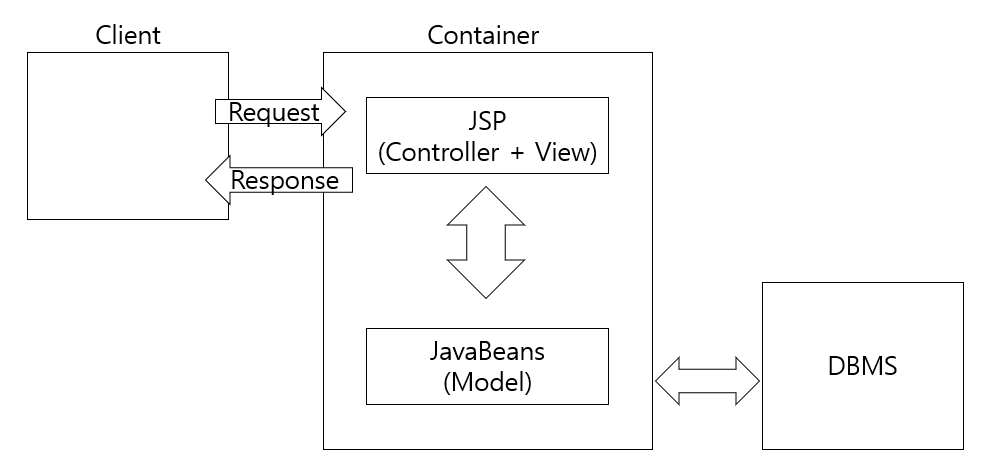
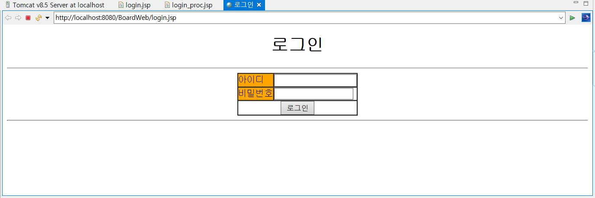
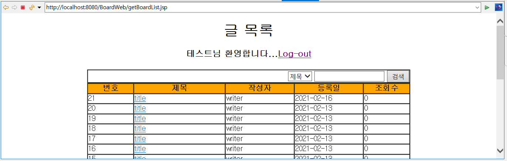
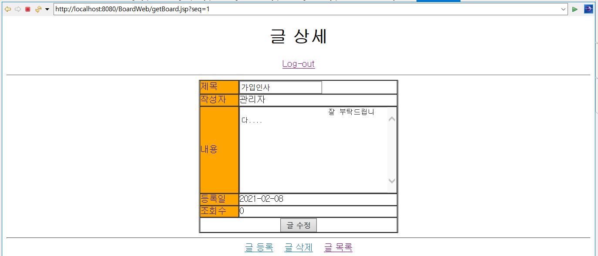
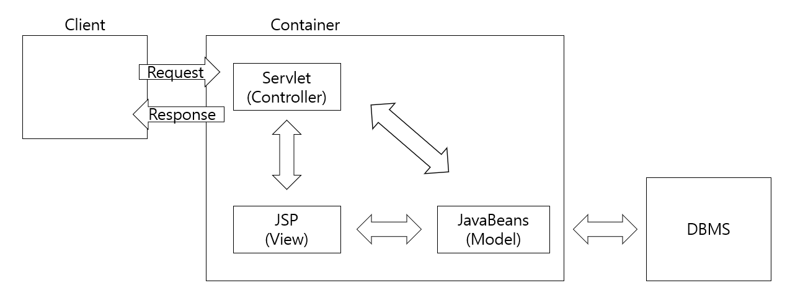
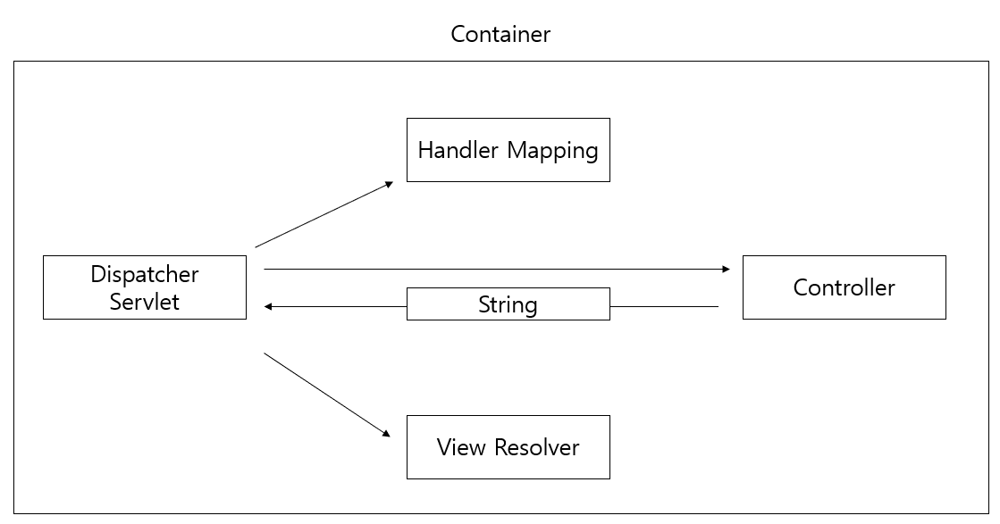
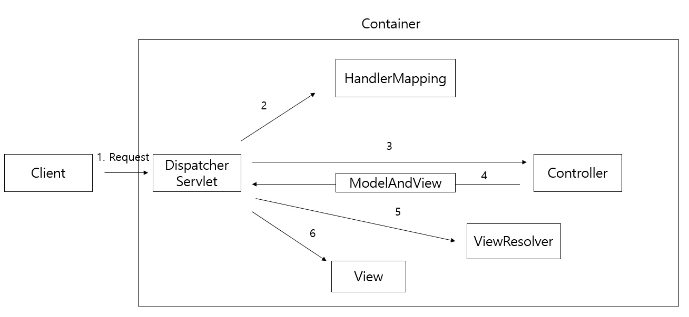

# Day3

## Model 1 아키텍처(JSP)로 게시판 개발

**1. Model 1 아키텍처 구조**



1. **JavaBeans(Model)** : DB 연동에 사용되는 자바 객체
2. **JSP파일(Controller + View)**
   Controller : 사용자의 요청 처리와 관련된 자바 코드(사용자 입력 정보 추출, DB 연동 처리, 화면 내비게이션)
   View : Model을 이용해 검색한 데이터를 화면으로 제공하기 위한 마크업(HTML, CSS)이 View 담당

- Model 1 구조는 JSP 파일에서 Controller와 View 기능 모두 처리
  -> 자바 코드와 마크업 코드가 뒤섞여 있어 디버깅 및 유지보수에 어려움
  -> Model 2 (MVC 아키텍처) 등장


**2. 로그인 기능 구현**

*모든 JSP 파일은 src/main/webapp에 등록*

1. 로그인 화면

   

   

2. 로그인

   ```jsp
   login_proc.jsp
   
   <%@page import="com.springbook.biz.user.impl.UserDAO"%>
   <%@page import="com.springbook.biz.user.UserVO"%>
   <%@page contentType="text/html; charset=EUC-KR"%>
   
   <%
   	// 1. 사용자 입력 정보 추출
   	String id = request.getParameter("id");
   	String password = request.getParameter("password");
   	
   	// 2. DB 연동 처리
   	UserVO vo = new UserVO();
   	vo.setId(id);
   	vo.setPassword(password);
   	
   	UserDAO userDAO = new UserDAO();
   	UserVO user = userDAO.getUser(vo);
   	
   	// 3. 화면 네비게이션(포워드 방식과 리다이렉트 방식 중 리다이렉트 방식 사용)
   	if (user != null) {
   		response.sendRedirect("getBoardList.jsp");
   	} else {
   		response.sendRedirect("login.jsp");
   	}
   %>
   ```

|            | 방식                                                         | 실행속도 | URL 변경           |
| ---------- | ------------------------------------------------------------ | -------- | ------------------ |
| 포워드     | RequestDispatcher를 이용하여 요청을 JSP 화면으로 넘겨<br />포워드된 화면이 클라이언트에 전송됨 | 빠름     | X(응답 출처 확인X) |
| 리다이렉트 | 요청된 JSP에서 브라우저로 응답 메시지 보낸 후 다시 서버로 재요청 | 느림     | O(응답 출처 확인O  |


**3. 글 목록**




**4. 글 상세**




## Model 2 아키텍처로 게시판 개발(Model 1 -> Model 2)

**1. Model 2 아키텍처 구조**



- Model 1 카이텍처에서 JSP 파일에 있는 자바 코드만 Controller로 이동하면 Model 2 아키텍처

| 기능       | 구성 요소 | 개발 주체                           |
| ---------- | --------- | ----------------------------------- |
| Model      | VO, DAO   | 자바 개발자                         |
| View       | JSP       | 웹 디자이너                         |
| Controller | Servlet   | 자바 개발자 or MVC 프레임워크(권장) |

> **Controller 로직** : 사용자 입력 정보 추출 + Model을 이용한 DB 연동 + 화면 네비게이션에 해당하는 자바 코드


**2. Controller 구현**

1. 서블릿 생성 & 등록

   ```xml
   web.xml
   src/main/java에 Servlet 생성
   
   <?xml version="1.0" encoding="UTF-8"?>
   <web-app xmlns:xsi="http://www.w3.org/2001/XMLSchema-instance" 
   				xmlns="http://java.sun.com/xml/ns/javaee" 
   				xsi:schemaLocation="http://java.sun.com/xml/ns/javaee 
   				https://java.sun.com/xml/ns/javaee/web-app_2_5.xsd" version="2.5">
     <servlet>
       <servlet-name>action</servlet-name>
       <servlet-class>com.springbook.view.controller.DispatcherServlet</servlet-class>
     </servlet>
     
     <servlet-mapping>
       <servlet-name>action</servlet-name>
       <url-pattern>*.do</url-pattern>
     </servlet-mapping>
   </web-app>
   ```

   

2. Controller 서블릿 구현

   ```java
   package com.springbook.view.controller;
   
   import java.io.IOException;
   import javax.servlet.ServletException;
   import javax.servlet.http.HttpServlet;
   import javax.servlet.http.HttpServletRequest;
   import javax.servlet.http.HttpServletResponse;
   
   public class DispatcherServlet extends HttpServlet {
   	private static final long serialVersionUID = 1L;
       
   	protected void doGet(HttpServletRequest request, HttpServletResponse response) throws ServletException, IOException {
   		process(request, response);
   	}
   	
   	protected void doPost(HttpServletRequest request, HttpServletResponse response) throws ServletException, IOException {
   		request.setCharacterEncoding("EUC-KR");
   		process(request, response);
   	}
   
   	private void process(HttpServletRequest request, HttpServletResponse response) throws IOException {
   		// 1. 클라이언트의 요청 path 정보를 추출
   		String uri = request.getRequestURI();
   		String path = uri.substring(uri.lastIndexOf("/"));
   		System.out.println(path);
   		
   		// 2. 클라이언트의 요청 path에 따라 적절히 분기처리
   		if (path.equals("/login.do")) {
   			System.out.println("로그인 처리");
   		} else if (path.equals("/logout.do")) {
   			System.out.println("로그아웃 처리");
   		} else if (path.equals("/insertBoard.do")) {
   			System.out.println("글 등록 처리");
   		} else if (path.equals("/updateBoard.do")) {
   			System.out.println("글 수정 처리");
   		} else if (path.equals("/deleteBoard.do")) {
   			System.out.println("글 삭제 처리");
   		} else if (path.equals("/getBoard.do")) {
   			System.out.println("글 상세 조회 처리");
   		} else if (path.equals("/getBoardList.do")) {
   			System.out.println("글 목록 검색 처리");
   		}
   	}
   }
   ```

   - `doGet()` 과 `doPost()` 모두 `process()` 를 통해 클라이언트 요청 처리
   - `doPost()` 에서 한글 인코딩 일괄 처리 -> 인코딩 변경 시 `DispatcherServlet` 클래스만 수정하면 됨
   - `process()` 에서 추출하는 path 정보는 URI 에서 마지막 "/xxx.do" 문자열


> **`DispatcherServlet` 으로 검색 결과 가져올 때 유의사항**
>
> 사실 `DispatcherServlet` 에서 검색 결과를 `HttpSession` 이 아닌 `HttpServletRequest` 객체에 저장하여 공유해야 한다.
>
> - 세션(`HttpSession`)은 브라우저당 서버 메모리에 하나씩 유지 -> 사용자 많으면 많은 세션 생성 -> 서버에 
> - `HttpServletRequest` 객체는 클라이언트가 요청 시 매번 새롭게 생성 -> 응답 메시지 전송 시 삭제 -> 서버에 부담 X


## MVC 프레임워크 개발

**1. MVC 프레임워크 구조**

- `DispatcherServlet` 클래스 하나로 Controller를 구현하면 하나의 서블릿이 모든 요청 처리, 분기가 많아짐 
  -> 유지보수 어려움
- Spring MVC와 동일한 구조의 프레임워크를 구현할 것



| 클래스            | 기능                                                         |
| ----------------- | ------------------------------------------------------------ |
| DispatcherServlet | 유일한 서블릿 클래스<br /> 모든 클라이언트의 요청을 가장 먼저 처리하는 Front Controller |
| HandlerMapping    | 클라이언트의 요청을 처리할 Controller 매핑                   |
| Controller        | 실질적인 클라이언트의 요청 처리                              |
| ViewResolver      | Controller가 반환한 View 이름으로 실행될 JSP 경로 완성       |


**2. MVC 프레임워크 구현**

1. `Controller` 인터페이스

   - `DispatcherServlet` 은 `HandlerMapping`을 통해 Controller 객체 검색 & 실행
   - 어떤 Controller 객체가 검색되더라도 같은 코드로 실행하기 위해 인터페이스 필요

   ```java
   public interface Controller {
   	String handleRequest(HttpServletRequest request, HttpServletResponse response);
   }
   ```

2. `LoginController`

   ```java
   public class LoginController implements Controller {
   
   	@Override
   	public String handleRequest(HttpServletRequest request, HttpServletResponse response) {
   		System.out.println("로그인 처리");
   		
   		// 1. 사용자 입력 정보 추출
   		String id = request.getParameter("id");
   		String password = request.getParameter("password");
   		
   		// 2. DB 연동 처리
   		UserVO vo = new UserVO();
   		vo.setId(id);
   		vo.setPassword(password);
   		
   		UserDAO userDAO = new UserDAO();
   		UserVO user = userDAO.getUser(vo);
   		
   		// 3. 화면 네비게이션
           // 확장자 없는 문자열 반환 시 '.jsp' 확장자가 붙음
   		if (user != null) {
   			return "getBoardList.do";
   		} else {
   			return "login";
   		}
   	}
   
   }
   ```

3. `HandlerMapping` 클래스

   - 모든 Controller 객체들을 저장하고 있다가 클라이언트의 요청이 들어오면 Controller를 검색
   - `DispatcherServlet`이 사용하는 객체
   - `DispatcherServlet`이 생성되고 `init()` 메소드가 호출될 때 단 한 번 생성됨

   ```java
   public class HandlerMapping {
   	private Map<String, Controller> mappings;
   	
   	public HandlerMapping() {
   		mappings = new HashMap<String, Controller>();
   		mappings.put("/login.do", new LoginController());
   	}
   	
   	public Controller getController(String path) {
   		return mappings.get(path);
   	}
   }
   ```

4. `ViewResolver` 클래스

   - Controller가 반환한 View 이름에 접두사와 접미사를 결합하여 최종 실행될 View 경로와 파일명 완성
   - `DispatcherServlet`의 `init()` 메소드가 호출될 때 생성됨

   ```java
   public class ViewResolver {
   	public String prefix;
   	public String suffix;
   	
   	public void setPrefix(String prefix) {
   		this.prefix = prefix;
   	}
   	
   	public void setSuffix(String suffix) {
   		this.suffix = suffix;
   	}
   	
   	public String getView(String viewName) {
   		return prefix + viewName + suffix;
   	}
   }
   ```

5. `DispatcherServlet` 수정(`init()` 추가, `process()` 수정)

   - `init()` 메소드는 서블릿 객체가 생성된 후 멤버변수를 초기화하기 위해 자동으로 실행됨
   - `HandlerMapping`과 `ViewResolver`를 이용해 사용자의 요청 처리

   ```java
   public class DispatcherServlet extends HttpServlet {
       ...
       private HandlerMapping handlerMapping;
   	private ViewResolver viewResolver;
   	
   	public void init() throws ServletException {
   		handlerMapping = new HandlerMapping();
   		viewResolver = new ViewResolver();
   		viewResolver.setPrefix("./");
   		viewResolver.setSuffix(".jsp");
   	}
       
       ...
   
       private void process(HttpServletRequest request, HttpServletResponse response) throws IOException {
   		// 1. 클라이언트의 요청 path 정보를 추출
   		String uri = request.getRequestURI();
   		String path = uri.substring(uri.lastIndexOf("/"));
   		
   		// 2. HandlerMapping을 통해 path에 해당하는 Controller를 검색
   		Controller ctrl = handlerMapping.getController(path);
   		
   		// 3. 검색된 Controller를 실행
   		String viewName = ctrl.handleRequest(request, response);
   		
   		// 4. ViewResolver를 통해 viewName에 해당하는 화면 검색
   		String view = null;
   		if (!viewName.contains(".do")) {
   			view = viewResolver.getView(viewName);
   		} else {
   			view = viewName;
   		}
   		
   		// 5. 검색된 화면으로 이동
   		response.sendRedirect(view);
   	}
   }
   ```


## Spring MVC 구조

**1. Spring MVC 수행 흐름**




**2. DispatcherServlet 등록 & 스프링 컨테이너 구동**

1. `DispatcherServlet` 등록

   - WEB-INF/web.xml 파일에 등록된 `DispatcherServlet` 클래스를 스프링에서 제공하는 `DispatcherServlet`으로 변경

   - 서블릿 컨테이너는 클라이언트의 ".do" 요청이 있어야 `DispatcherServlet` 객체를 생성

     ```xml
     <servlet>
         <servlet-name>action</servlet-name>
         <servlet-class>org.springframework.web.servlet.DispatcherServlet</servlet-class>
     </servlet>
     ```

     

2. 스프링 컨테이너 구동

   - 클라이언트 요청 -> `DispatcherServlet` 객체 생성 -> `init()` 메소드 실행
     -> `XmlWebApplicationContext` (`DispatcherServlet`이 생성) 라는 스프링 컨테이너 구동
   - `DispatcherServlet` 은 `HandlerMapping`, `Controller`, `ViewResolver` 객체들과 상호작용을 해야 함
     -> 이 객체들을 메모리에 생성하기 위해 서블릿이 스프링 컨테이너 구동
   - `init()` 메소드는 스프링 설정 파일을 로딩하여 컨테이너 구동
   - 스프링 설정 파일에 `DispatcherServlet`이 사용할 `HandlerMapping`, `Controller`, `ViewResolver` 클래스를
     `<bean>` 등록하면 컨테이너가 해당 객체 생성

3. 스프링 설정 파일 등록

   - `DispatcherServlet`은 스프링 컨테이너 구동 시 web.xml 파일에 등록된 서블릿 이름 뒤에
     '-servlet.xml'을 붙여서 스프링 설정파일을 찾음


**3. 스프링 설정 파일 변경**

- `DispatcherServlet`은 사용할 객체를 생성하기 위해 스프링 컨테이너 구동

- 이때 스프링 컨테이너를 위한 설정 파일의 이름과 위치는 서블릿 이름을 기준으로 결정됨
  -> 서블릿 초기화 파라미터를 이용해 변경 가능

  ```xml
  web.xml
  
  <servlet>
      <servlet-name>action</servlet-name>
      <servlet-class>org.springframework.web.servlet.DispatcherServlet</servlet-class>
      <init-param>
          <param-name>contextConfigLocation</param-name>
          <param-value>/WEB-INF/config/presentation-layer.xml</param-value>
      </init-param>
  </servlet>
  ```


**4. 인코딩 설정**

- 스프링은 인코딩 처리를 위해 `CharacterEncodingFilter` 클래스 제공

- web.xml 파일에 `CharacterEncodingFilter`를 등록 시 모든 클라이언트 요청에 대해 인코딩 처리 가능

  ```xml
  web.xml
  
  <filter>
      <filter-name>characterEncoding</filter-name>
      <filter-class>org.springframework.web.filter.CharacterEncodingFilter</filter-class>
      <init-param>
          <param-name>encoding</param-name>
          <param-value>EUC-KR</param-value>
      </init-param>
  </filter>
  		
  <filter-mapping>
      <filter-name>characterEncoding</filter-name>  객체 이름을 characterEncoding이라 지정
      <url-pattern>*.do</url-pattern>  클라이언트의 모든 ".do" 요청에 대해 인코딩
  </filter-mapping>
  ```


## Spring MVC 적용

**1. 변경 사항**

* `handleRequest()` 메소드의 반환타입을 `String`이 아닌 `ModelAndView`로 수정

* Controller마다 presentation-layer.xml에 등록

  ```xml
  <beans xmlns="http://www.springframework.org/schema/beans"
  	xmlns:xsi="http://www.w3.org/2001/XMLSchema-instance"
  	xsi:schemaLocation="http://www.springframework.org/schema/beans http://www.springframework.org/schema/beans/spring-beans.xsd">
  
  		<!-- HandlerMapping 등록 -->
  	<bean class="org.springframework.web.servlet.handler.SimpleUrlHandlerMapping">
  		<property name="mappings">
  			<props>
  				<prop key="/login.do">login</prop>
  				<prop key="/getBoardList.do">getBoardList</prop>
  				<prop key="/getBoard.do">getBoard</prop>
  				<prop key="/insertBoard.do">insertBoard</prop>
  				<prop key="/updateBoard.do">updateBoard</prop>
  				<prop key="/deleteBoard.do">deleteBoard</prop>
  				<prop key="logout.do">logout</prop>
  			</props>
  		</property>
  	</bean>
  
  	<!-- Controller 등록 -->
  	<bean id="login" class="com.springbook.view.user.LoginController"></bean>
  	<bean id="getBoardList" class="com.springbook.view.board.GetBoardListController"></bean>
  	<bean id="getBoard" class="com.springbook.view.board.GetBoardController"></bean>
  	<bean id="insertBoard" class="com.springbook.view.board.InsertBoardController"></bean>
  	<bean id="updateBoard" class="com.springbook.view.board.UpdateBoardController"></bean>
  	<bean id="deleteBoard" class="com.springbook.view.board.DeleteBoardController"></bean>
  	<bean id="logout" class="com.springbook.view.user.LogoutController"></bean>
  </beans>
  ```

* 검색 결과를 세션에 저장 시 서버에 부담 ->  `HttpServletRequest`에 저장 해야 함.

  `DispatcherServlet`이 Controller가 반환한 `ModelAndView` 객체에서 Model 정보 추출 후 `HttpServletRequest` 객체에 담아 JSP로 포워딩


**2. ViewResolver 활용**

- `ViewResolver`를 사용하면 클라이언트가 직접 JSP를 호출하는 것을 차단 가능
- 클라이언트가 직접 JSP를 호출하면 페이지에 아무 데이터가 출력되지 않음(Controller 실행하지 않았으므로)
- JSP를 View로 사용할 경우 `InternalResourceViewResolver` 사용

1. ViewResolver 적용

   - WEB-INF 폴더는 브라우저에서 접근 불가
   - WEB-INF 폴더에 있는 JSP 파일을 View 화면으로 사용할 수 있도록 presentation-layer.xml을 수정

   ```xml
   presentation-layer.xml
   getBoardList.jsp와 getBoard.jsp파일은 /WEB-INF/board/로 이동된 상태
   
   <beans>
       ...
       <!-- ViewResolver 등록 -->
       <bean id="viewResolver" class="org.springframework.web.servlet.view.InternalResourceViewResolver">
           <property name="prefix" value="/WEB-INF/board/"></property>
           <property name="suffix" value=".jsp"></property>
       </bean>
   </beans>
   ```

   

2. Controller 수정

   - `ModelAndView` 객체에 저장되는 View의 이름은 'redirect:'를 붙여서 지정
     -> `ViewResolver` 가 설정되어 있어도 무시하고 리다이렉트
