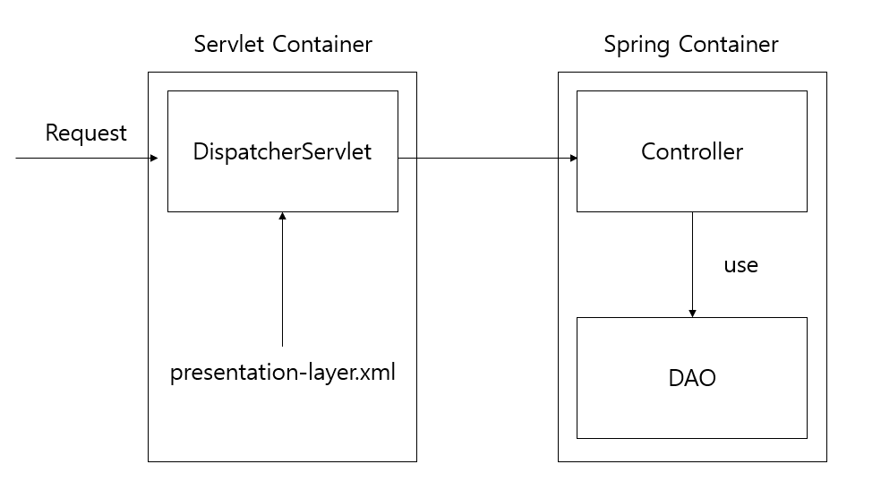
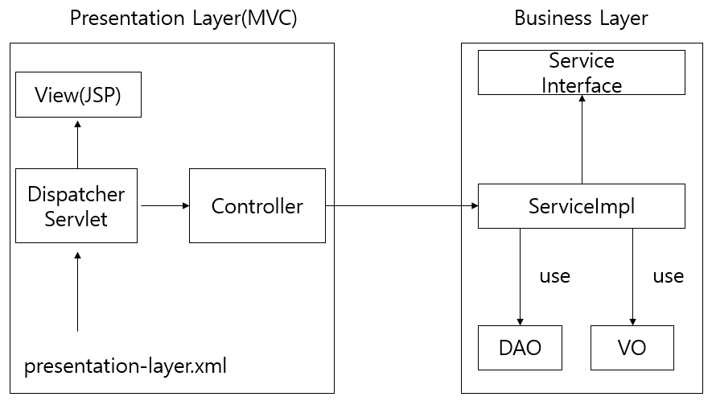

# Day4

## 어노테이션 기반 MVC 개발

**1. 어노테이션 관련 설정**

1. `<beans>` 루트 엘리먼트에 context 네임스페이스 추가
2. `HandlerMapping`, `Controller`, `ViewResolver` 클래스에 대한 `<bean>` 등록 대신
   `<context:component-scan>` 엘리먼트로 대체

```xml
<?xml version="1.0" encoding="UTF-8"?>
<beans xmlns="http://www.springframework.org/schema/beans"
	xmlns:xsi="http://www.w3.org/2001/XMLSchema-instance"
	xmlns:context="http://www.springframework.org/schema/context"
	xsi:schemaLocation="http://www.springframework.org/schema/beans
		http://www.springframework.org/schema/beans/spring-beans.xsd
		http://www.springframework.org/schema/context
		http://www.springframework.org/schema/context/spring-context-4.2.xsd">

	<context:component-scan base-package="com.springbook.view"></context:component-scan>
</beans>
```


**2. @Controller**

- 클래스 선언부 위에 `@Controller` 사용
- component scan으로 객체 생성 & `DispatcherServlet`이 인식하는 Controller 객체로 만듦
- `@Controller`를 사용하지 않으면 모든 컨트롤러 클래스는 스프링에서 제공하는 `Controller` 인터페이스를 구현해야 함
  -> 스프링에서 지향하는 POJO 스타일 클래스가 아님


**3. @RequestMapping**

```java
@Controller
public class InsertBoardController {

	@RequestMapping(value="insertBoard.do")
	public void insertBoard(HttpServletRequest request) {
        ...
    }
}
```

- `HandlerMapping`역할(클라이언트의 요청이 어떤 것인지 구분을 하게 해줌)
- value 속성은 생략 가능


**4. 클라이언트 요청 처리**

- 대부분 Controller는 사용자의 입력 정보 추출 -> VO 객체에 저장
  비즈니스 컴포넌트 메소드 호출 시 VO 객체를 인자로 전달
- But, 사용자 입력 정보가 많으면 자바 코드가 길어지고 정보가 변경이 되면 Controller 클래스를 수정해야 함
  -> **Command 객체**를 이용하여 해결
- **Command 객체** : Controller 메소드 매개변수로 받은 VO 객체
  Controller 메소드 실행 시 컨테이너가 사용자가 입력한 값들을 Command 객체에 세팅 후 전달해줌
  -> JSP 파일의 Form 태그 내의 파라미터 이름과 Command 객체의 Setter 메소드 이름이 일치해야 함

> - Command 객체의 이름은 클래스 이름의 첫 글자를 소문자로 변경한 것
> - DAO 객체 또한 매개변수로 선언 시 Command 객체처럼 컨테이너가 해당 객체를 생성하여 전달


## 어노테이션으로 게시판 프로그램 구현

**1. 요청 방식에 따른 처리**

1. `RequestMapping`의 `method` 속성

   - `@RequestMapping` 사용 시 Servlet처럼 클라이언트의 요청 방식(GET/POST)에 따라 수행될 메소드 설정 가능

2. JSP에서 Command 객체 사용

   - Command 객체에 저장된 데이터를 JSP에서 사용하려면 `${}` 구문 이용
   - 클라이언트가 URL입력/하이퍼링크 클릭하여 요청하면 기본이 GET방식

3. `@ModelAttribute` 사용

   - Command 객체의 이름을 변경

     ```java
     public String loginView(@ModelAttribute("user") UserVO vo) {...}
     ```

     

**2. Servlet API 사용**

- Controller 메소드 매개변수로 다양한 Servlet API 사용 가능


**3. 기타 어노테이션**

1. `@RequestParam`

   - Command 객체에 없는 파라미터를 Controller 클래스에서 사용할 때 사용
   - `HttpServletRequest`의 `getParamter()`메소드와 같은 기능의 어노테이션이라 할 수 있음

2. `@ModelAttribute`

   - Command 객체의 이름 변경
   - View에서 사용할 데이터를 설정
   - `@ModelAttribute`가 설정된 메소드는 `@RequestMapping` 메소드보다 먼저 호출됨
     `ModelAttribute` 메소드 실행 결과로 반환된 객체는 자동으로 Model에 저장됨

3. `SessionAttributes`

   - 수정 작업 처리 시 전달되지 않은 값이 null로 업데이트 되는 것 방지

     ```java
     @Controller
     @SessionAttributes("board") // Model에 "board"라는 이름의 데이터를 세션에도 자동으로 저장
     public class BoardController {
         ...
         // 글 수정
     	@RequestMapping("/updateBoard.do")
     	public String updateBoard(@ModelAttribute("board") BoardVO vo, BoardDAO boardDAO) {
             ...
         }
     }
     ```

     

## 프레젠테이션 레이어와 비즈니스 레이어 통합

**1. 비즈니스 컴포넌트 사용**



- Controller의 모든 메소드가 요청 처리 시 DAO 객체 직접 이용
  -> 비즈니스 컴포넌트를 이용해 DAO 객체를 사용해야 함

> DAO 객체 사용 시 비즈니스 컴포넌트를 이용해야 하는 이유
>
> 1. 유지보수 과정에서 DAO 클래스가 다른 클래스로 교체될 수 있음
> 2. AOP를 적용하기 위함(포인트컷을 인터페이스 구현 패키지가 실행될 때로 지정하여)


**2. 비즈니스 컴포넌트 로딩**

1. **2-Layered 아키텍처**

   

   - 프레임워크 기반의 웹 프로젝트의 일반적 구조
   - Controller 객체가 생성되기 전에 Controller에서 사용할 비즈니스 컴포넌트를 메모리에 생성해야 함
     -> `ContextLoaderListener` 사용

2. `ContextLoaderListener` 등록

   - 클라이언트의 요청이 없어도 컨테이너 구동 시 Pre-Loading 되는 객체


## 검색 기능

## 파일 업로드

**1. 파일 업로드 처리**

1. VO에 Getter/Setter 추가

   ```java
   public class BoardVO {
       ...
       private MultipartFile uploadFile;
   	
   	public MultipartFile getUploadFile() {
   		return uploadFile;
   	}
       
       // MultipartFile은 스프링 컨테이너가 생성
   	public void setUploadFile(MultipartFile uploadFile) {
   		this.uploadFile = uploadFile;
   	}
       ...
   }
   ```

   > `MultipartFile` : 클라이언트가 업로드한 파일에 대한 모든 정보 저장

2. dependency 추가

   ```xml
   pom.xml
   <!-- FileUpload -->
   <dependency>
       <groupId>commons-fileupload</groupId>
       <artifactId>commons-fileupload</artifactId>
       <version>1.3.1</version>
   </dependency>
   ```

   

3. `MultipartResolver` 설정

   ```xml
   <!-- 파일 업로드 설정 -->
   <bean id="multipartResolver" class="org.springframework.web.multipart.commons.CommonsMultipartResolver">
       <property name="maxUploadSize" value="100000"></property>
   </bean>
   ```

   - **id는 반드시 'multipartResolver'**
   - **multipartResolver**라는 이름의 `CommonsMultipartResolver` 객체가 없으면 컨테이너가 `MultipartFile` 객체 생성 불가


**2. 예외 처리**

1. 스프링 설정

   ```xml
   <beans xmlns="http://www.springframework.org/schema/beans"
   	xmlns:mvc="http://www.springframework.org/schema/mvc"
   	xsi:schemaLocation="http://www.springframework.org/schema/mvc http://www.springframework.org/schema/mvc/spring-mvc-4.2.xsd">
       <mvc:annotation-driven></mvc:annotation-driven>
   </beans>
   ```

   

2. 어노테이션 기반 예외 처리

   ```java
   @ControllerAdvice("com.springbook.view")
   public class CommonExceptionHandler {
   	
   	@ExceptionHandler(ArithmeticException.class)
   	public ModelAndView handlerArithmeticException(Exception e) {
   		ModelAndView mav = new ModelAndView();
   		mav.addObject("exception", e);
   		mav.setViewName("/common/arithmeticError.jsp");
   		return mav;
   	}
       
       ...
   }
   ```

3. XML 기반 예외 처리(더 간단, 클래스 구현 안해도 됨)

   ```xml
   <!-- 예외 처리 설정 -->
   <bean id="exceptionResolver"
         class="org.springframework.web.servlet.handler.SimpleMappingExceptionResolver">
       <property name="exceptionMappings">
           <props>
               <prop key="java.lang.ArithmeticException">
                   common/arithmeticError.jsp
               </prop>
               <prop key="java.lang.NullPointerException">
                   common/nullPointerException.jsp
               </prop>
           </props>
       </property>
       <property name="defaultErrorView" value="common/error.jsp"></property>
   </bean>
   ```

   

## 다국어 처리

**1. 메시지 파일 작성**

- 각 언어에 따른 메시지 파일(.properties)을 작성해야 함
- 파일명은 언어에 해당하는 Locale 정보를 포함하여 작성 (ex) ***_ko.properties)


**2. MessageSource 등록**

- 스프링 설정 파일에 메시지 파일을 읽어 들이는 `MessageSource` 클래스를 `<bean>` 등록

- `ResourceBundleMessageSource` 클래스의 id는 항상 **messageSource**

- 메시지 파일 등록 시 확장자(.properties)와 언어(_en, _ko)는 생략

  ```xml
  <!-- 다국어 설정 -->
  <!-- MessageSource 등록 -->
  <!-- id는 반드시 "messageSource" -->
  <bean id="messageSource" class="org.springframework.context.support.ResourceBundleMessageSource"
        <property name="basenames">
  		<list>
              <value>message.messageSource</value>
  		</list>
  	</property>
  </bean>
  ```


**3. LocaleResolver 등록**

- `LocaleResolver` : 클라이언트의 Locale 정보 추출, Locale에 해당하는 언어의 메시지 적용

- 세션에서 Locale 정보 추출 후 세션을 유지하는 `SessionLocaleResolver`를 가장 많이 사용

- `LocaleResolver`의 id는 항상 **localResolver**

  ```xml
  <!-- LocaleResolver 등록 -->
  <bean id="localeResolver" class="org.springframework.web.servlet.i18n.SessionLocaleResolver"></bean>
  ```

  

**4. Locale 변경**

- 화면의 언어 변경 할때 사용

  ```xml
  <beans ...
  	xmlns:mvc="http://www.springframework.org/schema/mvc"
  	xsi:schemaLocation="http://www.springframework.org/schema/mvc
                          http://www.springframework.org/schema/mvc/spring-mvc-4.2.xsd">
      <!-- LocaleChangeInterceptor 등록 -->
      <mvc:interceptors>
          <bean class="org.springframework.web.servlet.i18n.LocaleChangeInterceptor">
              <property name="paramName" value="lang"></property>
          </bean>
      </mvc:interceptors>
  </beans>
  ```

  

## 데이터 변환

**1. JSON으로 변환**

1. Jackson2 라이브러리(JSON 데이터로 변환하기 위함)

   ```xml
   <!-- Jackson2 -->
   <dependency>
       <groupId>com.fasterxml.jackson.core</groupId>
       <artifactId>jackson-databind</artifactId>
       <version>2.7.2</version>
   </dependency>
   ```

   

2. `HttpMessageConvertor` 등록

   - 클라이언트로 보낼 응답 결과를 HTTP body에 JSON이나 XML으로 변환하여 저장하기 위함

   - 자바 객체를 JSON으로 변환할 때는 `MappingJackson2HttpMessageConverter` 사용

     ```xml
     <mvc:annotation-driven></mvc:annotation-driven>
     ```

3. 링크 추가

   - `@ResponseBody` 가 설정된 메소드의 반환 값을 JSON으로 변환하여 HTTP 응답 body에 저장
