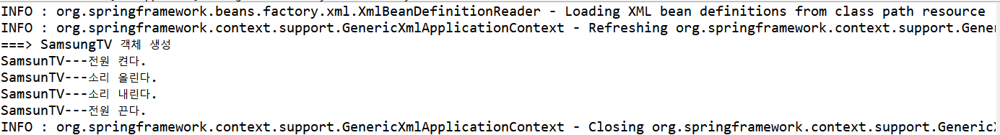

# CLASS02 프레임워크 개요

# 프레임워크 개념

- 개발에서 기본이 되는 뼈대나 틀 제공
- 애플리케이션의 기본 아키텍처 제공


## 프레임워크의 장점

- 분석, 설계, 구현에서 재사용성 증가

1. 빠른 구현 시간

2. 쉬운 관리

3. 개발자들의 역량 획일화

4. 검증된 아키텍처의 재사용과 일관성 유지


## 프레임 워크 종류

- **Spring(MVC)**
  - 처리영역 : Presentation
  - MVC아키텍쳐 제공
  - UI Layer프레임워크
  - Spring프레임워크에 포함


- **Spring(IoC, AOP)**
  - 처리영역 : Business
  - 컨테이너 성격
  - IoC, AOP 모듈 이용하여 Spring 컨테이너에서 동작하는 엔터프라이즈 비즈니스 컴포넌트 개발 가능
    - IoC(Inversion of Control, 제어의 역행)


- Hibernate 
  - 처리영역 : Persistence
  - ORM(Object Relation Mapping)프레임워크
  - SQL명령어 자체 생성해 DB연동


- **JPA**
  - 처리영역 : Persistence
  - 모든 ORM의 공통 인터페이스 제공하는 자바 표준 API


- Ibatis
  - 처리영역 : Persistence
  - `SQL` + `자바객체(VO / DTO)` 매핑
  - SQL 명령어의 재사용


- **Mybatis**
  - Ibatis에서 파생된 프레임워크 


# 스프링 프레임워크

> IoC와 AOP를 지원하는 경량의 컨테이너 프레임워크

- POJO(Plain Old Java Object)형태의 클래 관리


# IoC(Inversion of Control) 컨테이너

- 일련의 작업들을 소스코드로 처리하지 않고, 컨테이너로 처리하는 것을 의미
- 객체 생성과 의존 관계에 대한 코드가 사라짐
  - 낮은 결합도의 컴포넌트 구현 가능


## 결합도 낮추는 방법

### 1. 다형성 이용하기

- 결합도를 낮추기 위함
- 상속, 메소드 재정의(Overriding), 형변환 필요
  - 객체지향 언어는 이를 문법으로 지원
  - <u>인터페이스를 이용</u>해 모든 하위 클래스가 같은 메소드를 가지도록 강제함


### 2. 디자인 패턴 이용하기

- Factory사용해 객체 반환
- 클라이언트 소스를 수정하지 않고, 객체 교환 가능


---

---

# CLASS03 스프링 컨테이너 및 설정 파일

# 스프링 컨테이너

- IoC컨테이너는 각 컨테이너에서 관리할 객체들을 위한 별도의 설정 파일 존재

- `Spring Bean Configuration File` 추가

  - `applicationContext.xml`
  - `<beans>` 루트 엘리먼트와 네임스페이스 관련 설정 추가
    - class 속성 값에 <u>패키지명 포함된 전체 클래스 경로 지정</u>

  ```xml
  <bean id="tv" class="polymorphism.SamsungTV"/>
  ```


- `TVUser.java`

```java
package polymorphism;

import org.springframework.context.support.AbstractApplicationContext;
import org.springframework.context.support.GenericXmlApplicationContext;

public class TVUser {

	public static void main(String[] args) {
		
		// 1. Spring 컨테이너를 구동한다
		AbstractApplicationContext factory = new GenericXmlApplicationContext("applicationContext.xml");
		
		// 2. Spring 컨테이너로부터 필요한 객체를 요청
		TV tv = (TV)factory.getBean("tv"); // 이름이 tv인 객체 요청
		tv.powerOn();
		tv.volumeUp();
		tv.volumeDown();
		tv.powerOff();
		
		// 3. Spring 컨테이너 종료
		factory.close();
	}

}

```




## 스프링 컨테이너 구동과정

1. TVUser 클라이언트가 스프링 설정 파일 로딩하여 컨테이너 구동
   - `applicationContext.xml`
2. Spring 설정 파일의  `<bean>` 등록된 SamsungTV 객체 생성
   - `<bean id="tv" class="polymorphism.SamsungTV"/>`
3. getBean()메소드로 이름이 "tv"인 객체 요청(Lookup)
4. SamsungTV객체 반환

---

- 여기서 SamsungTV가 아닌 LgTV로 변경시 `applicationContext.xml`파일만 수정

- BeanFactory 클래스 이용하는 것보다 유지, 복수 수월


## 스프링 컨테이너 종류

### 1. BeanFactory

- `<bean>`객체 생성, 관리
  - 가장 기본적 컨테이너 기능 제공

- 지연로딩(Lazy Loading) 방식
  - **클라리언트의 요청**에 의해서만**`<bean>`객체 생성**
- <u>일반적 스프링 프로젝트에서 사용할 일 거의 없음</u>


### 2. ApplicationContext

- BenaFactory 기능 포함
  - `<bean>`객체 생성, 관리
- 트랜잭션 관리
- 메시지 기반의 다국어 처리
- 즉시로딩(pre-loading) 방식
  - **컨테이너가 구동되는 시점**에 `<bean>`에 등록된 **클래스 객체 생성**


#### 2-1. <u>GenericXml</u>ApplicationContext

- 파일 시스템이나 클래스 경로에 있는 XML 설정 파일을 로딩하여 구동하는 컨테이너
- 우리가 직접 객체 생성해서 구동


#### 2-2. <u>XmlWeb</u>ApplicationContext

- 웹 기반의 스프링 애플리케이션을 개발할 때 사용하는 컨테이너
- 우리가 직접 생성하지 않음


# 스프링 컨테이너

>XML설정 파일 참조해` <bean> `의 생명주기 관리

- XML 설정파일 = `<bean> `저장소
- 객체의 생성과 의존관계를 컨테이너가 자동으로 관리


## `<beans>`<u>루트</u> 엘리먼트

- `<beans>`를 루트 엘리먼트로 사용
- 네임스페이스, 스키마 문서 위치 등록 가능


## `<import>`엘리먼트

- 기능별  XML파일로 나누어진 설정 파일들을 하나로 통합할 때 사용
- import태그로 한 파일에 작성하는 효과


## `<bean>`엘리먼트

- 스프링 설정 파일에 클래스 등록위해 사용
- id, class속성명 사용


### `<bean>`엘리먼트 속성

#### id속성

- 생략 가능
- `<bean>`객체를 위한 이름을 지정할 때 사용하는 속성
- 스프링 컨테이너가 생성한 객체들 사이에서 유일해야 함
- 자바 식별자 작성 규칙
- 낙타표기법 사용
- cf) name속성 -  자바 식별자 작성 규칙을 따르지 않음, 특수기호 포함된 아이디 기입시 사용


#### class

- 필수 속성
- 정확한 패키지명 기입
- 자동완성 기능 이용하기


#### init-method 속성

- 객체를 생성한 후, 멤버변수 초기화 작업시 사용

```xml
<bean id="tv" class="polymorphism.SamsungTV" init-method="initMethod" />
```

- 스프링 컨테이너는 `<bean>`등록된 클래스 객체를 생성한 후, init-method속성으로 지정된 `initMethod()`메소드 호출


#### destroy-method 속성

- 스프링 컨테이너가 객체를 삭제하기 직전에 호출될 임의의 메소드 지정

```xml
<bean id="tv" class="polymorphism.SamsungTV" destroy-method="destroyMethod" />
```

- 컨테이너가 종료되기 직전, 컨테이너는 자신이 관리하는 모든 객체를 삭제
  - 이떄, destroy-method 속성으로 지정한 destroyMethod()는 SamsungTV객체 삭제되기 직전 호출


#### lazy-init 속성

- 해당 `<bean>`이 <u>사용되는 시점에 객체를 생성하는 속성</u>
  - ApplicationContext이용해 컨테이너 구동시 즉시 로딩방식으로 동작
    - 자주 사용되지 않는 `<bean>`은 많은 메모리 차지하기 때문
- true설정 : 클라이언트 요청 시, `<bean>`생성
- 효율적 메모리 관리 

```xml
<bean id="tv" class="polymorphism.SamsungTV" lazy-init="true" />
```


#### scope 속성

- 컨테이너가 생성산 bean을 어느 범위에서 사용할지 지정할 때 사용
- 기본이 싱글톤
  - 싱글톤 : 하나의 객체만 생성하도록 제어

```xml
<bean id="tv" class="polymorphism.SamsungTV" scope="singleton" />
```

```java
package polymorphism;

import org.springframework.context.support.AbstractApplicationContext;
import org.springframework.context.support.GenericXmlApplicationContext;

public class TVUser {

	public static void main(String[] args) {
		
		// 1. Spring 컨테이너를 구동한다
		AbstractApplicationContext factory = new GenericXmlApplicationContext("applicationContext.xml");
		
		// 2. Spring 컨테이너로부터 필요한 객체를 요청한다.
		// scope="singleton", SamsungTV 객체는 메모리에 하나만 생성되어 유지
        // scope="protorype", SamsungTV 객체는 호출하는만큼 메모리 차지
		TV tv1 = (TV)factory.getBean("tv");
		TV tv2 = (TV)factory.getBean("tv");
		TV tv3 = (TV)factory.getBean("tv");
		
		
		// 3. Spring 컨테이너 종료
		factory.close();
	}

}

```


- `scope="prototype"`
  - `<bean>`이 요청될 때마다 매번 새로운 객체 생성해 반환

```xml
<bean id="tv" class="polymorphism.SamsungTV" scope="prototype" />
```


---

---

# CLASS04 의존성 주입


# Dependency Lookup

- 실제 개발과정에서 사용하지 않음
- 컨테이너가 애플리케이션 운용에 필요한 객체를 생성, 클라이언트는 컨테이너가 생성한 객체를 검색(Lookup)하여 사용하는 방식


# Dependency Injection

- 실제 개발에서 사용
- 객체 사이의 <u>의존관계를</u> 스프링 설정 파일(XML)에 등록된 정보를 바탕으로 <u>컨테이너가 자동으로 처리</u>
- 코드 수정 없이 <u>스프링 설정 파일(XML) 수정만으로 변경사항 적용 가능</u>
  - 유지 보수 향상 
- **코딩 컨벤션에 따라 대부분 Setter Injection사용**
  - Setter메소드가 제공되지 않는 클래스만 생성자 인젝션 사용


## 1. DI : Setter Injection(세터 인젝션)

- Setter 메소드를 호출하여 의존성 주입 처리
- XML의 `<bean>`등록 설정에서 시작/종료 태그 사이에 `<property>`엘리먼트 사용
  - <u>`name`속성</u>에 <u>호출하고자 하는 메소드  이름</u>
  - ex) `setSpeaker()`-> `name="speaker"`
  - ex) `setAddressList()`-> `name="addressList"`
  - ex) `setBoardDAO()`-> `name="boardDAO"`
- **`<property>`대신 p네임스페이스 사용 가능**
  - `<bean id="tv" class="polymorphism.SamsungTV" p:speaker-ref="sony" p:price="270000"/>`


## 2. DI : Constructor Injection(생성자 인젝션)

- 생성자를 이용하여 의존성 처리

- 생성자의 매개변수로 의존관계에 있는 객체의 주소 정보 전달 가능

- XML의 `<bean>`등록 설정에서 시작/종료 태그 사이에 `<constructor-arg>`엘리먼트 사용

  - `ref`속성에 <u>호출하고자 하는 id명</u>
  - `applicationContext.xml`

  ```xml
  ...
  
  <bean id="tv" class="polymorphism.SamsungTV">
  	<constructor-arg ref="sony"></constructor-arg>
  </bean>
  
  <bean id="sony" class="polymorphism.SonySpeaker"></bean>
  ```


- `value`속성 : 고정된 문자열이나 정수같은 기본형 데이터 참조

```xml
<bean id="tv" class="polymorphism.SamsungTV">
    <constructor-arg ref="sony"></constructor-arg>
    <constructor-arg value="2700000"></constructor-arg>
</bean>

<bean id="sony" class="polymorphism.SonySpeaker"></bean>
```


- `index`속성 : 어떤 값이 몇 번째 매개변수로 매핑됐는지 확인가능

```xml
<bean id="tv" class="polymorphism.SamsungTV">
    <constructor-arg index="0" ref="sony"></constructor-arg>
    <constructor-arg index="1" value="2700000"></constructor-arg>
</bean>

<bean id="sony" class="polymorphism.SonySpeaker"></bean>
```


# 의존성 관계

> 객체와 객체의 결합 관계

- 하나의 객체에서 다른 객체의 변수나 메소드 이용
  - SamsungTV에서 SonySpeaker사용
- 객체 생성과 생성된 객체의 레퍼런스 정보 필요


## 스프링 컨테이너

- 기본적으로 <u>bean 등록된 순서대로 객체 생성</u>
- 모든 객체는 기본 생성자 호출 원칙
  - 여기선 SonySpeaker 객체를 매개변수로 받아들이는 생성자 호출
- **BUT**, <u>생성자 인젝션</u>으로 의존성 주입될 경우 <u>먼저 객체 생성</u>
  - 여기선 SonySpeaker가 먼저 호출


# 컬렉션(Collection) 객체 설정

## 컬렉션(Collection)?

>데이터의 집합, 그룹

> 여러 원소들을 담을 수 있는 자료구조 = **배열**

- JCF(Java Collections Framework)는 이러한 데이터, 자료구조인 컬렉션과 이를 구현하는 클래스를 정의하는 인터페이스 제공
- Java 컬렉션 프레임워크 상속구조


## 컬렉션 인터페이스 종류

| 인터페이스 |                             설명                             |                       구현 클래스                       |
| :--------: | :----------------------------------------------------------: | :-----------------------------------------------------: |
| `List<E>`  |        순서가 있는 데이터 집합 <br />데이터 중복 허용        | Vector, ArrayList, <br />LinkedList, <br />Stack, Queue |
|  `Set<E>`  |        순서 없는 데이터 집합 <br />데이터 중복 허용X         |                    HashSet, TreeSet                     |
| `Map<K,V>` | 키, 값의 한쌍으로 이뤄진 데이터 집합 <br />순서 X <br />키는 중복허용X, 값은 중복가능 |      HashMap, TreeMap,<br /> Hashtable, Properties      |

- ex)

```java
ArrayList<String> arrayList = new ArrayList<String>();
 
LinkedList<String> linkedList = new LinkedList<String>();

HashMap<Integer, String> hashMap = new HashMap<Integer, String>();
```


## 컬렉션 유형

|      컬렉션유형      | 엘리먼트  |
| :------------------: | :-------: |
| java.util.List, 배열 | `<list>`  |
|    java.util.Set     |  `<set>`  |
|    java.util.Map     |  `<map>`  |
| java.util.Properties | `<props>` |


- Map타입 : 특정 key로 데이터 등록
- Properties타입 : key=value형태의 데이터 등록


---

---


# CLASS05 어노테이션 기반 설정

- Context 네임스페이스 추가, component-scan설정 필요

- **어노테이션은 XML설정 부담을 줄여줌**
- 스프링 설정 파일의 루트 엘리먼트인 beans에 Context관련 <u>네임스페이스</u>와 <u>스키마 문서</u> 위치 등록

```xml
<?xml version="1.0" encoding="UTF-8"?>
<beans xmlns="http://www.springframework.org/schema/beans"
	xmlns:xsi="http://www.w3.org/2001/XMLSchema-instance"
	xmlns:p="http://www.springframework.org/schema/p"
	xmlns:context="http://www.springframework.org/schema/context"
	xsi:schemaLocation="http://www.springframework.org/schema/beans 														       http://www.springframework.org/schema/beans/spring-beans.xsd
						http://www.springframework.org/schema/context
						http://www.springframework.org/schema/context/spring-context-4.2.xsd">
	<context:component-scan base-package="polymorphism"></context:component-scan>
</beans>
```


## @Component

- 사용할 객체들을 스프링 설정 파일의  `<bean>`에 등록하지 않으려면 `<context:component-scan/>`엘리먼트 정의 필요

  - `<context:component-scan base-package="polymorphism"></context:component-scan>`

- `@Component` 설정된 클래스들은 자동으로 객체 생성

  - **해당 클래스에 <u>기본 생성자가 있어야만</u> 컨테이너가 객체 생성 가능**

  

- `@Component("id/name")` 
  - ex) `@Component("samsungTV")`
  - id, name명 필요
  - 지정하지 않았다면 클래스 이름의 첫글자를 소문자로 변경해서 사용


### @Component와 @ Bean의 차이

- @Component는 개발자가 직접 컨트롤 가능한 class 경우
- @Bean은 개발자가 컨트롤이 불가능한 **외부 라이브러리들을 Bean으로 등록하고 싶은 경우**


# 의존성 주입 어노테이션

| 어노테이션 | 설명                                                         |
| ---------- | ------------------------------------------------------------ |
| @Autowired | 주로 변수 위에 설정 <br />해당 타입의 객체를 찾아 자동 할당 <br />org.springframework.beans.factory.annotation.Autowired; |
| @Qualifier | 특정 객체의 이름 이용하여 의존성 주입 <br />org.springframework.beans.factory.annotation.Qualifier; |
| @Inject    | @Autowired와 동일한 기능 제공                                |
| @Resource  | Autowired와 @Qualifier기능 결합                              |


## @Autowired

>필요한 의존 객체의 “타입"에 해당하는 빈을 찾아 주입

- 생성자, 메소드, 멤버변수 위에 모두 사용 가능
  - 대부분 멤버변수 위에 선언
- 스프링 컨테이너는 **@Autowired가 붙은 변수를 확인하는 순간, <u>해당 변수의 "타입"</u> 체크**
  - 그 타입의 객체가 메모리에 존재하는지 확인 후, 그 객체를 변수에 주입
  - 메모리에 없다면 `NoSuchBeanDefinitionException`발생

```java
@Autowired
	private Speaker speaker; // @Autowired로 인해, speaker타입의 객체를 찾아 speaker변수에 주입
```


## @Qualifier(객체id/이름)

> 의존성 주입 대상을 식별하기 위해 사용

- 특정한 객체의 이름이용

```java
package polymorphism;

import org.springframework.beans.factory.annotation.Autowired;
import org.springframework.beans.factory.annotation.Qualifier;
import org.springframework.stereotype.Component;

@Component("tv")
public class LgTV implements TV {
	
	@Autowired
	@Qualifier("apple")
	private Speaker speaker; // @Autowired로 인해, speaker타입의 객체를 찾아 speaker변수에 주입
	
	
	...
```


## @Resource

> **객체의 이름 이용**하여 의존성 주입 처리

> `@Autowired` + `@Qualifier("특정객체명")` = `@Resource(name="특정객체명")`

- name속성 사용가능
  - 컨테이너가 이름으로 생성된 객체 검색

```java
package polymorphism;

import javax.annotation.Resource;

import org.springframework.stereotype.Component;

@Component("tv")
public class LgTV implements TV {
	
//	@Autowired 
//	@Qualifier("apple")
	@Resource(name="apple") // apple이라는 이름으로 메모리에 생성된 AppleSpeaker객체를 speaker변수에 할당
	private Speaker speaker; 
	
	...
```


- cf) @Autowired : **변수의 타입을 기준**으로 객체 검색하여 의존성 주입 처리
- @Inject도 @Resource와 같은 기능


# 어노테이션과 XML설정 병행하여 사용하기

- XML설정과 어노테이션 설정은 장단점 상충
  - 적절히 섞어 사용하면 유지보수 편리
  - 클라리언트가 요청할 객체는 @Component와 @Autowired로 처리하고, 특정 객체를 사용할 때 bean이용 

- 즉, **<u>변경되지 않는 객체는 어노테이션</u>으로 설정, <u>변경될 가능성 있는 객체는 XML</u>로 설정**

- BUT, 라이브러리 형태로 제공되는 클래스는 반드시 XML설정을 통해서만 사용 가능
  - ex) BigDataSource클래스


# 추가 어노테이션

| 어노테이션  |      위치      |                    의미                     |
| :---------: | :------------: | :-----------------------------------------: |
|  @Service   | XXXServiceImpl |  **비즈니스 로직** 처리하는 Service클래스   |
| @Repository |     XXXDAO     |       DB**연동을** 처리하는 DAO클래스       |
| @Controller | XXXController  | 사용자 **요청을 제어**하는 Controller클래스 |


# CLASS06 비즈니스 컴포넌트 실습

- 일반적으로 비즈니스 컴포넌트는 4개의 자바 파일로 구성
- ex) BOARD테이블 관련된 BoardService컴포넌트에 대한 클래스 
  - BoardVO, BoardDAO, BoardService, BoardServiceImpl


## VO(Value Object) = DTO(Date Transfer Object)

> 레이어와 레이어 사이에서 <u>관련된 데이터를 한꺼번에 주고받을 목적</u>으로 사용하는 클래스

- 데이터 전달 목적


1. DB에 생성되어 있는 BOARD테이블 구조 확인하기 
2. BOARD테이블 명 + Vo / DTO 붙인 클래스 이름으로 생성
3. BOARD테이블에 포함된 칼럼과 같은 이름의 멤버변수를 private접근제한자로 선언
4. Getters/Setters메소드 선언
5. 옵션으로 toString()메소드 생성해 놓기
   - VO객체의 값 출력시 요긴하게 사용가능
   - 코드 제너레이션 기능 이용
     - 전부체크


## DAO(Data Access Object)

> DB연동 담당 클래스

- CRUD(Create, Read, Update, Delete) 기능의 메소드 구현필요
  - JDBC드라이버 필요

- 이 클래스 객체를 스프링 컨테이너가 생성할 수 있도록 `@Repository`어노테이션 설정
- 독립된 클래스로 구현되어야 함(implements X)


|   기능    |      메소드 이름       |
| :-------: | :--------------------: |
|   등록    |     insert테이블명     |
|   수정    |     update테이블명     |
|   삭제    |     delete테이블명     |
| 상세 조회 |   get/select테이블명   |
| 목록 검색 | get/select테이블명List |


## Service 인터페이스

- DAO클래스에서 `Alt + Shift + T`통해 Service 인터페이스 작성
  - 이때, DAO에 생성되는 implements지우기


## Service 구현 클래스

- Service 인터페이스를 구현한 ServiceImpl클래스
  - Service인터페이스에서 구현한 모든 추상 메소드 재정의(Overriding)필요
- 멤버변수로 선언된 BoardDAO 이용
  - DB연동이 포함된 비즈니스 로직 처리 위함


