# CLASS01 스프링AOP(Aspect Oriented Programming)

- 낮은 결합도, 높은 응집도 중요
  - IoC는 결합도와 AOP는 응집도와 관련
  - DI(Dependency Injection: 의존성 주입) 이용시, 결합도 낮출 수 있음


- 비즈니스 로직은 겨우 3~5줄
  - 나머지는 부가적 코드(로깅, 예외 트랜잭션 등) → 복잡도 증가
  - 우리가 구현하는 메소드마다 이런 부가적 코드들을 매번 반복해야 함
  - **AOP는 이런 부가적 코드들을 효율적으로 관리**


## AOP의 관심 분리(Separation of Concerns)

### 1. 횡단 관심(Crosscutting Conserns)

> 메소드마다 공통으로 등장하는 로깅, 예외, 트랜잭션 처리 같은 공통 코드


### 2. 핵심 관심(Core Concerns)

> 사용자의 요청에 따라 실제로 수행되는 핵심 비즈니스 로직


- 두 관심을 분리하면 간결하고, 응집도 높은 코드 유지 가능
  -  BUT, 기존의 OOP언어에서는 공통코드를 완벽하게 독립시키기 어려움


## AOP 시작하기

- AOP라이브러리 추가
  - `pom.xml`파일 수정
- 네임스페이스 추가 및 AOP설정
  - `applicationContext.xml`
- AOP사용시, 핵심 관심 메소드와 횡단 관심 메소드 사이엣 소스상의 결합 발생X


# CLASS02 AOP 용어 및 기본 설정

## AOP기본 용어

### 조인포인트(Joinpoint)

> = 포인트컷(Pointcut) 대상, 포인트컷(Pointcut) 후보

> 클라이언트가 호출하는 모든 <u>**비즈니스 메소드 (= 핵심 관심 메소드)**</u>

- BoardServiceImpl, UserServiceImpl과 같은 클래스의 모든 메소드 


### 포인트컷(Pointcut)

> **필터링된** 조인포인트

- ex) 트랜잭션을 처리하는 공통기능을 만들었다면 

  - 등록, 수정, 삭제 기능의 비즈니스 메소드엔 동작 / 검색 기능의 메소드엔 동작 필요X

- 원하는 특정 메소드에서만 횡단 관심에 해당하는 공통 기능 수행위해 포인트컷 필요

- `<aop:pointcut>`엘리먼트 선언해 사용

  ```xml
  <aop:pointcut id="getPointcut" expression="execution(* com.springbook.biz..*Impl.get*(..))"/>
  ```

  - id속성 : 포인트컷을 식별할 유일한 문자열 선언
  - expression속성에 따라 필터링 되는 메소드가 달라짐


### 어드바이스(Advice)

> **<u>횡단 관심에 해당</u>**하는 공통 기능의 코드 의미

- 독립된 클래스의 메소드로 작성
  - 언제 동작하리 스프링 설정파일 통해 지정 가능

- ex) 트랜잭션 관리 기능의 어드바이스 메소드 존재
  - 비즈니스 로직 수행 후, 트래낵션 커밋 / 롤백 처리
  - 동작시점 : after(공통 로그의 위치 변화)

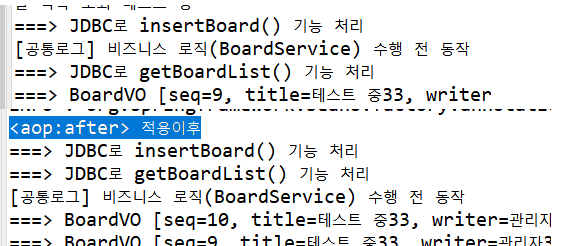


#### 어드바이스의 동작 시점

- before
- after
- after-returning
- after-thorwing
- around


### 위빙(Weaving)

> 포인트컷으로 지정한 핵심 관심 메소드가 호출될 때, 어드바이스에 해당하는 횡단 관심 메소드가 삽입되는 과정

- 비즈니스 메소드를 수정하지 않고도 횡단 관심에 해당하는 기능 추가, 변경 가능
- 스프링에선 런타임 위빙 방식만 지원


### 애스팩트(Aspect) / 어드바이저(Advisor)

> **<u>포인트컷(핵심 관심) + 어드바이스(횡단관심 : 공통 코드)</u>**

> 어떤 포인트컷 메소드에 대해 어떤 어드바이스 메소드 실행할지 결정

- AOP의 핵심

- `<aop:aspect>`사용
  - 단, 트랜잭션 설정시 `<aop:advisor>`사용


## AOP엘리먼트

- XML방식과 어노테이션 방식으로 지원

- `applicationContext.xml`

```xml
	...

	<bean id="log" class="com.springbook.biz.common.LogAdvice"></bean>
	<aop:config>
		<aop:pointcut id="allPointcut" expression="execution(* com.springbook.biz..*Impl.*(..))"/>
		<aop:pointcut id="getPointcut" expression="execution(* com.springbook.biz..*Impl.get*(..))"/>
		<aop:aspect ref="log">
			<aop:after pointcut-ref="getPointcut" method="printLog"/>
		</aop:aspect>
	</aop:config> 
	
	
	...
```


### `<aop:config>`

> 루트 엘리먼트

- 여러 번 사용 가능
- 하위엔 `<aop:pointcut>`, `<aop:aspect>` 위치 가능


### `<aop:pointcut>`

> 포인트 컷 지정위해 사용

- 여러 개 지정 가능
-  `<aop:config>`,  `<aop:aspect>`의 자식 엘리먼트로 사용가능
  - 단,  `<aop:aspect>`가 부모 엘리먼트면 해당  `<aop:aspect>`에서만 사용 가능

- id할당으로  `<aop:aspect>`서렁시 포인트 컷 참조하는 용도


### ★`<aop:aspect>`★

> 핵심 관심에 해당하는 포인트컷 메소드와 횡단 관심에 해당하는 어드바이스 메소드 결합위해 사용

- aspect설정 결과에 따라 위빙 결과 달라짐

- 어드바이스 id, 메소드명 알아야 사용 가능


### `<aop:advisor>`

> 핵심 관심에 해당하는 포인트컷 메소드와 횡단 관심에 해당하는 어드바이스 메소드 결합위해 사용

>`<aop:aspect>`와 같은 기능

- `<aop:aspect>`를 사용하지 못할 때 사용


## 포인트컷 표현식

```xml
<aop:pointcut id="getPointcut" expression="execution(* com.springbook.biz..*Impl.get*(..))"/>
```

- expression
  - `*` : 리턴타입
  - `com.springbook.biz..` : 패키지 경로
  - `*Impl` : 클래스명
  - `get*(..)` : 메소드명(매개변수)


### 리턴타입 지정

| 표현식 |                설명                |
| :----: | :--------------------------------: |
|   *    |         모든 리턴타입 허용         |
|  void  |   리턴타입이 void인 메소드 선택    |
| !void  | 리턴타입이 void가 아닌 메소드 선택 |


### 패키지 지정

|          표현식          |                             설명                             |
| :----------------------: | :----------------------------------------------------------: |
|    com.springbook.biz    |                  com.springbook.biz만 선택                   |
|   com.springbook.biz..   |        com.springbook.biz로 시작하는 모든 패키지 선택        |
| com.springbook.biz..impl | com.springbook.biz로 시작하면서 마지막 패키지 이름이 impl로 끝나는 패키지 선택 |


### 클래스 지정

|      표현식      |                             설명                             |
| :--------------: | :----------------------------------------------------------: |
| BoardServiceImpl |                   BoardServiceImpl만 선택                    |
|      *Impl       |                 Impl로 끝나는 클래스만 선택                  |
|  BoardService+   | 클래스 이름 뒤의 + : 해당 클래스로부터 파생된 모든 자식 클래스 선택, <br />인터페이스 뒤의 + : 해당 인터페이스 구현한 모든 클래스 선택 |


### 메소드 지정

|  표현식  |                  설명                  |
| :------: | :------------------------------------: |
|  *(..)   | 가장 기본 설정 ,<br />모든 메소드 선택 |
| get*(..) |   get으로 시작하는 모든 메소드 선택    |


### 매개변수 지정

|            표현식             |                             설명                             |
| :---------------------------: | :----------------------------------------------------------: |
|             (..)              |      가장 기본 설정 매개변수의 개수, <br />타입에 제약X      |
|              (*)              |           반드시 1개의 매개변수 가지는 메소드 선택           |
| (com.springbook.user.UserVO)  | 매개변수로 UserVO를 가지는 메소드만 선택, <br />클래스의 패키지 경로 반드시 포함 |
| (!com.springbook.user.UserVO) |        매개변수로 UserVO를 가지지 않는 메소드만 선택         |
|         (Integer, ..)         | 한 개 이상의 매개변수, <br />첫 번째 매개변수 타입이 Integer |
|         (Integer, *)          | 반드시 두 개의 변수 가져야 함, <br />첫 번째 매개변수 타입이 Integer |


# CLASS03 어드바이스 동작 시점

- 동작 시점은 각 AOP기술마다 다름

| 동작 시점 |                             설명                             |
| :-------: | :----------------------------------------------------------: |
|  Before   |                 비즈니스 메소드 실행 전 동작                 |
|   After   | - After Returning : 비즈니스 메소드가 성공적으로 리턴되면 동작 <br />- After Throwing : 비즈니스 메소드 실행 중 예외발생 시 동작(try ~ catch의 catch에 해당)<br />- After : 비즈니스 메소드 실행 후, 무조건 실행((try ~ catch ~ finally의 finally에 해당) |
|  Around   | 메소드 호출 자체를 가로채 비즈니스 메소드 실행 전후에 처리할 로직 삽입 가능 |


- `<aop:aspect>` 엘리먼트 하위에 어드바이스 메소드의 동작시점 지정


## Before 어드바이스

- 포인트컷으로 지정된 메소드 호출 시, 메소드가 <u>실행되기 전에 처리될 내용</u>들을 기술하기 위해 사용
  - 즉, 비즈니스 로직 수행 전 호출

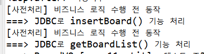


## After Returning 어드바이스

- 포인트컷으로 지정된 메소드가 <u>정상적으로 실행되고 나서</u>, 메소드 수행 결과로 생성된 데이터를 리턴하는 시점에 동작
- 비즈니스 메소드 수행 결과로 얻은 데이터를 이용하여 사후 처리 로직 추가시 사용


## After Throwing 어드바이스

- 포인트컷으로 지정한 메소드가 <u>실행되다가 예외가 발생하는 시점</u>에 동작
  - **예외처리 어드바이스 설정 시, 사용**

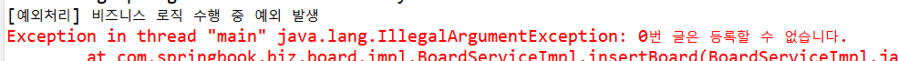


## After 어드바이스

- <u>예외 발생 여부에 상관없이 무조건 수행</u>되는 어드바이스 등록시 사용

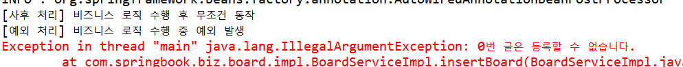

- 예외가 발생한 상황에서 먼저 after로 설정한 finallyLog()메소드가 먼저 실행


## Around 어드바이스

- 하나의 어드바이스가 비즈니스 메소드 실행 전, 후에 모두 동작하여 로직 처리
- 클라이언트의 메소드 호출 가로챔
  - 비즈니스 메소드 실행 전, 호출
    - ProceedingJoinPoint 객체를 매개변수로 받아야 가능
    - ProceedingJoinPoint 객체의 proceed() 메소드 통해 비즈니스 메소드 호출 가능
  - 비즈니스 메소드 실행 후, 호출

```java
package com.springbook.biz.common;

import org.aspectj.lang.ProceedingJoinPoint;

public class AroundAdvice {
	public Object aroundLog(ProceedingJoinPoint pjp) throws Throwable{
		System.out.println("[BEFORE]: 비즈니스 메소드 수행 전, 처리할 내용 - Before어드바이스와 동일하게 동작");
		Object returnObj = pjp.proceed();
		System.out.println("[AFTER]: 비즈니스 메소드 수행 후, 처리할 내용 - After어드바이스와 동일하게 동작");
		return returnObj;
	}
}

```

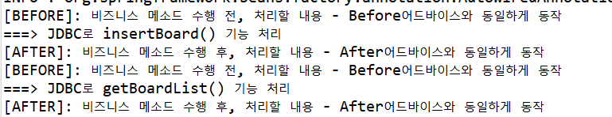


- 나머지 어드바이스에서는 JoinPoint 사용해야 하고, <u>Aroud어드바이스만 ProceedingJoinPoint를 매개변수로 사용</u>해야 함
  - `proceed()`메소드가 필요하기 때문


# CLASS04 JoinPoint와 바인드 변수

- 횡단 관심에 해당하는 어드바이스 메소드를 구현하려면 클라이언트가 호출한 비즈니스 메소드의 정보가 필요


## JoinPoint 메소드

|          메소드          |                             설명                             |
| :----------------------: | :----------------------------------------------------------: |
| Signature getSignature() | 클라이언트가 호출한 메소드의 시그니처(**리턴타입, 이름, 매개변수) 정보가 저장**된 **Signature객체 리턴** |
|    Object getTarget()    | 클라이언트가 호출한 비즈니스 메소드를 포함하는 **비즈니스 객체 리턴** |
|    Object[] getArfs()    | 클라이언트가 메소드를 호출할 때 **넘겨준 인자 목록을 Object 배열로 리턴** |


### Signature객체가 제공하는 메소드

|        메소드명        |                             설명                             |
| :--------------------: | :----------------------------------------------------------: |
|    String getName()    |             클라이언트가 호출한 메소드 이름 리턴             |
| String toLongString()  | 클라이언트가 호출한 **메소드의 리턴 타입, 이름, 매개변수를 패키지 경로까지 포함하여 리턴** |
| String toShortString() | 클라이언트가 호출한 메소드 **시그니처를 축약한 문자열로 리턴** |


- JoinPoint 사용하려면 JoinPoint를 어드바이스 메소드 매개변수로 선언만 하면 된다.
  - 클라이언트가 비즈니스 메소드를 호출할 때, 스프링 컨테이너가 JoinPoint객체 생성
  - 메소드 호출과 관련된 모든 정보를 JoinPoint객체에 저장, 
  - 어드바이스 메소드 호출할 때 , 인자로 넘겨줌


## Before 어드바이스

- 호출된 메소드 시그니처만 알 수 있으면 다양한 사전 처리 로직 구현 가능

```java
package com.springbook.biz.common;

import org.aspectj.lang.JoinPoint;

public class BeforeAdvice {
	public void beforeLog(JoinPoint jp) {
		String method = jp.getSignature().getName(); // 시그니처 정보가 저장된 Signature객체 리턴/ 클라이언트가 호출한 메소드 이름 리턴
		Object[] args = jp.getArgs(); // 클라이언트가 메소드를 호출할 때 넘겨준 인자 목록을 Object배열로 리턴
		
		System.out.println("[사전처리]" + method + "()메소드 ARGS 정보 : " + args[0].toString());
	}
}

```

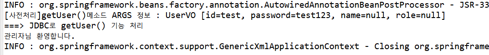


## After Returning 어드바이스

- 비즈니스 메소드가 수행되고 나서, 결과 데이터를 리턴할 때 동작하는 어드바이스

- **바인드 변수** : 비즈니스 메소드가 리턴한 결괏값을 바인딩할 목적으로 사용
  - 어떤 값이 리턴될지 모르기 떄문에 Object타입으로 선언
  - 바인드 변수 추가했다면, 매핑 설정 파일에 추가 
  - `<aop:after-returning>`엘리먼트의 returning속성 사용
    - 해당 엘리먼트에서만 retruning속성 사용가능
    - `returning="returnObj"` 속성 값으로 들어온 returnObj와 어드바이스 메소드 매개변수로 선언된 바인드 변수명과 동일해야 함
- `AfterReturningAdvice.java`

```java
package com.springbook.biz.common;

import org.aspectj.lang.JoinPoint;

import com.springbook.biz.user.UserVO;

public class AfterReturningAdvice {
	public void afterLog(JoinPoint jp, Object returnObj) { // Object변수도 매개변수로 선언 -> 바인드변수
		String method = jp.getSignature().getName();
		if(returnObj instanceof UserVO) {
			UserVO user = (UserVO) returnObj;
			if(user.getRole().equals("Admin")) {
				System.out.println(user.getName() + "로그인(Admin)");
			}
		}
		System.out.println("[사후 처리]" + method +"()메소드 리턴값" +returnObj.toString());
		
	}
}

```


- `applicationContext.xml`

```xml
...

	<bean id="afterReturning" class="com.springbook.biz.common.AfterReturningAdvice" />
 
	<aop:config>
		<aop:pointcut id="getPointcut" expression="execution(* com.springbook.biz..*Impl.*(..))"/>
		
		<aop:aspect ref="afterReturning">
			<aop:after-returning pointcut-ref="getPointcut" method="afterLog" returning="returnObj"/>
		</aop:aspect>

	</aop:config>

...
```

- 비즈니스 메소드가 리턴한 결괏값을 retrunObj라는 바인드 변수에 바인드하는 것

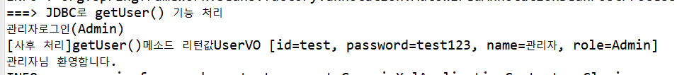


## After Throwing 어드바이스

- 예외 발생 시 동작하는 어드바이스
  - 어떤 메소드에서 예외가 발생했는지 알아야 함


- `AfterThrowingAdvice.java`

```java
package com.springbook.biz.common;

import org.aspectj.lang.JoinPoint;

public class AfterThrowingAdvice {
	public void exceptionLog(JoinPoint jp, Exception exceptObj) {
		String method  = jp.getSignature().getName();
		
		System.out.println("[예외 처리]" + method + "()메소드 수행 중 발생된 예외 메시지 : " + exceptObj.getMessage());
	}
}

```


- `applicationContext.xml`

```xml
...

	<bean id="afterThrowing" class="com.springbook.biz.common.AfterReturningAdvice" />
 
	<aop:config>
		<aop:pointcut id="allPointcut" expression="execution(* com.springbook.biz..*Impl.*(..))"/>
		
		<aop:aspect ref="afterThrowing">
			<aop:after-throwing pointcut-ref="allPointcut" method="exceptionLog" throwing="exceptObj"/>
		</aop:aspect>

	</aop:config>

...
```

- 비즈니스 메소드에서 발생한 예외객체를 exceptObj라는 바인드 변수를 통해 받음
  - 바인드 변수는 모든 예외 객체를 바인드할 수 있도록 예외 클래스의 최상위 타입인 Exception으로 선언
- `<aop:after-throwing>`엘리먼트의 throwing속성 사용
  - 해당 엘리먼트에서만 throwing속성 사용가능
  - `throwing="returnObj"` 속성 값으로 들어온 exceptObj와 어드바이스 메소드 매개변수로 선언된 바인드 변수명과 동일해야 함

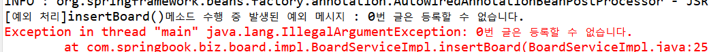

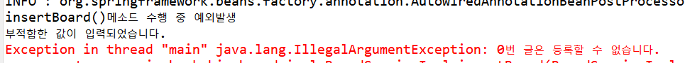


## Around 어드바이스

- 다른 어드바이스와 달리 반드시 ProceedingJoinPoint객체를 매개변수로 받아야 함
  - ProceedingJoinPoint객체는 비즈니스 메소드를 호출하는 proceed()메소드 가짐
  - JoinPoint상속함

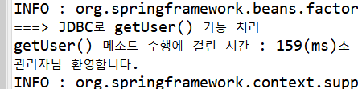


# CLASS05 어노테이션 기반 AOP

- AOP를 어노테이션으로 설정하려면 `<aop:aspectj-autoproxy>`엘리먼트 설정 필요
  - 스프링 컨테이너가 AOP관련 어노테이션들을 인식하고 용도에 맞게 처리
- AOP관련 어노테이션들은 어드바이스 클래스에 설정
  - 반드시 어드바이스 객체 생성되어 있어야 처리 가능
  - `<bean>`에 등록하거나 `@Service`에 등록해야 사용 가능


- `@Pointcut`
  - 어노테이션으로 포인트 컷 설정
  - 하나의 어드바이스 클래스 안에 여러 개의 포인트컷 선언 가능
    - 따라서 **<u>여러 포인트컷을 식별</u>하기 위한 식별자가 필요한데, 이때 참<u>조 메소드</u> 이용**

- 참조 메소드

  > 구현 로직이 없는 메소드

  - 기능 처리가 목적이 아닌, 포인트컷 식별하는 이름으로만 사용


## 어드바이스 설정

- 어드바이스 메소드가 언제 동작할지 결정하여 관련된 메소드 위에 설정
- 어드바이스 메소드가 결합될 포인트컷 참조하기
  - `@Before("allPointcut()")`


## 어드바이스 동작 시점과 관련된 어노테이션

|   어노테이션    |                             설명                             |
| :-------------: | :----------------------------------------------------------: |
|     @Before     |                 비즈니스 메소드 실행 전 동작                 |
| @AfterReturning |          비즈니스 메소드가 성공적으로 리턴되면 동작          |
| @AfterThrowing  |          비즈니스 메소드 실행 중 예외 발생하면 동작          |
|     @After      |            비즈니스 메소드 실행 후,  무조건 실행             |
|     @Around     | 호출 자체를 가로채 비즈니스 메소드 실행 전후에 처리할 로직 삽입 |


## 애스팩트 설정

- AOP설정에서 가장 중요한 애스팩트는 `@Aspect`이용해 설정

  - 애스팩트

    > 포인트컷 + 어드바이스

    - 따라서 `@Aspect`가 설정된 애스팩트 객체는 반드시 포인트컷과 어드바이스 결합하는 설정 필요


- `LogAdvice.java`
  - `@Service`, `@Aspect`를 추가하여 LogAdvice클래스가 컴포넌트 스캔되어 애스팩트 객체로 인식되게 함
  - `@Pointcut("execution(* com.springbook.biz..*Impl.*(..))")`에서 
    - allPointcut() 참조 메소드를 추가해 포인트컷 선언
  - ` @Before("allPointcut")`에서 
    - allPointcut()로 지정한 메소드가 호출될 때, printLog()메소드가 Before형태로 동작하게 설정

```java
package com.springbook.biz.common;

import org.aspectj.lang.annotation.Aspect;
import org.aspectj.lang.annotation.Before;
import org.aspectj.lang.annotation.Pointcut;
import org.springframework.stereotype.Service;

@Service
@Aspect // Aspect = Pointcut + Advice
public class LogAdvice { // @Aspect 설정으로 LogAdvice객체를 애스팩트 객체로 인식
	
	@Pointcut("execution(* com.springbook.biz..*Impl.*(..))") // 포인트컷
	public void allPointcut() {}; // 포인트컷 메소드
	
	@Before("allPointcut()") // 어드바이스
	public void printLog() { // 어드바이스 메소드
		System.out.println("[공통로그] 비즈니스 로직 수행 전 동작");
	}
	// 포인트컷 메소드와 어드바이스 메소드에 의해 위빙처리
}

```


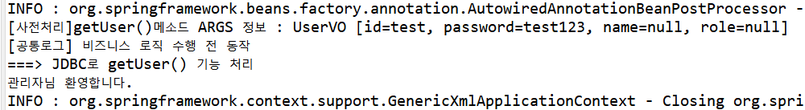


### After Retruning / After Throwing 어드바이스

- `pointcut`속성 필요
  - 비즈니스 메소드 수행 결과를 받아내기 위해 바인드 변수를 지정해야 하기 때문

-  `returning` / `throwing` 속성 필요
  - 바인드 변수를 명확하게 지정하기 위함

- `AfterReturningAdvice.java`

```java
package com.springbook.biz.common;

import org.aspectj.lang.JoinPoint;
import org.aspectj.lang.annotation.AfterReturning;
import org.aspectj.lang.annotation.Aspect;
import org.aspectj.lang.annotation.Pointcut;
import org.springframework.stereotype.Service;

import com.springbook.biz.user.UserVO;

@Service
@Aspect
public class AfterReturningAdvice {
	
	@Pointcut("execution(* com.springbook.biz..*Impl.get*(..))")
	public void getPointcut() {}
	
	@AfterReturning(pointcut="getPointcut()", returning="returnObj")
	public void afterLog(JoinPoint jp, Object returnObj) { // Object변수도 매개변수로 선언 -> 바인드변수
		String method = jp.getSignature().getName();
		if(returnObj instanceof UserVO) {
			UserVO user = (UserVO) returnObj;
			if(user.getRole().equals("Admin")) {
				System.out.println(user.getName() + "로그인(Admin)");
			}
		}
		System.out.println("[사후 처리]" + method +"()메소드 리턴값" +returnObj.toString());
		
	}
}

```


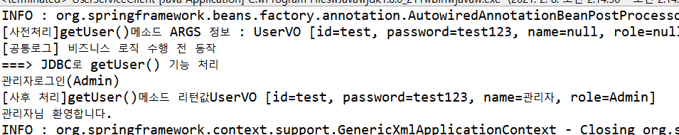


## 외부 Pointcut 참조하기

- XML에서 설정했던 것과 달리, 어노테이션 설정으로 변경하면 어드바이스 클래스마다 포인트컷 설정 포함
  - 비슷하거나 같은 포인트컷이 반복 선언
  - 이런 문제를 해결하기 위해 포인트컷을 외부에 독립된 클래스에 따로 설정하도록 함

- `PointcutCommon.java`
  - 시스템에서 사용할 모든 포인트컷을 PointcutCommon클래스에 등록

```java
package com.springbook.biz.common;

import org.aspectj.lang.annotation.Aspect;
import org.aspectj.lang.annotation.Pointcut;

@Aspect
public class PointcutCommon {
	@Pointcut("execution(* com.springbook.biz..*Impl.*(..))")
	public void allPointcut() {}
	
	@Pointcut("execution(* com.springbook.biz..*Impl.*get(..))")
	public void getPointcut() {}

}

```


- 정의된 포인트컷을 사용하려면 클래스 이름과 참조 메소드 이름을 조합하여 지정해야 함
- 변경된 `BeforeAdvice.java`

```java
package com.springbook.biz.common;

import org.aspectj.lang.JoinPoint;
import org.aspectj.lang.annotation.Aspect;
import org.aspectj.lang.annotation.Before;
import org.aspectj.lang.annotation.Pointcut;
import org.springframework.stereotype.Service;

@Service
@Aspect
public class BeforeAdvice {
//	@Pointcut("execution(* com.springbook.biz..*Impl.*(..))")
//	public void allPointcut() {}
//	
//	@Before("allPointcut()")
	// 위의 주석처리 된 코드 3줄이 아래 코드 한줄과 같은 역할, 단, 미리 Pointcut에 등록해야 함
	@Before("PointcutCommon.allPointcut()")
	public void beforeLog(JoinPoint jp) {
		String method = jp.getSignature().getName(); // 시그니처 정보가 저장된 Signature객체 리턴/ 클라이언트가 호출한 메소드 이름 리턴
		Object[] args = jp.getArgs(); // 클라이언트가 메소드를 호출할 때 넘겨준 인자 목록을 Object배열로 리턴
		
		System.out.println("[사전처리]" + method + "()메소드 ARGS 정보 : " + args[0].toString());
	}
}

```


- `AfterReturningAdvice.java`

```java
package com.springbook.biz.common;

import org.aspectj.lang.JoinPoint;
import org.aspectj.lang.annotation.AfterReturning;
import org.aspectj.lang.annotation.Aspect;
import org.aspectj.lang.annotation.Pointcut;
import org.springframework.stereotype.Service;

import com.springbook.biz.user.UserVO;

@Service
@Aspect
public class AfterReturningAdvice {
	
//	@Pointcut("execution(* com.springbook.biz..*Impl.get*(..))")
//	public void getPointcut() {}
//	
//	@AfterReturning(pointcut="getPointcut()", returning="returnObj")
	@AfterReturning(pointcut="PointcutCommon.getPointcut()", returning="returnObj")
	public void afterLog(JoinPoint jp, Object returnObj) { // Object변수도 매개변수로 선언 -> 바인드변수
		String method = jp.getSignature().getName();
		if(returnObj instanceof UserVO) {
			UserVO user = (UserVO) returnObj;
			if(user.getRole().equals("Admin")) {
				System.out.println(user.getName() + "로그인(Admin)");
			}
		}
		System.out.println("[사후 처리]" + method +"()메소드 리턴값" +returnObj.toString());
		
	}
}

```


# CLASS06 스프링 JDBC

- JDBC : DB연동 기술
  - 이용하려면 개발자가 작성해야 할 코드가 너무 많음
  - 스프링은 JDBC 기반의 DB 연동 프로그램을 쉽게 개발할 수 있도록 JdbcTemplate 클래스 지원


## JdbcTemplate클래스

- GoF디자인 패턴 중 템플릿 메소드 패턴이 적용된 클래스

- 템플릿 메소드 패턴

  > 복잡하고 반복되는 알고리즘을 캡슐화해서 재사용하는 패턴

  - JDBC처럼 코딩 순서가 정형화된 기술에서 유용하게 사용가능


- JdbcTemplate클래스를 통해 반복되는 DB연동 로직 처리
  - **JDBC의 반복적인 코드 제거**
- 개발자는 달라지는 SQL구문과 설정값만 처리


## 스프링 JDBC설정

### 1. 라이브러리 추가

- `pom.xml`

```xml
<!-- DBCP -->
<dependency>
    <groupId>commons-dbcp</groupId>
    <artifactId>commons-dbcp</artifactId>
    <version>1.4</version>
</dependency>
```


### 2. DataSource 설정

- JdbcTemplate클래스가 JDBC API를 이용해 DB연동을 처리케 하려면 반드시 DB로부터 커넥션 얻어야 함
  - JdbcTemplate객체가 사용할 DataSource를 `<bean>` 등록
- <u>DataSource설정은 트랜잭션 처리, Mybatis연동, JPA연동에서도 사용</u>

- `applicationContext.xml`
  - appache의 BasicDataSource등록
  - BigDataSource객체는 연결에 필요한 프로퍼티들을 Setter인젝션으로 설정
  - BigDataSource객체 삭제되기 전, 연결 해제하고자 close()메소드를 destroy-method속성으로 지정

```xml
<!-- DataSource 설정 -->
<bean id="dataSource" class="org.apache.commons.dbcp.BasicDataSource" destroy-method="close">
    <property name="driverClassName" value="org.h2.Driver" />
    <property name="url" value="jdbc:h2:tcp://localhost/~/test" />
    <property name="username" value="sa" />
    <property name="password" value="" />
</bean>
```


### 3. 프로퍼티 파일을 활용한 DataSource 설정

- PropertyPlaceholderConfigurer이용
- `database.properties`

```properties
jdbc.driver=org.h2.Driver
jdbc.url=jdbc:h2:tcp://localhost/~/test
jdbc.username=sa
jdbc.password=
```


- `applicationContext.xml`

```xml
<!-- DataSource 설정 -->
<context:property-placeholder location="classpath:config/database.properties" />
<bean id="dataSource" class="org.apache.commons.dbcp.BasicDataSource" destroy-method="close">
    <property name="driverClassName" value="{jdbc.driver}" />
    <property name="url" value="{jdbc.url}" />
    <property name="username" value="{jdbc.username}" />
    <property name="password" value="{jdbc.password}" />
</bean>
```


## JdbcTemplate 메소드

### 1. update() 메소드

- INSERT, UPDATEm DELETE구문 처리위해 사용
- 이용방법
  1. SQL구문에 설정된 ?만큼 차례대로 나열
  2. Object배열 객체에 SQL구문에 설정된 ?수만큼의 값 세팅하여 두 번째 인자로 전달


### 2. queryForInt() 메소드

- SELECT구문으로 검색된 정숫값 리턴받기 위해 사용


### 3. <u>queryForObject() 메소드</u>

- SELECT구문의 실행 결과를 **특정 자바 객체(Value Object)로 매핑**하여 리턴 받을 때 사용
  - **검색 결과를 자바객체로 매핑할 `RowMapper`객체 지정 필요**
    - RowMapper 인터페이스를 구현한 RowMapper 클래스 필요
    - 즉, <u>RowMapper클래스는 테이블당 하나씩은 필요</u>
- 검색 결과가 없거나 검색 결과가 2개 이상이면 예외 발생시킴
  - 즉, **검색 결과 1개일 때 사용**


- RowMapper 인터페이스에는 mapRow()메소드 존재
  - 검색 결과로 얻어낸 Row정보를 어떤 VO에 어떻게 매핑할 것인지 구현
- **RowMapper객체를 queryForObject()메소드의 매개변수로 넘겨주기**


### 4. <u>query() 메소드</u>

- **SELECT문의 실행 결과가 목록일 때, 사용**
  - CF) queryForObject()메소드는 SELECT문으로 객체 하나 검색 시, 사용
  - 사용법은 같음
- 검색 결과를 VO객체에 매핑하려면 RowMapper객체 사용
- query()메소드 실행시 , 여러 건의 ROW정보가 검색, 검색된 데이터 ROW수만큼 RowMapper객체의 mapRow()메소드 실행
  - <u>ROW정보가 매핑된 VO객체 여러 개가 List컬렉션에 저장되어 리턴</u>


## DAO클래스 구현방법

### 1. JdbcDaoSupport 클래스 상속

- `BoardDAO.java`

```java
package com.springbook.biz.board.impl;

import java.util.List;

import javax.sql.DataSource;

import org.springframework.beans.factory.annotation.Autowired;
import org.springframework.jdbc.core.support.JdbcDaoSupport;
import org.springframework.stereotype.Repository;

import com.springbook.biz.board.BoardVO;

@Repository("boardDAO") // DB와 연동하는 DAO클래스
public class BoardDAO extends JdbcDaoSupport {	
		// SQL명령어들
		private final String BOARD_INSERT = "INSERT INTO BOARD(SEQ, TITLE, WRITER, CONTENT) VALUES((SELECT NVL(MAX(SEQ), 0)+1 FROM BOARD), ?, ?, ?)";
		private final String BOARD_UPDATE = "UPDATE BOARD SET TITLE=?, CONTENT=? WHERE SEQ=?";
		private final String BOARD_DELETE = "DELETE BOARD WHERE SEQ=?";
		private final String BOARD_GET = "SELECT * FROM BOARD WHERE SEQ=?";
		private final String BOARD_LIST = "SELECT * FROM BOARD ORDER BY SEQ DESC"; // 최신 글부터 조회
		
	    // DataSource객체를 가지기 위해 부모클래스인 JdbcTemplate 클래스의 setDataSource() 메소드 호출해 의존성 주입
		@Autowired 
		public void setSuperDataSource(DataSource dataSource) { 
			super.setDataSource(dataSource);
		}
		
		// CRUD 기능의 메소드 구현
		// 글 등록
		public void insertBoard(BoardVO vo) {
			System.out.println("===> Spring JDBC로 insertBoard() 기능 처리");
			getJdbcTemplate().update(BOARD_INSERT, vo.getTitle(), vo.getWriter(), vo.getContent());
		}
		
		// 글 수정
		public void updateBoard(BoardVO vo) {
			System.out.println("===> Spring JDBC로 updateBoard() 기능 처리");
			getJdbcTemplate().update(BOARD_UPDATE, vo.getTitle(), vo.getContent(), vo.getSeq());
		}
		
		// 글 삭제
		public void deleteBoard(BoardVO vo) {
			System.out.println("===> Spring JDBC로 deleteBoard() 기능 처리");
			getJdbcTemplate().update(BOARD_DELETE, vo.getSeq());
		}
		
		// 글 상세 조희
		public BoardVO getBoard(BoardVO vo) {
			System.out.println("===> Spring JDBC로 getBoard() 기능 처리");
			Object[] args = {vo.getSeq()};
			return getJdbcTemplate().queryForObject(BOARD_GET, args, new BoardRowMapper());
		}
		
		// 글 목록 조회
		public List<BoardVO> getBoardList(BoardVO vo) {
			System.out.println("===> Spring DBC로 getBoardList() 기능 처리");
			return getJdbcTemplate().query(BOARD_LIST, new BoardRowMapper()); // 여러 결
		}
}	
```


- JdbcDaoSupport클래스를 부모 클래스로 지정하면, `getJdbcTemplate()`메소드 상속받을 수 있음

  - `getJdbcTemplate()`호출시, JdbcTemplate객체 리턴됨
  - 모든 메소드를 JdbcTemplate객체로 구현가능
  - BUT, DataSource객체 가지고 있어야 함

  ```java
  // DataSource객체를 가지기 위해 부모클래스인 JdbcTemplate 클래스의 setDataSource() 메소드 호출해 의존성 주입
  @Autowired 
  public void setSuperDataSource(DataSource dataSource) { 
  super.setDataSource(dataSource);
  }
  ```

  

### 2. JdbcTemplate클래스 `<bean>`등록, 의존성 주입

- JdbcTemplate클래스를 `<bean>`등록하고, 의존성 주입으로 처리
- `applicationContext.xml`

```xml
<!-- DataSource 설정 - JdbcTemplate클래스 <bean>등록, 의존성 주입 -->
<bean id="dataSource" class="org.apache.commons.dbcp.BasicDataSource" destroy-method="close">
    <property name="driverClassName" value="org.h2.Driver" />
    <property name="url" value="$jdbc:h2:tcp://localhost/~/test" />
    <property name="username" value="sa" />
    <property name="password" value="" />
</bean>

<!-- Spring JDBC설정 -->
<bean id="jdbcTemplate" class="org.springframework.jdbc.core.JdbcTemplate">
	<property name="dataSource" ref="dataSource" />
</bean>
```


