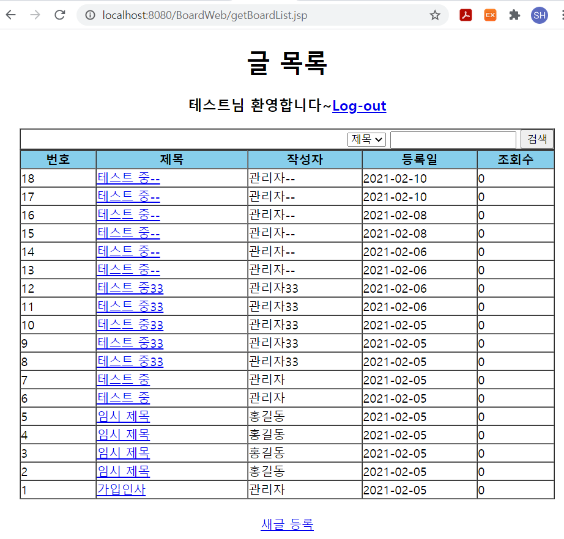

# CLASS01-02 Model 1아키텍처로 게시판 개발

## Model1 아키텍처 구조

- JSP와 JavaBeans만 사용하여 웹 개발


- Bean = 객체
  - JavaBean = 자바객체
  - JavaBeans = DB 연동에 사용되는 자바 객체들
- **Model**
  - **DB연동 로직을 제공하면서 DB에서 검색한 데이터가 저장되는 자바 객체** 
  - **VO, DAO클래스 해당**
- **JSP**가 가장 중요
  - **Controller와 View기능** 처리하기 때문
  - Model을 사용하여 검색한 데이터를 사용자가 원하는 화면으로 제공하기 위해 다양한 마크업 언어 사용
  - 마크업 언어 : HTML, CSS -> View기능 담당
- Controller
  - JSP 파일에 작성된 자바 코드
  - BUT, JSP에 작성된 모든 코드를 Controller라고 하지 않음
  - 일반적으로 **사용자의 요청 처리와 관련된 자바코드**

---

---

- JSP파일에서 Controller, View모두 처리
  - 자바코드와 마크업 관련 코드들이 뒤섞여 유지보수 어렵
  - 간단한 프로젝트에 적합
  - 엔터프라이즈급의 복잡한 시스템에 부적합
  - 그래서 Model2 등장
- **Model2 = MVC아키텍처**
  - Model, View, Controller요소로 기능 분리
  - Model1의 단점 보완

---

- 모든 JSP파일은 `src/main/webapp`폴더에 등록


### 로그인 화면 구현

- `<hr>` 
  - 수평선 그리기
- `login.jsp`


### 로그인 인증처리 구현

- `login_proc.jsp`

- **사용자가 입력한 id, password를 request객체로 부터 추출**
- model에 해당하는 **UserVO, UserDAO객체 이용해 사용자 정보 검색**
  - 검색 결과로 UserVO객체 리턴되면 로그인 성공
    - 글 목록 화면인 `getBoardList.jsp`로 이동
  - null이 리턴되면 로그인 실패로 처리
    - 로그인 화면인 `login.jsp`이동
    - 다시 로그인

```jsp
<%@page import="com.springbook.biz.user.impl.UserDAO" %>
<%@page import="com.springbook.biz.user.UserVO" %>
<%@page contentType="text/html; charset=EUC-KR"%>

<%
	// 1. 사용자 입력 정보 추출 -  요청 받음(request)
	String id = request.getParameter("id");
	String password = request.getParameter("password");
	
	// 2. DB 연동처리 - 받은 id, pw를 vo에 세팅
	UserVO vo = new UserVO();
	vo.setId(id);
	vo.setPassword(password);
	
	UserDAO userDAO = new UserDAO();
	UserVO user = userDAO.getUser(vo);
	
	// 3. 화면 네비게이션 - 응답(response)
	if(user != null) {
		response.sendRedirect("getBoardList.jsp");
	} else {
		response.sendRedirect("login.jsp");
	}
	
%>


...
```

- UserVO를 통해 받은 id, pw 세팅
  - 세팅 된 값을 userDAO의 getUser()메소드의 매개변수로 넘겨줌
  - 넘겨준 값이 있으면 user에 값이 리턴되고, 아니면 null
  - 그 받은 값을 reponse객체를 통해 응답해줌


#### Forward(포워드)

>RequestDispatcher를 이용해 응답으로 사용할 JSP화면으로 넘겨, 포워드된 화면이 클라이언트에 전송되는 방식

- 한 번의 요청과 응답으로 처리
  - 실행속도 빠름
- 클라이언트 브라우저에서 URL이 바뀌지 않아 응답이 어디에서 들어왔는지 확인할 수 없음


#### Redirect(리다이렉트)

> 요청된 JSP에서 일단 브라우저로 응답 메시지를 보냈다가 다시 서버로 재요청하는 방식

- 일단 응답이 브라우저로 들어간 후, 재요청
- 응답이 들어온 파일의 브라우저의 URL변경
  - BUT, 두 번의 요청과 응답으로 처리되어 실행 속도는 포워드보다 느림


### 글 목록 검색 기능 구현

- `getBoardList.jsp`
- BoardVO, BoardDAO객체 이용해 BOARD테이블에 저장된 게시글 목록 검색
  - 검색 결과로 얻은 `List<BoardVO>`객체 이용해 저장된 게시글 목록 검색



### 글 상세 기능 구현

- `getBoard.jsp`

- 글 목록 화면에서 사용자가 클릭한 게시글 조회
  - 조회된 게시글의 상세화면 제공

- 가장 먼저 글 목록 화면에서 사용자가 클릭한 게시글 번호 추출
- BoardDAO객체의 getBoard()메소드 이용해 이 게시글 번호에 해당하는 BoardVO객체 검색
- `&nbsp` : 웹페이지에서 공백 표시


- 이 페이지는 수정을 위한 페이지이기도 함
  - 따라서, 수정 버튼 클릭시 글 수정 처리


### 글 등록 기능 구현

#### 글 등록 화면

- `insertBoard.jsp`

#### 글 등록 처리

- `insertBoard_proc.jsp`
- 사용자 입력 데이터에 한글이 포함되어 있으면, 사용자 입력 정보를 getParameter() 메소드로 추출했을 때, 한글이 깨짐
  - **사용자 입력 정보 추출 직전 반드시 setCharacterEncoding()메소드로 한글 처리하기**


### 글 수정 기능 구현

- `getBoard.jsp`이 글 수정에 사용
  - 수정할 글의 제목, 내용, 게시글 번호도 알아야 함
  - form태그 밑에 HIDDEN타입의 input태그 추가해 수정할 게시글 번호도 같이 전달되게 수정
  - `<input type="hidden">`은 사용자에게는 보이지 않는 숨겨진 입력 필드를 정의
    -  사용자가 변경해서는 안 되는 데이터를 함께 보낼 때 유용하게 사용

```jsp
...

<body>
<center>
<h1>글 상세</h1>
<a href="logout.jsp">Log-out</a>
<hr>
<form action="updateBoard_proc.jsp" method="post">
<input name="seq" type="hidden" value="<%=board.getSeq() %>">
<table border="1" cellpadding="0" cellspacing="0">

...
```

- 게시글 상세화면에서 수정할 제목, 정보 입력 후 글 수정 버튼 클릭
  - 사용자가 입력한 title, content파라미터 정보와 HIDDEN으로 설정한 게시글 번호 가지고 updateBoard_proc.jsp호출


### 글 삭제 기능 구현

- 상세 화면에서 글 삭제 힝크를 클릭하면 `deleteBoard_proc.jsp`파일에서 해당 게시글 삭제 처리
  - 삭제할 게시글 번호를 `deleteBoard_proc.jsp`파일에 알려줘야 함
  - `deleteBoard_proc.jsp` 뒤에 seq파라미터 정보 추가
- `getBoard.jsp`

```jsp
....

<hr>
<a href="insertBoard.jsp">글등록</a>&nbsp;&nbsp;&nbsp;
<a href="deleteBoard.jsp?seq=<%=board.getSeq() %>">글삭제</a>&nbsp;&nbsp;&nbsp;
<a href="getBoardList.jsp">글목록</a>&nbsp;&nbsp;&nbsp;
</center>
</body>
</html>
```


- `deleteBoard_proc.jsp`
  - 삭제 요청된 게시글 번호 추출해 BoardVo객체에 저장


### 로그아웃 기능 구현


# CLASS03 Model 2 아키텍처로 게시판 개발

- 시스템 규모가 크고 기능이 복잡한 엔터프라이즈 시스템 개발에 적합
- Model1과 다른 점 : Controller의 등장
  - 서블릿 클래스를 중심으로 구현


- Model1아키텍처로 개발한 프로그램에서 JSP파일에 있는 자바 코드만 Controller로 이동하면 Model2됨

|    기능    |   구성 요소    |            개발 주체            |
| :--------: | :------------: | :-----------------------------: |
|   Model    | VO, DAO 클래스 |           자바 개발자           |
|    View    |   JSP 페이지   |           웹 디자이너           |
| Controller | Servlet 클래스 | 자바 개발자 또는 MVC 프레임워크 |

- Controller를 성능과 유지보수의 편의성을 고려하여 잘 만드는 것이 중요
  - 직접 구현해도 되지만, **MVC프레임워크에서 제공하는 Controller이용 가능**
  - 하지만, 여기서 제공하는 Controller는 복잡하고 어렵


## Controller 구현하기

- **Controller기능 수행하는 서블릿 클래스 추가**
  - 이클립스 기능 이용하기
  - New -> servlet추가
- WEB-INF/`web.xml`
  - 클라이언트의 모든 `*.do`요청을 DispatcherServlet클래스의 객체가 처리한다는 설정

```xml
<?xml version="1.0" encoding="UTF-8"?>
<web-app xmlns:xsi="http://www.w3.org/2001/XMLSchema-instance" xmlns="http://java.sun.com/xml/ns/javaee" xsi:schemaLocation="http://java.sun.com/xml/ns/javaee https://java.sun.com/xml/ns/javaee/web-app_2_5.xsd" version="2.5">
  <servlet>
    <servlet-name>action</servlet-name>
    <servlet-class>com.springbook.view.controller.DispatcherServlet</servlet-class>
  </servlet>
  <servlet-mapping>
    <servlet-name>action</servlet-name>
    <url-pattern>*.do</url-pattern>
  </servlet-mapping>
</web-app>
```


## Controller 서블릿 구현하기

- `DispatcherServlet`에는 GET방식 요청 처리하는 doGet(), POST방식 요청 처리하는 doPost()메소드 재정의
  - 어떤 방식으로 요청하든 **process()메소드 통해 클라이언트 요청 처리**
- POST방식 요청에 한글이 깨지지 않도록 인코딩 처리 추가
  - **인코딩 작업을 DispatcherServlet클래스에서 일괄 처리**
  - 인코딩 변경시 DispatcherServlet클래스만 변경하면 됨
- process()메소드는 가장 먼저 클라이언트의 요청 URI로부터 path정보 추출
  - 이때 추출된 path는 URI문자열에서 마지막 `/xxx.do`문자열
- `dispatcherServlet.java`

```java
package com.springbook.view.controller;

import java.io.IOException;

import javax.servlet.ServletException;
import javax.servlet.http.HttpServlet;
import javax.servlet.http.HttpServletRequest;
import javax.servlet.http.HttpServletResponse;

public class DispatcherServlet extends HttpServlet {
	private static final long serialVersionUID = 1L;

	protected void doGet(HttpServletRequest request, HttpServletResponse response) throws ServletException, IOException {
		process(request, response);
	}

	protected void doPost(HttpServletRequest request, HttpServletResponse response) throws ServletException, IOException {
		request.setCharacterEncoding("EUC-KR");
		process(request, response);
	}
	
	private void process(HttpServletRequest request, HttpServletResponse response) {
		// 1. 클라이언트의 요청 path정보를 추출한다.
		String uri = request.getRequestURI(); // 클라이언트의 요청 URI
		String path = uri.substring(uri.lastIndexOf("/")); // "/"로 표현된 index중 가장 마지막 = /xxx.do
		System.out.println(path);
		
		// 2. 클라이언트의 요청 path에 따라 적절히 분기처리 한다.
		if(path.equals("/login.do")) {
			System.out.println("로그인 처리");
		} else if(path.equals("/logout.do")) {
			System.out.println("로그아웃 처리");
		} else if(path.equals("/insertBoard.do")) {
			System.out.println("글 등록 처리");
		} else if(path.equals("/updateBoard.do")) {
			System.out.println("글 수정 처리");
		} else if(path.equals("/deleteBoard.do")) {
			System.out.println("글 삭제 처리");
		} else if(path.equals("/getBoard.do")) {
			System.out.println("글 상세 조회 처리");
		} else if(path.equals("/getBoardList.do")) {
			System.out.println("글 목록 검색 처리");
		}
		
		
	}

}

```


## 로그인 기능 구현하기

- `login.jsp` 파일의 `<form>`엘리먼트의 action속성값을 `login.do`로 수정
  - 왜냐하면 `*.do`형태의 요청에 대해서만 DispatcherServlet 동작하기 때문

- `login_proc.jsp`에 있는 자바 로직을 DispatcherServlet에 추가


## 글 목록 검색 기능 구현하기

- MVC구조로 변경하는데 가장 중요한 기능
- 기존의 글 목록 화면을 처리했던 `getBoardList.jsp`파일에서 Controller로직에 해당하는 자바 코드를 DispatcherServlet으로 복사
- `DispatcherServlet.java`

```java
...

} else if(path.equals("/getBoard.do")) {
			System.out.println("글 상세 조회 처리");
			
			// 1. 사용자 입력 정보 추출(검색 기능 나중에 구현)
			// 2. DB 연동 처리
			BoardVO vo = new BoardVO();
			BoardDAO boardDAO = new BoardDAO();
			List<BoardVO> boardList = boardDAO.getBoardList(vo);
			
			// 3. 응답화면 구성
			// 검색 결과를 세션에 저장하고 목록 화면으로 이동
			HttpSession session = request.getSession();
			session.setAttribute("boardList", boardList);
			response.sendRedirect("getBoardList"); // getBoardList.jsp에선 저장된 글 목록을 꺼낼 거
			
		} else if(path.equals("/getBoardList.do")) {
			System.out.println("글 목록 검색 처리");
		}
```

- 리다이렉트 되는 `getBoardList.jsp` 화면에서 검색 결과를 출력하기 위해 세션(HttpSession)객체 사용
  - 세션저장은 문제가 있음
    - 세션은 브라우저당 서버 메모리에 하나씩 유지되는 객체이므로 사용자 많을수록 많은 세션 생성
    - 세션에 정보가 많이 저장될수록 서버입장에서는 부담스럽
  - 검색 결과는 `HttpServletRequest` 객체에 저장해야 함
    - 이 객체는 클라이언트가 서버에 요청을 전송할 때마다 매번 새롭게 생성
    - 응답 메시지가 브라우저에 전송되면 바로 삭제되는 1회성 객체


## 글 상세 보기 기능 구현하기

- 글 목록 검색 기능과 유사


## 글 등록 기능 구현하기

- form엘리먼트의 action 속성 값을 insertBoard.do로 수정
- 등록 작업이 성공하면 반드시 `getBoardList.jsp`가 아닌`getBoardList.do`를 다시 요청
  - 세션에 저장된 글 목록 갱신해야 함


## 글 수정 기능 구현하기

- form엘리먼트의 action 속성 값을 updateBoard.do로 수정


## 글 삭제 기능 구현하기

- 글 삭제 관련 링크를 `deleteBoard.do`로 수정
- 목록 링크도 `getBoardList.do`로 수정


## 로그아웃 기능 구현하기

- 링크수정


## -- Controller

- Controller 로직은 사용자 입력 정보 추출
- Model을 이용한 DB연동 처리
- 화면 내비게이션에 해당하는 자바 코드 의미


# CLASS04 MVC프레임워크 개발

## MVC프레임워크 구조

- 앞에서 한 것들은 DispatcherServlet 클래스 하나로 Controller기능 구현
  - 하나의 서블릿으로 Controller구현 시, 클라이언트의 모든 요청을 하나의 서블릿이 처리
  - 개발과 유지보수 어렵
- 다양한 디자인 패턴 결합하여 개발, 유지보수의 편의성 보장되게끔 만들어야 함
- BUT, 프레임워크에서 제공하는 Controller 사용하면 직접 Controller구현하지 않아도 됨
  - Struts, Spring(MVC)사용


### Spring MVC

- 최종적으로 적용
- DispatcherServlet을 시작으로 다양한 객체들이 상호작용하면서 클라이언트의 요청 처리


|      클래스       |                             기능                             |
| :---------------: | :----------------------------------------------------------: |
| DIspatcherServlet | 유일한 서블릿 클래스,<br /> 모든 클라이언트의 요청을 가장 먼저 처리하는 Front Controller |
|  HandlerMapping   |          클라이언트의 요청을 처리할 Controller 매핑          |
|    Controller     |               실질적인 클라이언트의 요청 처리                |
|   ViewResolver    |     Controller가 리턴한 View이름으로 실행될 JSP경로 완성     |


## MVC 프레임워크 구현

### Controller 인터페이스 구현

- Controller를 구성하는 요소 중 **DispatcherServlet**은 클라이언트의 요청 가장 먼저 받아들이는 **Front Controller**
  - 클라이언트 요청 처리하기 위해 DispatcherServelt은 하는 일X
  - 실질적 요청 처리는 각 Controller에서 담당
- 구체적 Controller클래스들을 구현하기 위해 Controller를 같은 타입으로 관리하기 위한 인터페이스 필요
  - 클라이언트 요청 →`DipactcherServlet`→ `HandlerMapping` → `Controller객체 검색` → `검색된 Controller실행`
  - 어떤 Controller객체가 검색되더라도 같은 코드로 실행하려면 **모든 Controller의 최상위 인터페이스 필요**


### LoginController 구현

- DispatcherServlet의 로그인 처리 기능의 소스와 같음
  - 다만, Controller인터페이스의 handleRequest()메소드 재정의 필요
  - **로그인 처리 기능의 마지막**은 이동할 화면을 리다이렉트하지 않고 **리턴하는 것으로 처리**
- 로그인에 실패했을 때, 이동할 화면 : `login`
  - `login.jsp`가 아닌!
  - `ViewResolver` 클래스와 관련
- <u>`handleRequest()`메소드가 확장자 없는 문자열 리턴하면 자동으로 `.jsp`확장자가 붙어 처리</u>


### HandlerMapping클래스 작성

- **모든 Controller의 객체들을 저장**하고 있다가, 클라이언트의 요청이 들어오<u>면 요청을 처리할 특정 Controller검색하는 기능 제공</u>

- HandlerMapping객체는 DispatcherServlet이 사용하는 객체
- **DispatcherServlet이 생성되고 init()메소드가 호출될 때 <u>단 한 번</u> 생성**
  - ViewResolver클래스와 마찬가지
- HandleMapping은 <u>Map타입의 컬렉션을 멤버 변수로 가지고</u> 있으면서 게시판 프로그램에 <u>필요한 모든 Controller객체 등록 관리</u>

- `getController()메소드`는 매개변수로 받은 path에 해당하는 Controller객체를 HashMap 컬렉션으로부터 검색하여 리턴
  - 앞으로 추가될 Controller 등록하는 메소드
- `HashMap`에 등록된 정보를 보면 Controller객체가 어떤 `.do`요청과 매핑되어 있는지 확인 가능


```java
package com.springbook.view.controller;

import java.util.HashMap;
import java.util.Map;

import com.springbook.view.user.LoginController;

public class HandlerMapping {
	private Map<String, Controller> mappings; // Map타입의 컬렉션을 멤버변수로 가짐
	
	public HandlerMapping() { // Controller등록하는 메소드
		mappings = new HashMap<String, Controller>();
		mappings.put("/login.do", new LoginController()); // LoginController클래스 등록
	}
	
	public Controller getController(String path) { // path에 해당하는 Controller객체를 HashMap컬렉션으로부터 검색하여 리턴
		return mappings.get(path);
	}
}

```


### ViewResolver 클래스 작성

- Controller가 리턴한 View이름에 접두사(prepix), 접미사(suffix)를 결합
  - 최종 실행될 View경로와 파일명 완성
- **DispatcherServlet의 init()메소드가 호출될 때 생성**
  - HandlerMapping과 마찬가지

- `setPrefix()`, `setSuffix()`메소드로 접두사(prefix), 접미사(suffix)를 초기화


### DispatcherServlet 수정

- Front Controller기능의 클래스
- Controller 구성 요소 중 가장 중요한 역할
- 서블릿의 `init()`메소드
  - 서블릿 객체가 생성된 후, 멤버변수를 초기화하기 위해 자동으로 실행
  - DispatcherServlet이 사용할 HandlerMapping, ViewResolver객체 초기화
  - 생성된 두 개의 객체를 가지고 사용자 요청 처리


## MVC프레임워크 적용

### 글 목록 검색 구현

- GetBoardListController 클래스 작성
- 생성 후, HandlerMapping에 등록하기


### 글 상세 보기 구현

- GetBoardController 클래스 작성
- 생성 후, HandlerMapping에 등록하기


### 글 등록 구현

- InsertBoardController 클래스 작성

- 화면 네비게이션
  - `return "getBoardList.do";` 
  - 글 등록에 성공하면 등록된 글이 포함된 글 목록을 다시 보여줘야 하기 때문
- 생성 후, HandlerMapping에 등록하기


### 글 수정 구현

- UpdateBoardController 클래스 작성
- 생성 후, HandlerMapping에 등록하기


### 글 삭제 구현

- DeleteBoardController 클래스 작성
- 생성 후, HandlerMapping에 등록하기


### 로그아웃 구현

- LogoutController 클래스 작성

- 생성 후, HandlerMapping에 등록하기


---

---

- Controller에서 가장 중요한 DispatcherServlet클래스
  - 유지보수 과정에서 기존의 기능을 수정하거나 새로운 기능을 추가하더라도 절대 수정되지 않음
  - 즉, HandlerMapping에 새롭게 추가하고자 하는 기능의 Controller 객체를 등록하면 됨
  - DispatcherServlet클래스는 수정X


## EL/JSTL 이용한 JSP화면처리

- 자바코드를 JSP파일에서 제거하기 위함
- EL(Expression Language)
  - 기존의 표현식을 대체하는 표현 언어
  - ex) `<%=board.getSeq() %>` → `${board.seq}`
- JSTL(JSP Standard Tag Library)
  - if, for, switch등과 같은 자바 코드 사용시 태그 형태로 사용 가능하게 지원


# CLASS05 Spring MVC 구조

- 대부분의 MVC프레임워크는 비슷한 구조 가짐


1. 클라이언트로부터 모든 `.do`요청을 DispatcherServlet이 받음
2. DispatcherServlet은 HandlerMapping을 통해 요청을 처리할 Controller 검색
3. DispatcherServlet은 검색된 Controller를 실행하여 클라이언트의 요청 처리
4. Controller는 비즈니스 로직의 수행 결과로 얻어낸 Model 정보와 Model을 보여줄 View정보를 ModelAndView객체에 저장 후, 리턴
5. DispatcherServlet은 ModelAndView로부터 View정보를 추출하고, ViewResolver를 이용하여 응답으로 사용할 View를 얻어냄
6. DispatcherServlet은 ViewResolver를 통해 찾아낸 View를 실행하여 응답 전송\

---

- 기존과 다른 점 
  - Controller의 리턴타입이 String  → ModelAndView로 바뀜


## DispatcherServlet 등록 및 스프링 컨테이너 구동

### DispatcherServlet 등록

- Spring MVC에서 가장 중요한 요소인 DispatcherServlet
  - 모든 클라이언트의 요청을 가장 먼저 받아들임
- 가장 먼저 할 일
  - `WEB-INF/web.xml`파일에 등록된 DispatcherServlet클래스를 스프링 프레임워크에서 제공하는 DispatcherServlet으로 변경
  - `<servlet-class>com.springframework.web.servlet.DispatcherServlet</servlet-class>`
- 서블릿 컨테이너는 클라이언트의 `.do`요청이 있어야 DispatcherServlet객체 생성
  - 클라이언트가 로그인 버튼을 클릭하여 `login.do`요청을 서버에 전달하면 서블릿 컨테이너는 `web.xml`파일에 action이라는 이름으로 등록된 DispatcherServlet클래스의 객체 생성


### 스프링 컨테이너 구동

- 클라이언트의 요청으로 DispatcherServlet 객체가 생성되고 나면 DispatcherServlet클래스에 재정의된 init()메소드 자동 실행
  - XmlWebApplicationContext스프링 컨테이너 구동
  - 이 컨테이너는 ApplicationContext를 구현한 클래스 중 하나, DispatcherSetvlet이 생성

- **DispatcherServlet : Spring MVC 구성 요소 중 유일한 서블릿**
  - 서블릿 컨테이너는 web.xml파일에 등록된 `DispatcherServlet`만 생성
  - 하지만 클라이언트의 요청 처리 위해 `HandlerMapping`, `Controller`, `ViewResolver`객체들과 상호작용 필요
  - 이 객체들을 메모리에 생성하기 위해 DispacherServlet 스프링 컨테이너 구동
- DispatcherServlet은 스프링 컨테이너를 구동할 때, web.xml파일에 등록된 서블릿 이름 뒤에 `-servlet.cml`을 붙여 스프링 설정파일 찾음


## 스프링 설정 파일 변경

- DispatcherServlet은 자신이 사용할 객체들을 생성하기 위해 스프링 컨테이너 구동
  - 이 때, 스프링 컨테이너를 위한 설정 파일의 이름과 위치는 서블릿 이름을 기준으로 자동 결정
  - 만약, 설정 파일의 이름을 바꾸거나 위치 변경하려면 서블릿 초기화 파라미터 이용
- `web.xml`에 DispatcherServlet 클래스를 등록한 곳에 `<init-param>`설정 추가


## 인코딩 설정

- 인코딩 설정과 관련된 필터 클래스 추가하기
- Spring MVC를 적용하여 글 등록, 수정을 구현하면 한글처리하지 못하고 깨짐
  - 인코딩 처리를 위해 `CharacterEncodingFilter`클래스 제공
  - `web.xml`파일에 등록
  - 일괄적 인코딩 처리 가능


```xml
	<filter>
		<filter-name>characterEncoding</filter-name>
		<filter-class>org.springframework.web.filter.CharacterEncodingFilter</filter-class>
		<init-param>
			<param-name>encoding</param-name>
			<param-value>EUC-KR</param-value>
		</init-param>
	</filter>
	<filter-mapping>
		<filter-name>characterEncoding</filter-name>
		<utl-pattern>*.do</utl-pattern> 
	</filter-mapping>
```

- 필터는 엘리먼트 이름만 다를 뿐, 서블릿과 거의 비슷한 형태로 등록
  - characterEncoding이름으로 등록한 characterEncodingFilter객체 생성
  - `<init-param>`으로 설정한 encoding파라미터 정보를 읽어 인코딩 방식 설정
  - filter-mapping에서 url-pattern설정을 `.do`이므로 모든 클라이언트의 `.do`요청에 대해 characterEncodingFilter객체가 한글처리


# CLASS06-07 Spring MVC적용

- 기존의 Controller관련된 파일들을 삭제해야 함
  - `~view.controller` 패키지 전체를 삭제
- 스프링이 제공하는 Controller와 기존에 만든 Controller 차이점
  - **handleRequest()메소드의 리턴타입이 String이 아닌 ModelAndView임**
  - 다른 부분은 같음
- 공통적으로 할 부분
  - **ModelAndView 타입으로 변경 후, HandlerMapping 등록**


## 로그인 기능 구현

### LoginController 구현

- handleRequest() 메소드의 리턴타입 ModelAndView로 수정
- 화면 내비게이션에서 로그인 성공과 실패일 때, 실행될 각 화면 정보를 ModelAndView객체에 저장하여 리턴


### HandlerMapping 등록

- 작성된 LoginController가 클라이언트의 `/login.do`요청에 대해 동작하기 위해 `<bean>`등록 필요
  - 스프링 설정 파일 `presentation-layer.xml`에
  - HandlerMapping, LoginController등록하기

```xml
<?xml version="1.0" encoding="UTF-8"?>
<beans xmlns="http://www.springframework.org/schema/beans"
	xmlns:xsi="http://www.w3.org/2001/XMLSchema-instance"
	xsi:schemaLocation="http://www.springframework.org/schema/beans http://www.springframework.org/schema/beans/spring-beans.xsd">
	
	<!-- HandlerMapping 등록 -->
	<bean class="org.springframework.web.servlet.handler.SimpleUrlHandlerMapping">
		<property name="mappings">
			<props>
				<prop key="/login.do">login</prop> <!-- login이라는 아이디와 매핑됨-->
			</props>
		</property>
	</bean>
	
	<!-- Controller등록 -->
	<bean id="login" class="com.springbook.view.user.LoginController"></bean>
	
</beans>
```


- SimpleUrlHandlerMapping객체는 Setter인젝션을 통해  Properties타입의 컬렉션 객체를 의존성 주입함
  - 의존성 주입된 Properties컬렉션에는 `/login.do`경로 요청에 대해 아이디가 login객체 매핑됨
  - `./login.do`경로 요청에 대해  id가 login객체가 매핑됨
- 여기서 SimpleUrlHandlerMapping객체는 HandlerMapping과 같음
  - HashMap객체 대신 Properties 사용

- 로그인에 성공하면 getBoardList.do요청이 서버에 전송
  - SimpleUrlHandlerMapping엔 그에 대한 매핑 정보가 없으므로 404에러 뜸,,


## 글 목록 검색 기능 구현

### GetBoardListController 구현

- session에 저장하는 것이 아닌 ModelAndView객체에 저장
- 검색 결과는 HttpServletRequest객체에 저장해야 함
  - BUT, GetBoardListController는 검색결과를 ModelAndView에 저장
  - Model과 View정보를 모두 저장하여 리턴할 때 사용
- HttpServletRequest객체에 검색 결과에 해당하는 Model정보 저장하여 JSP로 포워딩
  - JSP파일에서는 검색결과를 HttpServletRequest로부터 꺼내쓸 수 있음


### HandlerMapping 등록

- SimpleUrlHandlerMapping객체에 매핑정보 추가


1. 클라이언트로부터 `/getBoardList.do`요청을 전송하면 DispatcherServlet요청을 받고,
2. SimpleUrlHandlerMapping을 통해 요청을 처리할 GetBoardListController검색
3. DIspatcherServlet은 검색된 GetBoardListController를 실행하여 요처어리
4. GetBoardListController는 검색 결과인 `List<BoardVO>` 와 getBoardList.jsp 이름을 ModelAndView객체에 저장하여 리턴
5. DispatcherServlet은 ModelAndView로부터 View정보를 추출하고 ViewResolver를 이용해 응답으로 사용할 getBoardList.jsp검색
6. DispatcherServlet은 getBoardList.jsp를 실행하여 글 목록 화면 전송


## 글 상세 조회 기능 구현

### GetBoardController 구현

### HandlerMapping 등록


## 글 등록 기능 구현하기

### InsertBoardController 구현

### HandlerMapping 등록


## ViewResolver 활용하기

- ViewResolver를 이용하면 클라이언트로부터의 직접적인 JSP호출을 차단가능
  - 대부분 웹 프로젝트에서 ViewResolver사용은 필수
  - JSP를 View로 사용하는 경우, InternalResourceViewResolver사용


### 클라이언트가 JSP파일을 직접 호출하면,

- 예로 getBoardList.jsp를 바로 호출한다면
- 오류는 발생되지 않음
  - BUT, 게시글 목록을 볼 수 없음
  - 왜냐하면 이 파일 실행 전 GetBoardListController가 실행되지 않아 게시글 목록을 검색할 수 없기 때문


### ViewResolver 적용

- `/WEB-INF/board/`폴더생성
  - getBoardList.jsp와 getBoard.jsp파일 이동
  - WEB-INF폴더는 절대 브라우저(클라이언트)에서 접근할 수 없음
- `InternalResourceViewResolver`사용시 `WEB-INF` 폴더에 있는 JSP파일을 View화면으로 사용 가능
  - 직접적인 호출을 막을 뿐


### Controller 수정

- 로그인에 성공하거나 실패했을 때, View 이름 앞에 `redirect:`을 붙여서 지정해야 함
  - Resolver가 설정되어 있더라도 이를 무시하고 리다이렉트함
- 로그인에 성공했을 때, 실행되는 GetBoardListController에서는 확장자 .jsp제거 필요
  - ViewResolver가 접두사와 접시사를 할당하여 해당 파일을 실행


### 즉,

#### InternalResourceViewResolver를 등록했을 때, 도느 View 이름에서 확장자 .jsp제거

- 확장자가 .do인 요청은 앞에 `redirect:`붙여서 ViewResolver가 동작하지 않도록 해야 함