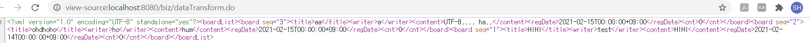

# CLASS01 어노테이션 기반 MVC개발

- 스프링은 어노테이션 기반 설정을 제공함으로써 과도한 XML설정으로 인한 문제 해결
- Spring MVC도 스프링 설정 파일에 HandlerMapping, Controller, ViewResolver같은 여러 클래스 등록 필요
  - 어노테이션을 최대한 활용해 XML설정 최소화하기


## 어노테이션 관련 설정

- `<beans>`루트 엘리먼트에 context네임스페이스 추가
  - 스프링 MVC에서 어노테이션 사용가능
  - HandlerMapping, Controller, ViewResolver 클래스에 대한 `<bean>`등록 모두 삭제
  - `<context:component-scan>`엘리먼트 사용
- `presentation-layer.xml`
  - 모든 Controller 클래스가 스캔 범위에 포함되도록 base-package속성에 Controller클래스들이 있는 가장 상위 패키지 등록

```xml
<?xml version="1.0" encoding="UTF-8"?>
<beans xmlns="http://www.springframework.org/schema/beans"
	xmlns:xsi="http://www.w3.org/2001/XMLSchema-instance"
	xmlns:context="http://www.springframework.org/schema/context"
	xsi:schemaLocation="http://www.springframework.org/schema/beans http://www.springframework.org/schema/beans/spring-beans.xsd
		http://www.springframework.org/schema/context
		http://www.springframework.org/schema/context/spring-context-4.2.xsd
	">
	<context:component-scan base-package="com.springbook.view"></context:component-scan>
</beans>
```


## @Controller 사용하기

- 기존 : Controller클래스들을 스프링 설정 파일에 `<bean>` 등록 필요
- 어노테이션 이용시 : 기존처럼 할 필요 없이 `@Controller`만 붙이면 됨
  
- 스프링 설정파일의 `<context:component-scan>`으로 스프링 컨테이너가 컨트롤러 객체들을 자동으로 생성하기 때문
  
- @Component를 상속한 @Controller

  - <u>**@Controller가 붙은 클래스의 객체를 메모리에 생성하는 기능 제공**</u>

    `+` <u>**DispactherServlet이 인식하는 Controller객체로 만들어줌**</u>

- POJO스타일

  - `@Controller`선언 이용

- 만약 다른 Controller가 등록되어 있으면 지우고 다시 해보기


## @RequestMapping 사용하기

- HandlerMapping설정을 대신함
  - <u>**클라이언트의 요청에 대해서 매핑하는 역할**</u>
  - ex) `/insertBoard.do`요청이 오면 insertBoard()메소드가 실행되게끔 만듦


- `InsertBoardController.java`
  - 클라이언트로부터 `/insertBoard.do`요청이 오면 insertBoard()메소드 매핑하다는 설정
  - value속성은 생략 가능
  - 대부분 생략

```java
package com.springbook.view.board;

import javax.servlet.http.HttpServletRequest;

import org.springframework.stereotype.Controller;
import org.springframework.web.bind.annotation.RequestMapping;

import com.springbook.biz.board.BoardVO;
import com.springbook.biz.board.impl.BoardDAO;

@Controller
public class InsertBoardController {
	
	@RequestMapping(value="/insertBoard.do")
	public void insertBoard(HttpServletRequest request) {
		System.out.println("글 등록 처리");
		
		// 1. 사용자 입력 정보 추출
		String title = request.getParameter("title");
		String writer = request.getParameter("writer");
		String content = request.getParameter("content");
		
		// 2. DB연동 처리
		BoardVO vo = new BoardVO();
		vo.setTitle(title);
		vo.setWriter(writer);
		vo.setContent(content);
		
		BoardDAO boardDAO = new BoardDAO();
		boardDAO.insertBoard(vo);	
	}
}

```


## 클라이언트 요청처리

- 대부분 Controller는 사용자의 입력 정보를 추출하여 VO객체에 저장
  - 비즈니스 컴포넌트의 메소드를 호출할 때 VO객체를 인자로 전달
- 사용자 입력정보는 HttpServletRequest의 getParameter()메소드를 사용하여 추출
  - 위와 같이 작성하면 사용자가 입력하는 정보가 많거나 변경되면 코드 수정필요함
  - Command객체 이용시 이런 문제 해결
- `InsertBoardController`클래스의 insertBoard()메소드를 Command객체를 이용하여 구분

- `InsertBoardController.java`
  - `insertBoard()`메소드의 매개변수로 사용자가 입력한 값을 매핑할 BoardVO클래스 선언
  - 스프링 컨테이너가 insertBoard()메소드 실행시, 사용자가 입력한 값들을 Command객체에 세팅까지 해서 생성해 넘겨줌

```java
package com.springbook.view.board;

import javax.servlet.http.HttpServletRequest;

import org.springframework.stereotype.Controller;
import org.springframework.web.bind.annotation.RequestMapping;

import com.springbook.biz.board.BoardVO;
import com.springbook.biz.board.impl.BoardDAO;

@Controller
public class InsertBoardController {
	
	@RequestMapping(value="/insertBoard.do")
	public void insertBoard(BoardVO vo) {
		System.out.println("글 등록 처리");
		
		BoardDAO boardDAO = new BoardDAO();
		boardDAO.insertBoard(vo);
	
	}
}

```


### 서블릿 객체의 service()메소드가 호출되는 과정(p359)

1. 서블릿 컨테이너는 클라이언트의 HTTP요청이 서버에 전달되는 순간
2. HttpServletRequest객체를 생성하고 HTTP프로토콜에 설정된 모든 정보 추출하여 HttpServletRequest객체에 저장
3. service()메소드를 호출할 때, 이 HttpServletRequest객체를 인자로 전달

---

- 서블릿 컨테이너가 **생성**
  - 서블릿 객체
  - HttpServletRequest, HttpServvletResponse 객체 
- 서블릿 컨테이너가 **호출**
  - service(), doGet(), doPost()메소드
  - 정상적으로 호출되려면 HttpServletRequest, HttpServvletResponse객체 필요
    - 이 객체들도 서블릿 컨테이너가 생성해서 넘겨줌

---

- 클라이언트가 글 등록 정보를 입력하고 서버에 `insertBoard.do`요청 전달
  - 스프링컨테이너는 @Controller가 붙은 모든 컨트롤러 객체 생성
  - InsertBoardController가 가지고 있는 insertBoard()메소드를 실행
    - 여기에 @RequestMapping이 써져 있기 때문
    - 이때, 매개변수에 해당하는 BoardVO객체를 스프링 컨테이너가 생성하여 전달


### Controller개체의 메소드가 호출되는 과정(p360)

1. 매개변수에 해당하는 BoardVO객체 생성
2. 사용자가 입력한 파라미터(title, writer, content)값들을 추출해 BoardVO객체에 저장
   - 이때, BoardVO클래스의 Setter메소드들이 호출됨
3. insertBoard()메소드 호출 시, 사용자 입력값들이 설정된 BoardVO객체가 인자로 전달
   - Form태그 안의 파라미터 이름과 Command객체의 Setter메소드 이름이 반드시 일치해야 함
   - 각 파라미터 이름에 해당하는 setTitle(), setWriter(), setContent()메소드가 있어야 Setter인젝션에 의해 자동으로 사용자 입력값이 저장됨


# CLASS02 어노테이션으로 게시판 프로그램 구현하기

## 글 등록 기능 구현하기

- 글 등록 처리 성공 후, 글 목록 출력
- `InsertBoardController.java`
  - GetBoardListController 실행시키기 위해 리턴타입을 String으로 수정
  - `"getBoardList.do"`리턴
  - 사용자 입력값을 Command객체로 받기 위해 BoardVO클래스를 매개변수로 선언
  - DB연동처리를 위해 BoardDAO도 매개변수로 선언
    - DAO객체 역시 매개변수로 선언화면 스프링 컨테이너가 해당 객체 생성하여 전달해줌

```java
package com.springbook.view.board;

import javax.servlet.http.HttpServletRequest;

import org.springframework.stereotype.Controller;
import org.springframework.web.bind.annotation.RequestMapping;

import com.springbook.biz.board.BoardVO;
import com.springbook.biz.board.impl.BoardDAO;

@Controller
public class InsertBoardController {
	
	@RequestMapping(value="/insertBoard.do")
	public String insertBoard(BoardVO vo, BoardDAO boardDAO) {
		return "getBoardList.do";
           
        ...
```


### 리다이렉트로 넘기기

- Controller메소드가 실행되고 View경로 리턴시, 기본이 포워딩 방식
  - 글 등록 후에 목록화면이 출력돼도 브라우저의 URL은 변경되지 X
  - 따라서, 리다이렉트 필요
    - `redirect:`라는 접두사 붙여주기
    - `return "redirect:getBoardList.do";`


## 글 목록 검색 구현하기

- 게시글을 등록한 후에 실행될 GetBoardListController
  - @Controller, @RequestMapping이용
- `GetBoardListController.java`
  - getBoardList()메소드는 매개변수가 3개
  - `public ModelAndView getBoardList(BoardVO vo, BoardDAO boardDAO, ModelAndView mav)`
    - 첫 번째 매개변수 : 사용자 입력값 받기 위한 BoardVo클래스
    - 두 번째 매개변수 : DB연동 처리 위한 BoardDAO클래스
    - 세 번재 매개변수 : 검색 결과와 화면 정보를 저장하여 리턴하기 위한 ModelAndView

```java
package com.springbook.view.board;

import java.util.List;

import javax.servlet.http.HttpServletRequest;
import javax.servlet.http.HttpServletResponse;

import org.springframework.stereotype.Controller;
import org.springframework.web.bind.annotation.RequestMapping;
import org.springframework.web.servlet.ModelAndView;

import com.springbook.biz.board.BoardVO;
import com.springbook.biz.board.impl.BoardDAO;

@Controller
public class GetBoardListController {
	@RequestMapping("/getBoardList.do")
	public ModelAndView getBoardList(BoardVO vo, BoardDAO boardDAO, ModelAndView mav) {
        
		mav.addObject("boardList", boardDAO.getBoardList(vo)); // Model 정보 저장
		mav.setViewName("getBoardList"); // View 정보 저장
		return mav;
	}
}

```


## 글 상세 보기 구현하기

- `GetBoard.java`

- GetBoardListController.java와 비슷


## 글 수정 기능 구현하기

- `UpdateBoardController.java`
  - 클라이언트로부터 `/.updateBoard.do`요청이 들어오면 updateBoard()메소드가 실행
  - 수정에 필요한 데이터는 매개변수로 선언된 BoardVO객체를 통해 받아냄
  - BoardDAO객체의 update()메소드를 호출하여 글 등록 처리 후, getBoardList.do를 리턴하여 글 목록으로 이동
- InsertBoardController.java와 비슷


## 글 삭제 기능 구현하기

- InsertBoardController.java와 비슷
- 클라이언트로부터 `/deleteBoard.do`요청이 들어오면 deleteBoard()메소드가 실행
  - 이때 삭제에 필요한 게시글 번호는 매개변수로 선언된 BoardVO객체를 통해 받아냄
  - BoardDAO객체의 deleteBoard()메소드를 호출하여 글 삭제를 처리한 후 getBoardList.do 리턴해 글 목록으로 이동


## 로그인 기능 구현하기

- `loginController.java`

```java
package com.springbook.view.user;

import org.springframework.stereotype.Controller;
import org.springframework.web.bind.annotation.RequestMapping;

import com.springbook.biz.user.UserVO;
import com.springbook.biz.user.impl.UserDAO;

@Controller
public class LoginController {
	@RequestMapping("/login.do")
	public String login(UserVO vo, UserDAO userDAO) {

		System.out.println("로그인 처리");
		if(userDAO.getUser(vo) != null) return "getBoardList.do";
		else return "login.jsp";
		
	}
	
}

```


- 클라이언트의 `/login.do`요청에 대해서 실행되는 login()메소드
  - 사용자가 입력한 아이디와 비밀번호를 받아내기 위해 UserVo클래스를 매개변수로 선언
- DB연동을 위한 UserDAO 클래스도 매개변수로 받음
- 로그인 성공과 실패에 대해 적절한 화면 정보 리턴


## 로그아웃 기능 구현하기

- 세션 객체 이용
- `LogoutController.java`

```java
package com.springbook.view.user;

import javax.servlet.http.HttpSession;

import org.springframework.stereotype.Controller;
import org.springframework.web.bind.annotation.RequestMapping;

@Controller
public class LogoutController  {
	@RequestMapping("/lougout.do")
	public String logout(HttpSession session) {
		System.out.println("로그아웃 처리");
		session.invalidate();
		return "login.jsp";

	}

}

```


- `/logout.do`요청으로 실행되는 logout메소드
  - 로그아웃 처리를 위해 세션 객체 필요
  - HttpSession 매개변수로 선언
  - 스프링 컨테이너가 로그아웃 요청한 브라우저와 매핑된 세션 객체를 찾아 넘겨줌
  - 매개변수로 받은 세션 객체를 강제 종료하기


## 컨트롤러 통합하기

- 어노테이션을 이용하여 Controller 클래스를 구현하면 4~5줄 내외로 간단하게 구현 가능
  - 따라서, 하나의 클래스로 묶어 처리하면 관리가 편리
  - 용도에 맞게 Controller생성하여 관련 Controller는 모두 모아두기
- `BoardController.java`
  - 기존의 컨트롤러 클래스들 전부 합침
    - InsertBoardController, UpdateBoardController, DeleteController, GetBoardController, GetBoardListController
  - 이 컨트롤러 클래스를 제외한 나머지 전부 삭제가능

```java
package com.springbook.view.board;

import org.springframework.stereotype.Controller;
import org.springframework.web.bind.annotation.RequestMapping;
import org.springframework.web.servlet.ModelAndView;

import com.springbook.biz.board.BoardVO;
import com.springbook.biz.board.impl.BoardDAO;

@Controller
public class BoardController {
	// 글 등록
	@RequestMapping("/insertBoard.do")
	public String insertBoard(BoardVO vo, BoardDAO boardDAO) {
		boardDAO.insertBoard(vo);
		return "getBoardList.do";
	}
	
	// 글 수정
	@RequestMapping("/updateBoard.do")
	public String updateBoard(BoardVO vo, BoardDAO boardDAO) {
		boardDAO.updateBoard(vo);
		return "getBoardList.do";
	}
	
	// 글 삭제
	@RequestMapping("/deleteBoard.do")
	public String deleteBoard(BoardVO vo, BoardDAO boardDAO) {
		boardDAO.deleteBoard(vo);
		return "getBoardList.do";
	}
	
	// 글 상세 조회
	@RequestMapping("/getBoard.do")
	public ModelAndView getBoard(BoardVO vo, BoardDAO boardDAO, ModelAndView mav) {
		mav.addObject("board", boardDAO.getBoard(vo));
		mav.setViewName("getBoard.jsp");
		return mav;
	}
	
	// 글 목록 검색
	@RequestMapping("/getBoardList.do")
	public ModelAndView getBoardList(BoardVO vo, BoardDAO boardDAO, ModelAndView mav) {
		mav.addObject("boardList", boardDAO.getBoardList(vo));
		mav.setViewName("getBoardList.jsp");
		return mav;
	}
}

```

- BoardController클래스를 구현하면 스프링 컨테이너가 BoardController객체를 생성
  - 클라이언트의 요청 패스에 따라 @RequestMapping 설정된 메소드 실행


## 요청방식에 따른 처리

### method속성

- @RequestMapping이용하면 Servlet처럼 <u>클라이언트의 요청 방식(GET/POST)에 따라 수행될 메소드 다르게 설정 가능</u>
  - 주로, **클라이언트가 GET방식으로 입력 폼 요청**하면 **입력화면 보여주고,**
  - 입력 화면에서 **submit버튼 클릭해 POST방식으로 요청**하면 클라이언트의 요청을 적절히 **처리하고자 할 때 사용**

- LoginController 클래스에 loginView()메소드 추가
- `LoginController.java`

```java
package com.springbook.view.user;

import org.springframework.stereotype.Controller;
import org.springframework.web.bind.annotation.RequestMapping;
import org.springframework.web.bind.annotation.RequestMethod;

import com.springbook.biz.user.UserVO;
import com.springbook.biz.user.impl.UserDAO;

@Controller
public class LoginController {
	@RequestMapping(value="/login.do", method=RequestMethod.GET)
	public String loginView(UserVO vo) {
		System.out.println("로그인 화면으로 이동");
		vo.setId("test");
		vo.setPassword("test123");
		return "login.jsp";
	}
	
	@RequestMapping(value="/login.do", method=RequestMethod.POST)
	public String login(UserVO vo, UserDAO userDAO) {
		System.out.println("로그인 인증 처리");
		if(userDAO.getUser(vo) != null) return "getBoardList.do";
		else return "login.jsp";
    }	
}

```

- 둘 다 `/login.do`요청에 실행되도록 설정
  - 이렇게만 있으면 에러
  - 하지만 method속성 추가로 에러 발생X
    - 두 메소드가 각기 다른 메소드로 처리되도록 함
    - GET방식의 요청이 오면 스프링 컨테이너는 loginView() 메소드 실행
      - 로그인 화면 이동
    - POST방식의 요청이 오면 login()메소드 실행
      - 실질적 로그인 인증작업 처리
- loginView()메소드는 로그인 화면으로 이동할 때 실행되는 메소드
  - 따라서, 사용자가 입력할 값이 아무것도 없는 상태
  - 매개변수로 UserVO객체 받아들이도록 매개변수 설정
  - 매개변수로 받은 Command객체에 적절한 데이터 설정하면 리턴된 JSP파일에어 이 데이터 사용가능


## JSP에서 Command객체 사용

- Command객체에 저장된 데이터를 JSP에서 사용하려면 `${}`구문 이용
- 클라이언트가 직접 URL을 입력하거나 하이퍼링크를 클릭하여 요청할 시
  - 기본은 GET방식
- `index.jsp`
  - 로그인 링크 클릭 시 서버에 `login.do`요청 전달됨
    - 이때, GET방식의 요청 전달
    - loginVIew()메소드 실행
    - login.jsp화면이 브라우저에 출력될 대, UserVO객체에 저장한 id,password정보가 자동으로 설정됨
  - 로그인 버튼 클릭시 (`login.jsp`) `login.do`요청 전달됨
    - 이때, POST방식의 요청
    - login()메소드 실행

```java
<%@ page language="java" contentType="text/html; charset=EUC-KR"
    pageEncoding="EUC-KR"%>
<!DOCTYPE html PUBLIC "-//W3C//DTD// HTML 4.01 Transitional//EN" "http://www.w3.org/TR/html4/loose.dtd">
<html>
<head>
<meta http-equiv="Content-Type" content="text/html; charset=EUC-KR">
<title>Main Page</title>
</head>
<body>
<center>
	<h1>게시판 프로그램/h1>
	<hr>
		<a href="login.do">로그인/a><br><br><br>
		<a href="getBoardList.do">글 목록 바로가기</a>
	</h1>
</center>

</body>
</html>
```


## @ModelAttribute 사용

- 스프링 컨테이너가 생성하는 Command 객체의 이름은 클래스 이름의 첫 글자를 소문자로 변경한 이름이 자동으로 설정됨
  - 그래서 login.jsp에서 UserVO객체의 변수에 접근할 때, `${userVO.변수명}`으로 접근했던 것
  - 하지만, Command객체의 이름을 변경하려면 @ModelAttribute사용해야 함

```java
	@RequestMapping(value="/login.do", method=RequestMethod.GET) // GET방식의 요청이 들어올 때, loginView호출
	public String loginView(@ModelAttribute("use") UserVO vo) {
		System.out.println("로그인 화면으로 이동");
		vo.setId("test");
		vo.setPassword("test123");
		return "login.jsp";
	}
	...
        
```

```jsp
...

<form action="login.do" method="post">
<table border="1" cellpadding="0" cellspacing="0">
<tr>
    <td bgcolor="skyblue">아이디</td>
    <td><input type="text" name="id" value="${user.id}" /></td>
</tr>
...
```


## Servlet API사용

- Controller메소드에서 사용자가 입력한 정보를 추출하기 위해 HttpServletRequest 대신 Command객체 사용
  - But, HttpServletRequest 객체는 입력값 추출할 때 뿐 아니라 더 다양한 메소드 제공
  - 이 메소드들을 이용해 Controller 구현할 때, HttpServletRequest 객체를 매개변수로 받아야 함
  - 스프링 MVC에서는 COntroller메소드 매개변수로 다양한 Servlet API를 사용할 수 있도록 지원
- `LoginController.java`
  - 로그인 성공시 사용자 이름을 세션에 저장
  - 꺼내 사용할 땐, `userName`을 가지고 사용

```java
	@RequestMapping(value="/login.do", method=RequestMethod.POST)
	public String login(UserVO vo, UserDAO userDAO, HttpSession session) {
		System.out.println("로그인 인증 처리");
		UserVO user = userDAO.getUser(vo);
		if(user != null) {
			session.setAttribute("userName", user.getName()); // 로그인 성공시 사용자 이름을 세션에 저장
			return "getBoardList.do";
		}
		else return "login.jsp";
```

- `getBoardList.jsp`
  - 세션에 저장된 사용자 이름 출력
  - 로그인에 성공한 사용자의 이름이 글 목록 화면에 출력

```jsp
<h1>글 목록</h1>
<h3>${userName}님 환영합니다~<a href="logout.do">Log-out</a></h3>
```


## Controller의 리턴타입

- Controller 메소드 정의할 때, 리턴타입은 개발자 마음대로 결정 가능
- **리턴타입을 String으로 설정시**
  - 완벽한 View이름을 문자열로 리턴
  - 이때, 스프링 컨테이너는 리턴된 JSP파일 찾아 실행
- 리턴타입을 ModelAndView로 설정시
  - 검색된 Model데이터와 View이름을 모두 저장하여 리턴

- 실행 결과는 같지만 대부분 프로젝트는 일관성 있는 코드를 중요케 생각
  - 따라서, 하나로 통일하여 사용
  - String이 좀 더 간결하므로 String으로 리턴타입 통일
- 기존에 ModelAndView에 저장했던 검색 결과는 이제 Model에 저장해야 함
  - 리턴된 JSP 화면에서 검색 결과를 출력하려면 검색결과를 Model에 저장


## 기타 어노테이션

### @RequestParam 사용하기

- Command객체 이용하면 클라이언트에서 넘겨준 요청 파라미터 정보 받아낼 수 있음
  - 이를 위해, **요청 파라미터와 매핑될 변수, Setter메소드가 Command클래스에 선언되어 있어야 함**
  - HTTP요청 파라미터 정보 추출위한 `@RequestParam`제공
    - Command클래스에는 없는 파라미터 정보 추출 가능
- 사용자가 글 목록 화면에서 검색 조건과 검색 키워드를 입력하고 검색 버튼을 클릭하면 `/getBoardList.do`와 매핑된 getBoardList()메소드가 실행됨
  - BUT, BoardVO라는 Command객체에는 searchCondition, searchKeyword라는 변수와 Setter메소드가 없음
  - 따라서, BoardVO를 Command객체로 사용할 수는 없음
- `@RequestParam` 사용하면 검색과 관련된 파라미터 정보 추출 할 수 있음
  - HttpServletRequest에서 제공하는 getParameter()메소드와 같은 기능의 어노테이션


```java
@RequestParam(value="searchCondition", 
	defaultValue="TITLE", 
	required=false) String condition,
```

- value : 화면(`.jsp`)으로부터 전달될 파라미터이름
  - 파라미터 정보가 전달된다면, 해당 값을 추출해서 condition변수에 할당
- defaultValue : 화면(`.jsp`, value)으로부터 전달될 파라미터 정보가 없을 때, 설정할 기본 값
  - 파라미터 정보가 전달되지 않았다면, 기본값으로 TITLE문자열 할당
- required : 파라미터의 생략 여부


---

- `@RequestParam`을 사용하기 싫다면 `BoardVO.java` 클래스에 searchCondition, searchKeyword 변수 추가
  - Getter/Setter 메소드만 생성해 간단하게 처리 가능


#### Command객체란?

> HttpServletRequest를 통해 들어온 요청 파라미터들을 setter메서드를 이용하여 객체에 정의되어있는 속성에 바인딩되는 객체

- 보통 VO나 DTO를 의미
- HttpServletRequest로 받아오는 요청 파라미터의 key값과 동일한 이름의 속성들과 setter메서드를 가지고 있어야 함
- [참고](https://medium.com/webeveloper/modelattribute-%EC%99%80-%EC%BB%A4%EB%A7%A8%EB%93%9C-%EA%B0%9D%EC%B2%B4-command-object-42c14f268324)


### @ModelAttribute 사용하기

- Command 객체의 이름을 변결할 목적으로도 사용 가능
- View(JSP)에서 사용할 데이터를 설정하는 용도로도 사용 가능

- @ModelAttribute가 설정된 메소드는 @RequestMapping어노테이션이 적용된 메소드보다 먼저 호출
  - `@ModelAttribute`메소드의 실행 결과로 리턴된 객체는 자동으로 Model에 저장
  - 그 객체를 View페이지에서 사용가능

- `BoardController.java`
  - seacrchConditionMap() 메소드위에 @ModelAttribute선언
  - getBoardList()메소드(@RequestMapping선언) 실행되기 전에 먼저 실행
  - searchConditionMap()메소드는 다양한 검색 조건이 저장된 conditionMap을 리턴
    - 이 리턴 결과를 다음에 실행된 getBoardList()메소드가 리턴한 JSP에서 사용 가능

```java
...

@Controller
public class BoardController { // 이 컨트롤러 하나로 나머지 컨트롤러 대체가능, 나머지 삭제해도 무방
	// 검색 조건 목록 설정
	@ModelAttribute("conditionMap")
	public Map<String, String> searchConditionMap() {
		Map<String, String> conditionMap = new HashMap<String, String>();
		conditionMap.put("제목", "TITLE");
		conditionMap.put("내용", "CONTENT");
		return conditionMap;
	}
	
    ...
        
	// 글 상세 조회
	@RequestMapping("/getBoard.do")
	public String getBoard(BoardVO vo, BoardDAO boardDAO, Model model) {
		model.addAttribute("board", boardDAO.getBoard(vo)); // Model정보 저장
		return "getBoard.jsp"; // View이름 리턴
	}
    
	...
```


#### 맵(Map)이란?

> 대응관계를 쉽게 표현할 수 있게 해주는 자료형

- ex) 이름 = 홍길동, 생일 = 몇 월 몇 일
- Associative array, Hash라고도 불림
- 사전(ditionary)와 비슷
  - Key, Value라는 것을 한 쌍으로 가짐
  - 순서에 상관없이 Key를 통해 value를 얻어냄
    - Map에 입력된 순서대로 데이터를 가지고 오고 싶은 경우 LinkedHashMap, TreeMap사용
    - LinkedHashMap : 입력된 순서대로 데이터 출력
    - TreeMap : 입력된 key의 소트순으로 데이터 출력

```java
import java.util.HashMap;

public class TestMap {
    public static void main(String[] args) {
        HashMap<String, String> map = new HashMap<String, String>();
        map.put("people", "사람");
        map.put("baseball", "야구");

        System.out.println(map.get("people"));
        System.out.println(map.containsKey("people"));
        System.out.println(map.remove("people"));
        System.out.println(map.size());
    }
}
```


### @SessionAttributes 사용하기

- 수정 작업 처리시 유용하게 사용할 수 있는 어노테이션

#### null 업데이트

#### null 업데이트 방지

- @SessionAttributes이용해 writer컬럼 값이 null로 업데이트 되지 않도록 처리하기

- `BoardController.java`
  - `model.addAttribute("board", boardDAO.getBoard(vo));`
    - 사용자가 상세화면 요청(/getBoard.do)하면 getBoard()메소드는 검색 결과를 BoardVO객체를 board라는 이름으로 Model에 저장
  - `@SessionAttributes("board")`
    - Model에 board라는 이름으로 저장되는 데이터가 있다면, 
    - 그 데이터를 세션(HttpSession)에도 자동으로 저장하라는 설정

```java
...

@Controller
@SessionAttributes("board")
public class BoardController { // 이 컨트롤러 하나로 나머지 컨트롤러 대체가능, 나머지 삭제해도 무방

    ...
        
    // 글 수정
	@RequestMapping("/updateBoard.do")
	public String updateBoard(@ModelAttribute("board") BoardVO vo, BoardDAO boardDAO) {
		System.out.println("번호 : " + vo.getSeq());
		System.out.println("제목 : " + vo.getTitle());
		System.out.println("작성자 : " + vo.getWriter());
		System.out.println("내용 : " + vo.getContent());
		System.out.println("등록일 : " + vo.getRegDate());
		System.out.println("조회수 : " + vo.getCnt());
		boardDAO.updateBoard(vo);
		return "getBoardList.do";
	}


    ...

	// 글 상세 조회
	@RequestMapping("/getBoard.do")
	public String getBoard(BoardVO vo, BoardDAO boardDAO, Model model) {
		model.addAttribute("board", boardDAO.getBoard(vo)); // Model정보 저장
		return "getBoard.jsp"; // View이름 리턴
	}
    
    ...
```


- getBoard()메소드가 실행되어 상세화면 출력되면, Model에 board라는 이름으로 BoardVO객체가 저장
  - 세션에도 board이름의 BoardVO객체 저장
  - 이 BoardVO객체에는 상세화면에 출력된 모든 정보(seq, title, writer, content, regDate, cnt)가 저장
  - 사용자가 글 수정 버튼 클릭시 updateBoard()메소드 실행
    - updateBoard()메소드엔 `@ModelAttribute("board")`가 매개변수로 선언
      - 스프링 컨테이너는 이 어노테이션을 우선 해석
      - 세션에 board라는 이름으로 저장된 데이터 있는지 확인
      - 있다면 해당 객체를 세션에서 꺼내 매개변수로 선언된 vo변수에 할당
        - 이때, 사용자가 입력한 수정정보인 title, content값만 새롭게 할당되고, 
        - 나머지는 상세 보기를 했을 때 세션에 저장된 데이터가 유지됨


# CLASS03 프레젠테이션 레이어와 비즈니스 레이어 통합

## 기능 동작 순서

- 브라우저에서 버튼, 하이퍼링크를 클릭하여 서버에 요청 전송시, 
  - 모든 요청을 서블릿 컨테이너가 생성한 DIspatcherServlet이 받음
  - DispatcherServlet은 스프링 컨테이너가 생성한 Controller에게 요청 전달
  - Controller는 매개변수를 통해 전달된 DAO객체를 이용해 사용자가 요청한 로직 처리
    - 하지만, Controller는 DO객체를 직접 이용해선 안됨
    - 반드시 비즈니스 컴포넌트 이용해야 함


## 비즈니스 컴포넌트 사용

- Controller는 비즈니스 컴포넌트 이용해 사용자의 요청 처리해야 함
  - 컴포넌트가 제공하는 Service인터페이스를 이용해야 함
  - Controller가 직접 DAO객체의 메소드를 호출하도록 하면 안됨


### Controller메소드에서 DAO의 메소드 호출하면 안되는 이유

#### 1) DAO클래스 교체하기 - 유지 보수가 어렵다.

- 현재, BoardController의 모든 메소드가 BoardDAO 객체를 매개변수로 받아 DB연동 처리
  - DAO클래스를 변경하면 BoardController의 모든 메소드 수정해야 함
  - 바람직하지 못함
- 비즈니스 컴포넌트가 수정되더라도 이를 사용하는 Controller는 수정하지 않아도 되게끔 하려면
  - **클라이언트가 인터페이스를 통해 비즈니스 컴포넌트를 이용하게끔 하기**
  - **BoardController의 모든 메소드를 BoardService 컴포넌트의 인터페이스 이용**
  - 다형성의 장점, 객체지향 언어의 중요 특징
- `BoardController.java`
  - boardService멤버 변수 선언, 
  - 변수 위에 @Autowired설정했으므로 BoardService타입의 BoardServiceImpl객체가 의존성 주입됨
  - BoardDAO매개변수 제거
  - boardService변수 이용해 비즈니스 컴포넌트 사용케 함

```java
...


@Controller
@SessionAttributes("board")
public class BoardController { // 이 컨트롤러 하나로 나머지 컨트롤러 대체가능, 나머지 삭제해도 무방
	@Autowired
	private BoardService boardService;
	
	...
```


- `BoardServiceImpl.java`
  - @Service를 통해 boardService이용가능
  - 이 클래스의 멤버변수로 선언된 BoardDAO를 다른 DAO클래스로 얼마든지 변경 가능

```java
package com.springbook.biz.board.impl;

import java.util.List;

import org.springframework.beans.factory.annotation.Autowired;
import org.springframework.stereotype.Service;

import com.springbook.biz.board.BoardService;
import com.springbook.biz.board.BoardVO;

@Service("boardService")
public class BoardServiceImpl implements BoardService {
	@Autowired
	private BoardDAO boardDAO;
	
	...
```


#### 2) AOP설정 적용하기

- 횡단 관심에 해당하는 어드바이스가 동작하려면 반드시 Service구현 클래스(BoardServiceImpl)의 비즈니스 메소드가 실행되어야 함
- 포인트컷 설정시 Service구현 클래스의 메소드 설정
  - 따라서, Controller가 매개변수로 DAO객체를 받아서 DAO 메소드를 직접 호출하는 현재상황에서는 AOP로 설정한 어떤 어드바이스도 동작할 수 없음
- 대부분 비즈니스 컴포넌트는 인터페이스를 가지고 있으며, 이 인터페이스만 컴포넌트를 사용하는 클라이언트에 노출
  - Controller클래스는 비즈니스 컴포넌트의 인터페이스 타입의 멤버변수를 가지고 있어야 함
  - 이 변수에 비즈니스 객체를 의존성 주입해야 함
- BoardController보다 의존성 주입될 BoardServiceImpl객체가 먼저 생성되어 있어야 함
  - Controller보다 의존성 주입 대상이 되는 비즈니스 컴포넌트를 먼저 생성하려면 비즈니스 컴포넌트를 먼저 생성하는 또 다른 스프링 컨테이너가 필요함
  - 이 컨테이너를 Controller를 메모리에 생성하는 컨테이너보다 먼저 구동하기


## 비즈니스 컴포넌트 로딩

### 2-Layered 아키텍처


- 일반적으로 프레임워크 기반의 웹 프로젝트 구조
  - 두 개의 레이어로 나눠 시스템 개발
- DistpatcherServlet이 생성되어 presentation-layer.xml 파일을 읽고 스프링 컨테이너를 구동하면 Controller객체들이 메모리에 생성
  - 하지만, Controller생성 전, applicationContext.xml파일을 읽어 비즈니스 컴포넌트들을 메모리에 생성해야 함
  - 이때 사용하는 클래스가 스프링에서 제공하는 ContextLoaderListener


### ContextLoaderListener 등록

- Listener는 web.xml파일에 등록
- `<listener>`태그 하위
  - `<listener-class>`태그 이용
  - ContextLoaderListener클래스 등록
- ContextLoaderListener클래스는 서블릿 컨테이너가 web.xml파일을 읽어서 구동될 떄, 자동으로 메모리에 생성
  - **ContextLoaderListener는 클라이언트의 요청 없어도 컨테이너가 구동될 때, Pre-Loading되는 객체**

- ContextLoaderListener는 기본적으로 `/WEB-INF/applicationContext.xml`파일을 읽어 스프링 컨테이너 구동
- 유지보수 과정에서 비즈니스 컴포넌트를 수정하고 테스트를 진행하기 위해서라도 `src/main/resources`소스폴더에 XML파일 위치시키기
  - 해당 위치에 스프링 설정파일 읽어들이기 위해서 web.xml파일에  `<context-param>`설정 추가하기
- `web.xml`
  - ContextLoaderListener객체는  `<context-param>`으로 등록된 contextConfigLocation파라미터 정보를 읽어 스프링 컨테이너 구동하도록 프로그램 되어 있음

```xml
<?xml version="1.0" encoding="UTF-8"?>
<web-app xmlns:xsi="http://www.w3.org/2001/XMLSchema-instance" xmlns="http://java.sun.com/xml/ns/javaee" xsi:schemaLocation="http://java.sun.com/xml/ns/javaee http://java.sun.com/xml/ns/javaee/web-app_2_5.xsd" version="2.5">
	
	<context-param>
		<param-name>contextConfigLocation</param-name>
		<param-value>classpath:applicationContext.xml</param-value>
	</context-param>
	
	<listener>
		<listener-class>
			org.springframework.web.context.ContextLoaderListener
		</listener-class>
	</listener>
	
	...
```


## 스프링 컨테이너의 관계


- **톰캣 서버를 처음 구동하면 web.xml파일 로딩하여 서블릿 컨테이너 구동 ... ①**
- **서블릿 컨테이너는 web.xml파일에 등록된 ContextLoaderListener 객체를 생성(Pre Loading) ... ②**
  - **ContextLoaderListener객체는 `src/main/resources`폴더에 있는 applicationContext.xml파일 로딩 ... ③**
  - **스프링 컨테이너 구동 ... ④**
  - 이를 Root 컨테이너라고 함
  - 이때, **Service 구현 클래스나 DAO객체들이 메모리에 생성 ... ④**
- **사용자가 로그인 버튼 클릭해 `.do`요청 서버에 전달 ... ⑤**
- **서블릿 컨테이너는 DispatcherServlet객체 생성 ... ⑥**
  - **Distpatcher객체는 /WEB-INF/config폴더에 있는 presentation-layer.xml파일 로딩해 두 번쨰 스프링 컨테이너 구동 ... ⑦**
    - **이 스프링 컨테이너가 Controller객체를 메모리에 생성 ... ⑧**

---

- 스프링 컨테이너는 2개 구동
  - ContextLoaderListener, DispatcherServlet
  - 각각 XmlWebApplicationContext생성
    - ContextLoaderListener가 생성한 스프링 컨테이너 = Root 컨테이너 = 부모 컨테이너
    - DispatcherServlet가 생성한 스프링 컨테이너 =  Root컨테이너 이용하는 자식 컨테이너
  - 즉, 부모 컨테이너가 생성한 비즈니스 객체를 자식 컨테이너가 생성한 Controller에서 참조하여 사용


# CLASS04 검색 기능 추가 구현

## 검색 정보 추출

### 검색 화면 구성

- 검색 버튼을 클릭하면 검색 결과가 출력되는 형태
- 검색화면에서 검색 조건과 검색 키워드에 해당하는 파라미터 이름
  - searchCondition, searchKeyword
  - searchCondition 파라미터 값은 사용자가 검색 조건을 제목으로 선택 - TITLE
  - 검색 조건을 내용으로 선택 - CONTENT로 설정
  - 검색 키워드는 텍스트 필드
    - 사용자가 입력한 값이 직접 파라미터값으로 설정
- 사용자가 이 searchCondition, searchKeyword 정보를 가지고 적절하게 설정하고 검색 버튼 클릭하면
  - 사용자 입력값을 가지고 `/getBoardList.do`요청을 서버에 전달


### command객체 수정

- `getBoardList.do`경로 요청이 서버에 전달되면 스프링 컨테이너는 BoardController에 getBoardList()메소드 실행
  - 이때, 사용자가 입력한 파라미터값들을 BoardVO라는 Command객체에 자동으로 채움
  - **Command객체로 사용할 BoardVO클래스에 파라미터에 해당하는 멤버변수, Getter/Setter메소드 추가**


### Controller 구현

- Command객체로 사용할 BoardVO 클래스를 수정 후, 비즈니스 컴포넌트 호출하는 BoardController클래스 수정
- 기본값을 적절하게 설정하여 비즈니스 컴포넌트에 전달해야 함
  - null값에 대한 로직 추가


### DAO클래스 수정

- DB연동 처리를 담당하는 DAO클래스 수정

#### 1) BoardDAO 클래스 수정

- JDBC 기반으로 구현한 BoardDAO 클래스 수정

- 기존의 글 목록을 조회하는 쿼리(BOARD_LIST)는 BOARD테이블의 모든 게시글을 조회하는 단일 쿼리
- 검색조건(searchCondition) 파라미터 값이 TITLE이냐 CONTENT냐에 따라 다른 쿼리가 동작할 수 있도록 2개로 나누기
- getBoardList() 메소드를 수정해 매개변수로 받은 BoardVO객체에 searchCondition변숫값이 TITLE, CONTENT에 따라 쿼리문 실행


#### 2) BoardDAOSpring 클래스 수정

- Spring JDBC를 이용해 DB연동 처리한 BoardDAOSpring 클래스 수정하기
- BoardDAO클래스와 수정사항은 같음
  - 다만, 검색 키워드를 설정하기 위해 Object배열 사용


# CLASS05 파일 업로드

## 파일 업로드 처리

### 1) 파일 업로드 입력 화면

- 글 등록 화면에서 파일을 업로드할 수 있게 만들기 위해 `<form>`태그에 enctype속성 추가
  - 속성값을 멀티파트 형식인 `multipart/for-data`로 지정
  - file타입의 input채그 추가


### 2) Command 객체 수정

- 업로드할 파일 정보가 추가되었으므로 Command객체로 사용하는 BoardVO에 파일 업로드 관련 변수 추가
  - `org.springframwork.web.multipart.MultipartFile`타입의 uploadFile변수 추가
  - Getter/Setter 메소드 적절한 위치에 생성


### 3) FileUpload 라이브러리 추가

- Apache에서 제공하는 Common FileUpload라이브러리 사용해 파일 업로드 처리
  - FileUpload라이브러리를 내려받기 위한 `pom.xml`파일 수정
  - `<dependency>`추가하기


### 4) MultipartResolver 설정

- 스프링 설정 파일에 CommonsMultiResolver를 `<bean>`등록
- `presentation-layer.xml`

```xml
...

	<!-- 파일 업로드 설정 -->
	<bean id="multipartResolver" class="org.springframework.web.multipart.commons.CommonsMultipartResolver">
		<property name="maxUploadSize" value="100000" />
	</bean>
	
	...
```


- **CommonsMultipartResolver 클래스의 id, name이 매우 중요**
  - 다른 bean등록과는 다르게, 이름이 정해져 있음
  - DispatcherServlet이 특정 이름으로 등록된 CommonsMultipartResolver객체만 인식하도록 프로그램되어 있음
  - 따라서, **CommonsMultipartResolver의 아이디 = `multipartResolver`**
    - 참고) 클래스 중 `Resolver`로 끝나는 클래스들은 대부분 아이디가 정해져 있음
- maxUploadSize에 대한 Setter인젝션은 업로드할 수 있는 파일의 크기 제한하기 위한 설정
  - 지정하지 않으면 기본으로 -1설정
    - 이는 파일 크기가 무제한이라는 것


- setUploadFile()메소드가 호출되려면 MultipartFile타입의 객체가 먼저 생성되어야 함
  - 스프링 컨테이너가 MultipartFile객체 생성, 할당
- **CommonsMultipartResolver객체가 있어야 스프링 컨테이너는 MultipartFile객체 생성가능**
  - CommonsMultipartResolver객체는 `multipartResolver`라는 이름으로 등록되어야 함


#### MultipartFile객체란?

> 클라이언ㅇ트가 업로드한 파일에 대한 모든 정보 저장되는 객체

- 따라서, 이 MultipartFile객체만 가지고 있으면 원하는 위치에 해당 파일 업로드 가능


##### MultipartFile 인터페이스가 제공하는 주요 메소드

|             메소드             |                      설명                      |
| :----------------------------: | :--------------------------------------------: |
|  String getOriginalFilename()  |        업로드한 파일명을 문자열로 리턴         |
| void transferTo(File destFile) |        업로드한 파일을 destFile에 저장         |
|       boolean isEmpty()        | 업로드한 파일 존재 여부 리턴(없으면 true 리턴) |


### 5) 파일 업로드 처리

- `BoardController.java`

```java
...

	// 글 등록
	@RequestMapping("/insertBoard.do")
//	public String insertBoard(BoardVO vo, BoardDAO boardDAO) {
	public String insertBoard(BoardVO vo) throws IOException {
		// 파일 업로드 처리
		MultipartFile uploadFile = vo.getUploadFile();
		if(!uploadFile.isEmpty()) {
			String fileName = uploadFile.getOriginalFilename();
			uploadFile.transferTo(new File("D:/" +fileName));
		}
		boardService.insertBoard(vo);
//		boardDAO.insertBoard(vo);
		return "getBoardList.do";
	}
	
	...
```


## 예외처리

- 예외발생시, 사용자에게 적절한 메시지가 담긴 화면 보여주기 위함
- 예외를 처리하기 위해 XML설정과 어노테이션 설정 가능


### 1) 어노테이션 기반의 예외처리

- `@ControllerAdvice`, `@ExceptionHandler` 이용
  - 컨트롤러의 메소드 수행 중 발생하는 예외 일괄 처리 가능
  - `presentation-layer.xml`파일에 예외 처리 관련 어노테이션 사용 설정 추가
  - mvc 네임스페이스 추가
  - `<mvc:annotation-driven>`엘리먼트 설정
- 예외의 종류에 따라 어노테이션 사용하기


- `CommonExceptionHandler.java`
  - 클래스 위에 선언된 `@ControllerAdvice("com.springbook.view")`
    - CommonExceptionHandler객체 자동 생성
    - `com.springbook.view`패키지로 시작하는 컨트롤러에서 예외발생하는 순간 `@ExceptionHandler`어노테이션으로 지정한 메소드 실행
      - 어떤 예외가 발생했냐에 따라 다른 메소드 수행

```java
package com.springbook.view.common;

import org.springframework.web.bind.annotation.ControllerAdvice;
import org.springframework.web.bind.annotation.ExceptionHandler;
import org.springframework.web.servlet.ModelAndView;

@ControllerAdvice("com.springbook.view")
public class CommonExceptionHandler {
	
	@ExceptionHandler(ArithmeticException.class)
	public ModelAndView handleArithmeticException(Exception e) {
		ModelAndView mav = new ModelAndView();
		mav.addObject("exception", e);
		mav.setViewName("/common/arithmeticError.jsp");
		return mav;
	}
	
	@ExceptionHandler(NullPointerException.class)
	public ModelAndView handleNullPointerException(Exception e) {
		ModelAndView mav = new ModelAndView();
		mav.addObject("exception", e);
		mav.setViewName("/common/nullPointerError.jsp");
		return mav;
	}
	
	@ExceptionHandler(Exception.class)
	public ModelAndView handleException(Exception e) {
		ModelAndView mav = new ModelAndView();
		mav.addObject("exception", e);
		mav.setViewName("/common/error.jsp");
		return mav;
	}
}

```


### 2) XML기반의 예외 처리

- 어노테이션 기반의 예외처리보다 쉬운 방법
  - CommonExceptionHandler처럼 예외 처리 클래스를 별도로 구현하지 않아도 됨
  - 단지 XML설정만 처리하면 됨
- `presentation-layer.xml`파일에 `SimpleMappingExceptionResolver` 클래스를 `<bean>`등록하기
  - ArithmethicException이 발생하면 arithmethicException.jsp화면이 전송
  - NullPointerException이 발생하면 nullPointerException.jsp화면이 전송
  - IllegalArgumentException이 발생하면 defaultErrorView로 설정한 error.jsp화면 전송

```xml
...

	<!-- 예외 처리 설정 -->
	<bean id="exceptionResolver" class="org.springframework.web.servlet.handler.SimpleMappingExceptionResolver">
		<property name="exceptionMappings">
			<props>
				<prop key="java.lang.ArithmethicException">
					common/arithmeticError.jsp
				</prop>
				<prop key="java.lang.NullPointerException">
					common/nullPointerError.jsp
				</prop>
			</props>
		</property>
		<property name="defaultErrorView" value="common/error.jsp"/>
	</bean>
	...
```


# CLASS06 다국어처리

- 다국어 지원 = 국제화
  - 하나의 JSP를 다양한 언어로 서비스하는 것을 의미
  - Struts 프레임워크와 매우 유사


## 메시지 파일 작성하기

- 사용자가 원하는 언어로 메시지 출력하려면 각 언어에 따른 메시지 파일 작성해야 함
  - 메시지 파일의 확장자 `.properties`
  - 파일명은 언어에 해당하는 Locale정보 결합해 작성


## MessageSource 등록

- 스프링 설정 파일에 이 메시지 파일들을 읽어 들이는 MessageSource클래스를 `<bean>`에 등록하기
  - `presentation-layer.xml`

```xml
...

	<!--  다국어 설정 -->
	<!--  MessageSource 등록 -->
	<bean id="messageSource" class="org.springframework.context.support.ResourceBundleMessageSource">
		<property name="basenames">
			<list>
				<value>message.messageSource</value>
			</list>
		</property>
	</bean>
	
	
	...
```


- ResourceBundleMessageSource클래스를 `<bean>`등록할 때, 이름이 `messageSource`로 고정됨
  - 이 객체는 setBasenames()메소드를 통해 메시지 파일들이 저장된 배열 객체를 넘겨줘야 함
  - MessageSource에 메시지 파일을 등록할 때, `.properties`확장자 생략
    - 실제 해당 파일을 찾을 대는 확장자 `.properties`를 추가하여 검색하면 됨
- 메시지 파일은 여러 개에 나눠 관리
  - 일반적으로 컴포넌트 하나당 하나의 메시지 파일 작성
  - 새로운 언어가 추가되거나 삭제될 때에도 스프링 설정 파일 수정할 필요X
  - 단, 어떤 메시지 파일이 적용되는지는 기본 언어 설정과 Locale변화에 따라 해당 언어의 메시지가 자동으로 선택됨


### Locale이란?

> 사용자의 언어, 국가뿐 아니라 사용자 인터페이스에서 사용자가 선호하는 사항을 지정한 매개변수의 모임

- 즉, 사용자로 하여금 프로그램 수행시 Locale에 의해 입맛에 맞는 환경을 선택할 수 있도록 만든 것


## LocaleResolver등록

- 웹 브라우저가 서버에 요청하면 브라우저의 Locale정보가 HTTP요청 메시지 헤더에 자동으로 설정되어 전송
  - 이때, 스프링은 LocaleResolver를 통해 클라이언트의 Locale정보 추출
  - 이  Locale정보에 해당하는 언어의 메시지 적용


### LocaleResolver 종류

- 기본적으로 4개의 LocaleResolver지원
  - 스프링 설정 파일에 LocaleResolver 등록되어 있지 않으면 기본으로 `AcceptHeaderLocaleResolver`적용
  - `SessionLocaleResolver`를 가장 많이 사용
    - 스프링 설정 파일에 등록하기
    - 고정된 이름인 `localeResolver`로  등록해야 함

|     LocaleResolver종류     |                          기능 설명                           |
| :------------------------: | :----------------------------------------------------------: |
| AcceptHeaderLocaleResolver | 브라우저에서 전송된 HTTP요청 헤더에서 Accept-Language에 설정된 Locale로 메시지 적용 |
|    CookieLocaleResolver    |        Cookie에 저장된 Locale정보 추출해 메시지 적용         |
|   SessionLocaleResolver    |      HttpSession에 지정된 Locale정보 추출해 메시지 적용      |
|    FixedLocaleResolver     |            웹 요청과 무관하게 특정 Locale로 고정             |


## Locale변경하기

- 특정 언어로 화면을 보다가 해당 화면의 언어를 변경하고 싶을 때 사용
  - LocaleChangeInterceptor클래스 사용
  - HandlerInterceptor인터페이스를 구현한 클래스
  - 스프링 설정 파일에 인터셉터로 등록해야 함
- `presentation-layer.xml`
  - `<beans>` 루트 엘리먼트에 mvc네임스페이스 추가해야`<mvc:interceptors>`엘리먼트 사용가능
    - 그래야 LocaleChangeInterceptor객체를 인터셉터로 등록가능
      - Setter주입으로  paramName값을  "lang"으로 지정
      - 클라이언트로부터 "lang"이라는 파라미터로 특정 Locale이 전송되면 해당 Locale로 변경하겠다는 설정

```xml
...

	
	<!-- LocaleChangeInterceptor 등록 -->
	<mvc:interceptors>
		<bean class="org.springframework.web.servlet.i18n.LocaleChangeInterceptor">
			<property name="paramName" value="lang" />
		</bean>
	</mvc:interceptors>
	
	...
```


## JSP파일 설정

### 1) 로그인 화면 처리

- JSP파일에서 메시지 파일에 등록한 메시지로 화면을 구성하려면 스프링에서 제공하는 태그 라이브러리를 이용해야 함
  - taglib지시자 반드시 선언
- `<spring:message/>` 태그의 code속성 값으로 메시지 파일에 등록된 메시지 키를 등록
  - 그러면 Locale에 해당하는 메시지 출력가능


### 2) 글 목록 화면 처리

- Locale이 영어인 상태에서 로그인에 성공하면 글 목록 화면도 영어 화면으로 유지되어야 함


# CLASS07 데이터 변환

- JSON : 다른 시스템과 정보를 주고받을 때 사용하는 포맷


## JSON으로 변환하기

- BoardVO 객체가 가진 각 변수와 변수에 저장된 값이 키:값 형태로 표현
- 검색결과가 하나가 아닌 여러 개일 때는 배열로 처리됨


## Jackson2 라이브러리 내려받기

- 검색 결과를 JSON 데이터로 변환하려면 Jackson2라이브러리 필요
  - pom.xml파일에 `<dependendy>`추가

```xml
...
<!-- Jackson2 -->
		<dependency>
			<groupId>com.fasterxml.jackson.core</groupId>
			<artifactId>jackson-databind</artifactId>
			<version>2.7.2</version>
		</dependency>
		
		...
```


## HttpMessageConverter 등록

- 일반적으로 브라우저에서 서블릿, JSP파일 요청하면
  - 서버는 클라이언트가 요청한 서블릿이나 JSP를 찾아 실행
  - 그 **실행 결과를 Http응답 프로토콜 메시지 바디에 저장하여 브라우저에 전송**
  - `<html>`관련 태그들
    - 하지만 이 응답 결과를 HTML이 아닌 JSON이나 XML로 변환하여 메시지 바디에 저장하려면 변환기(Converter)사용해야 함

- 스프링은 HttpMessageConvertor를 구현한 다양한 변환기 제공
  - 이 변환기를 이용하면 자바 객체를 다양한 타입으로 변환하여 HTTP응답 바디에 설정할 수 있음
- `MappingJackson2HttpMessageConverter`
  - **자바 객체를 JSON응답 바디로 변환할 때 사용**
  - 스프링 설정 파일에 등록하기
  - 이후에 XML 변환도 처리할 예정이므로 `<mvc:annotation-driven>`설정하기
- `presentation-layer.xml`
  - 아래처럼 설정시 HttpMessageConverter를 구현한 모든 변환기 생성
  - 이후, XML변환에 필요한 변환기도 자동 등록

```xml
<mvc:annotation-driven></mvc:annotation-driven>
```


## 링크 추가 및 Controller수정

- 사용자가 JSON형태로 글 목록을 요청할 수 있도록 index.jsp파일에 링크 수정필요
- `BoardController.java`에 글 목록 변환 처리 요청 처리할 메소드 추가하기
  - dataTransform() 메소드는 글 목록을 검색하여 리턴하는 getBoardList()메소드와 같음
  - `@ResopnseBody`어노테이션 사용
    - **자바 객체를 Http응답 프로토콜의 몸체로 변환하기 위해 사용**

```java
...

	
	@RequestMapping("/dataTransform.do")
	@ResponseBody
	public List<BoardVO> dataTransform(BoardVO vo) {
		vo.setSearchCondition("TITLE");
		vo.setSearchKeyword("");
		List<BoardVO> boardList = boardService.getBoardList(vo);
		return boardList;
	}
	
	
	...
```


- 잎서, 스프링 컨테이너가 MappingJackson2HttpMessageConverter 변환기 생성
  - 스프링 설정 파일에 `<mvc:annotation-driven>`추가
  - `@ResponseBody`가 적용된 dataTransform()메소드의 실행결과는 JSON으로 변환되어 HTTP 응답 보디에 설정될 것


## 실행 결과 확인

- 크롬 브라우저에서 확인하기


- 실행 결과에 검색 조건, 검색 키워드, 파일 업로드 정보까지 포함
  - 이 정보들은 출력 결과에서 제외하는 것이 맞음
  - `BoardVO.java`수정하기
    - Getter메소드수정

```java
...

	@JsonIgnore
	public MultipartFile getUploadFile() {
		return uploadFile;
	}

	public void setUploadFile(MultipartFile uploadFile) {
		this.uploadFile = uploadFile;
	}
	
	@JsonIgnore
	public String getSearchCondition() {
		return searchCondition;
	}

	public void setSearchCondition(String searchCondition) {
		this.searchCondition = searchCondition;
	}

	@JsonIgnore
	public String getSearchKeyword() {
		return searchKeyword;
	}
	
	...
```


- `@JsonIgnore`
  - <u>자바 객체를 JSON으로 변환할 때, 특정 변수를 변환에서 제외시킴</u>
  - **일반 어노테이션과 달리, Getter 메소드 위에 설정해야 함**
  - 실행하면, 아래처럼 세 가지 정보(searchCondition, searchKeyword, uploadFile)는 포함X


## XML로 변환하기

### JAXB 2 설정 추가

#### 1) BoardVO 클래스 수정

- 자바 객체를 XML형태의 데이터로 벼놘하려면 JAXB2 API에서 제공하는 어노테이션 사용
  - 이 API는 자바6 이후 버전에 기본으로 포함되어 있음
- 검색 결과를 저장하는 BoardVO클래스에 JAXB2어노테이션 추가하기
- `BoardVO`
  - `@XmlAccessorType` : BoardVO객체를 XML로 변환할 수 있다는 의미
  - `XmlAccessType.FIELD` : 이 객체가 가진 필드, 즉 변수들을 자동으로 자식 엘리먼트로 표현
  - `@XmlAttribute` : seq를 속성으로 표현하라는 의미
  - `@XmlTransient` : XML변환에서 제외하라는 의미
    - JSON변환에서 `@JsonIgnore`와 같은 개념의 어노테이션
  - `import java.util.Date;` : 특정 자바 객체를 XML로 변환하려면 반드시 해당 클래스에 기본 생성자가 있어야 함
    - regDate변수를 기본 생성자가 있는 java.util.Date 타입의 변수로 변경
    - 기존의 java.sql.Date클래스엔 기본 생성자 존재하지 않음

```java
...

import java.util.Date;

...
    
@XmlAccessorType(XmlAccessType.FIELD)
public class BoardVO { // =BoardDTO, 데이터 전달목적
	@XmlAttribute
	private int seq;
	private String title;
	private String writer;
	private String content;
	private Date regDate;
	private int cnt;
	@XmlTransient
	private String searchCondition;
	@XmlTransient
	private String searchKeyword;
	@XmlTransient
	private MultipartFile uploadFile;
	
	...
```


#### 2) BoardListVO 추가

- XML문서는 반드시 단 하나의 루트 엘리먼트를 가져야 함
- BoardVO는 하나의 게시글 정보를 저장하려고 사용하는 객체
  - 하지만, 게시글 목록을 XML로 표현해야 하므로 BoardVO 객체 여러 개를 포함하면서 루트 엘리먼트로 사용할 또 다른 자바 클래스 필요
  - 루트 엘리먼트로 사용할 BoardListVO클래스 추가 작성

- `BoardListVO`
  - JAXB2관련 어노테이션 : 루트 엘리먼트에 해당하는 객체
  - `@XmlRootElement(name = "boardList")` : 루트 엘리먼트 이름을 boardList로 설정하겠다는 의미
  - `@XmlElement(name = "board")`
    - 이 설정이 없다면 boardList가 엘리먼트 이름으로 사용됨
    - 엘리먼트 이름을 boardList에서 board로 변경

```java
package com.springbook.biz.board;

import java.util.List;

import javax.xml.bind.annotation.XmlAccessType;
import javax.xml.bind.annotation.XmlAccessorType;
import javax.xml.bind.annotation.XmlElement;
import javax.xml.bind.annotation.XmlRootElement;

@XmlRootElement(name = "boardList")
@XmlAccessorType(XmlAccessType.FIELD)
public class BoardListVO {
	@XmlElement(name = "board")
	private List<BoardVO> boardList;
	
	public List<BoardVO> getBoardList() {
		return boardList;
	}
	
	public void setBoardList(List<BoardVO> boardList) {
		this.boardList = boardList;
	}

}

```


### Controller 수정

- 검색 결과를 JSON형태로 변환하여 처리함
  - 이때, 자바 객체를 JSON응답 바디로 변환해주는 MappingJackson2HttpMessageConverter를 스프링 설정 파일에 추가필요
  - 이를 `<mvc:annotation-driven>`설정으로 대체함
    - 이 설정은 자바 객체를 XML 응답 바디로 변환할 때 사용하는 Jaxb2RootElementHttpMessageConverter도 같이 등록




- boardList가 루트 앨리먼트로 사용
  - 여러 개의 board엘리먼트를 자식으로 가짐
  - seq정보는 속성(attribute)로 사용됨
  - 이 모든 설정이 JAXB2 API에서 제공하는 어노테이션을 설정했기 때문