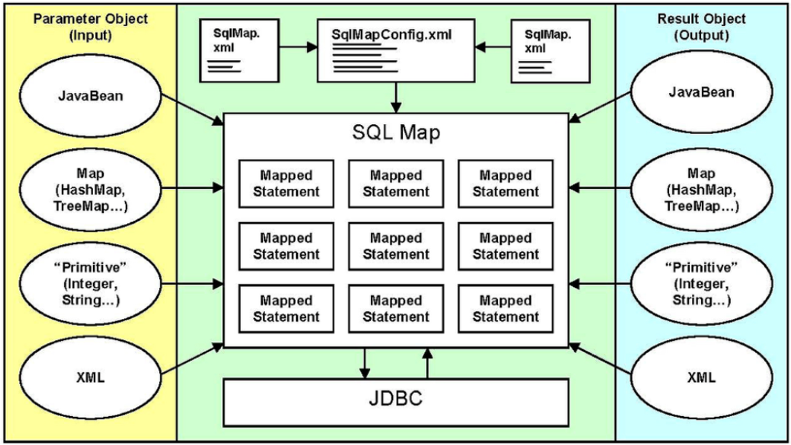
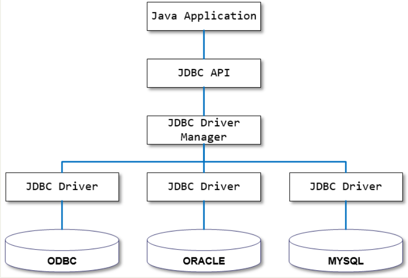
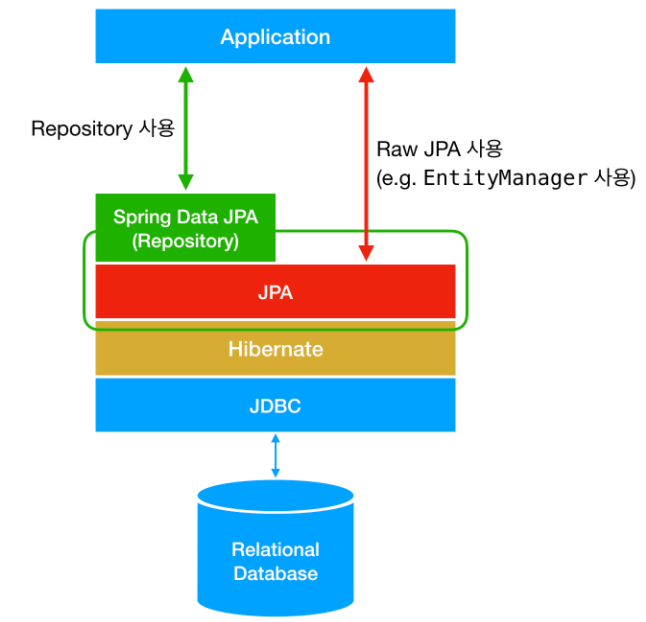
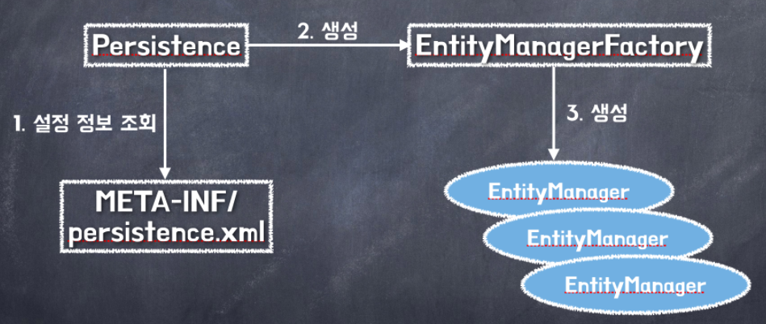

# CLASS01 Mybatis 프레임워크 시작하기

- Mybatis는 Ibatis에서 파생


## Mybatis프레임워크 특징

- 가장 중요한 특징 2가지

  1. 한두 줄의 코드로 DB연동
     - Mybatis는 XML파일에 저장된 SQL명령어를 대신 실행하고 **실행 결과를 VO와 같은 자바 객체에 자동 매핑**
     - 그래서 `Mybatis` = `Data Mapper`
     - Mybatis프레임워크를 이용하여 한 두줄의 코드로 DB연동 처리 가능
  2. SQL명령어를 자바 코드에서 분리해 XML파일에 따로 관리
     - SQL명령어만 변경시, 자바 클래스를 다시 컴파일 할 필요X

- 유지보수 관점에서 DB연동에 사용된 복잡한 자바 코드는 중요하지 않음

  - 개발자는 SQL만 관리
  - Mybatis는 개발자가 SQL관리에 집중할 수 있게 도와줌

  

## Java ORM Plugin 설치

- Mybatis 이용을 위해 Java ORM 플러그인 설치 필요


## 프로젝트 생성

- DB연동을 위한 H2 Driver와 Mybatis, Ibatis 라이브러리들을 내려받기 위해 dependency 추가하기


## VO 클래스 작성

- XML파일에 저장된 SQL명령어에 사용자가 입력한 값들을 전달하고 실행 결과를 매핑할 VO클래스를 작성


## SQLMapper XML 파일 작성

- Mybatis에서 가장 중요한 파일
  - `<mapper>`를 루트 엘리먼트로 사용
  - insert, update, delete, select 엘리먼트 이용해 필요한 SQL구문 등록
  - 기존에 BoardDAO에서 사용했던 SQL구문을 그대로 사용하면 됨
- `board-mapping.xml`

```xml
<?xml version="1.0" encoding="UTF-8"?>

<!DOCTYPE mapper PUBLIC "-//mybatis.org/DTD Mapper 3.0//EN"
						"http://mybatis.org/dtd/mybatis-3-mapper.dtd">
<mapper namespace="BoardDAO">
	<insert id="insertBoard">
    	insert into board(seq, title, writer, content)
        values ((select nvl(max(seq), 0)+1 from board), #{title}, #{writer}, #{content})
    </insert>
    
    <update id="updateBoard">
    	update board set title=#{title}, content=#{content}, where seq=#{seq}
    </update>
    
    <delete id="deleteBoard">
    	delete board where seq=#{seq}
    </delete>
    
    <select id="getBoard" resultType="board">
    	select * from board where seq=#{seq}
    </select>
    
    <select id="getBoardList" resultType="board">
    	select * from board
        where title like '%'||#{searchKeyword}||'%'
        order by seq desc
    </select>
</mapper>
```


## Mybatis 환경설정 파일

- db.properties파일 수정하기
  - MySQL데이터베이스 연동을 위한 프로퍼티 정보가 설정되어 있음
  - H2 데이터베이스 관련정보로 수정

- `sql-map-config.xml`
  - `<properties>`엘리먼트는 XML 설정에서 사용할 프로퍼티를 선언하거나 외부 프로퍼티 파일 참조시 사용
    - 선언된 프로퍼티는 `${프로퍼티명}`으로 참조하여 사용가능
  - `<typeAliases>`엘리먼트는 `<typeAliase>`를 여러 개 가질 수 있음
    - 이 엘리먼트를 이용해 특정 클래스의 별칭 선언 가능
    - Sql Mapper에서 사용 가능
  - `<environments>`엘리먼트엔 다양한 설정 추가 가능
    - 여기선 DataSource만 추가
    - Mybatis는 특정 DBMS로부터 커넥션을 획득하고 DB연동을 처리하기 위해서 반드시 DataSource정보 필요
  - `<mappers>`엘리먼트는 여러 `<mapper>`가질 수 있음
    - `<mapper>`를 이용해 SQL명령어들이 저장된 SQL파일들을 등록할 수 있음

```xml
<?xml version="1.0" encoding="UTF-8"?>

<!DOCTYPE mapper PUBLIC "-//mybatis.org/DTD Mapper 3.0//EN"
						"http://mybatis.org/dtd/mybatis-3-mapper.dtd">
<configuration>
	<!-- Properties 파일 설정-->
    <properties resource="db.properties"/>
    
    <!-- Alias 설정 -->
    <typeAliases>
    	<typeAlias alias="board" type="com.springbook.biz.board.BoardVO"/>
    </typeAliases>
    
    <!-- DataSource 설정-->
    <environments default="development">
    	<environment id="development">
        	<transactionMangeger type="JDBC" />
            <datasource type="POOLED">
            	<property name="driver" value="${jdbc.driverClassName}"/>
                <property name="url" value="${jdbc.url}"/>
                <property name="username" value="${jdbc.username}"/>
                <property name="password" value="${jdbc.upassword}"/>
            </datasource>
        </environment>
    </environments>
    
    <!-- SQL Mapper설정 -->
    <mappers>
    	<mapper resource="mappings/board-mapping.xml"/>
    </mappers>
</configuration>
```


## SqlSession 객체 생성하기

- **Mybatis를 이용하여 DAO를 구현하려면 SqlSession객체가 필요**
  - SqlSession객체를 얻으려면 **SqlSessionFactory객체 필요**
  - 따라서 DAO구현 전, **SqlSessionFactory객체 생성하는 유틸리티 클래스 작성 필요**
- `SqlSessionFactoryBean.java`
  - `sql-map-config.xml`파일로부터 설정 정보를 읽어 들이기 위한 입력 스트림 생성필요
  - 입력 스트림을 통해 `sql-map-config.xml`파일을 읽어 SqlSessionFactory객체 생성

```java
...
    
public class SqlSessionFactoryBean {
    private static SqlSessionFactory sessionFactory = null;
    static {
        try {
            if (sessionFactory == null) {
                Reader reader = Resources.getResourceAsReader("sql-map-config.xml"); 
                sessionFactory = new SqlSessionFactoryBuilder().build(reader);
            }
        } catch (Exception e) {
            e.printStackTrace();
        }
    }
    
    public static SqlSession getSqlSessionInstance() {
        return sessionFactory.openSession();
    }
}
```


## DAO 클래스 작성

- Mybatis를 이용해 데이터베이스 연동 처리
- `BoardDAO.java`
  - 해당 클래스는 생성자에서 SqlSessionFactoryBean이용해 SqlSession객체 얻음
  - 각 메소드는 두 개의 정보 인자로 전달
    - 첫 번째 인자 : 실행될 SQL의 id정보
      - SQL Mapper에 선언된 네임스페이스와 아이디를 조합하여 id를 지정해야 함
    - 두 번째 인자 : parameterType속성으로 지정된 파라미터 객체
      - 등록, 수정, 삭제 => insert(), update(), delete()
      - 단 건 조회, 목록 조회 => selectOne(), selectList()

```java
...

public class BoardDAO {
    private SqlSession mybatis;
    
    public BoardDAO() {
        mybatis = SqlSessionFactoryBean.getSqlSessionInstance();
    }
    
    public void insertBoard(BoardVO vo) {
        mybatis.insert("BoardDAO.insertBoard", vo);
        mybatis.commit();
    }
    
    public void updateBoard(BoardVO vo) {
        mybatis.update("BoardDAO.updateBoard", vo);
        mybatis.commit();
    }
    
    public void deleteBoard(BoardVO vo) {
        mybatis.delete("BoardDAO.deleteBoard", vo);
        mybatis.commit();
    }
    
    public BoardVO getBoard(BoardVO vo) {
        return (BoardVO) mybatis.selectOne("BoardDAO.getBoard", vo);
    }
    
    public List<BoardVO> getBoardList(BoardVO vo) {
        return mybatis.selectList("BoardDAO.getBoardList", vo);
    }
}
```


## 테스트 클라이언트 작성 및 실행

- BoardDAO클래스의 메소드를 테스트하는 클라이언트 프로그램
- `BoardServiceClient.java`

```java
...
    
public class BoardServiceClient {
    public static void main(String[] args) throws SQLException {
        BoardDAO boardDAO = new BoardDAO();
        
        BoardVO vo = new BoardVO();
        vo.setTitle("myBatis 제목");
        vo.setWriter("홍길동");
        vo.setContent("myBatis 내용");
        boardDAO.inserBoard(vo);
        
        vo.setSearchCondition("TITLE");
        vo.setSearchKeyword("");
        List<BoardVO> boardList = boardDAO.getBoardList(vo);
        for(BoardVO board : boardList) {
            System.out.println("---> " + board.toString());
        }
    }
}
```


# CLASS02 Mapper XML 파일 설정

## SQL Mapper XML 기본 설정

### Mybatis 구조



- `SqlMapConfig.xml`파일은 Mybatis 메인 환경설정 파일
  - 이 파일을 읽어 들여 어떤 DBMS와 커넥션을 맺을지, 어떤 SQL Mapper XML파일들이 등록되어 있는지 알 수 있음
- Mybatis는 `SqlMap.xml`파일에 등록된 각 SQL 명령어들을 Map 구조로 저장하여 관리
  - 각 SQL 명령어는 고유한 아이디 값을 가지고 있으므로 특정 아이디로 등록된 SQL을 실행할 수 있음
  - SQL이 실행될 때 **필요한 값들은 input형태의 데이터로 할당**
  - 실행된 SQL이 **SELECT구문일 땐, output형태의 데이터로 리턴**


### Mapper XML 파일 구조

- SQL Mapper XML파일

  = Mapper파일(앞으로 부르게 될 파일명)

  = SQL 명령어들이 저장되는 파일

  = `<mapper>`루트 엘리먼트로 가지는 XML파일

  - namespace 속성을 가짐
  - 이 속성을 이용해 더 쉽게 유일한 SQL아이디를 만들 수 있음
  - 이 네임스페이스가 저장된 Mapper의 SQL을 DAO클래스에서 참조할 땐, 네임스페이스와 SQL 아이디 결합해 참조

- 이 Mapper파일에 SQL 명령어들을 등록할 땐, SQL구문의 종류에 따라 적절한 엘리먼트 사용

  - INSERT구문은 `<insert>` , SELECT구문은 `<select>` 등등


| Mapper XML | `<mapper namespace="boardDAO">` <br />    `<delete id = "deleteBoard">` <br />        delete board where seq=#{seq} <br />    `</delete>` <br />`</mapper>` |
| :--------: | :----------------------------------------------------------- |
| DAO 클래스 | public void deleteBoard(BoardVO vo) {<br />    mybatis.delete("**BoardDAO.deleteBoard**", vo);<br />} |


### `<select>`엘리먼트

- 데이터를 조회하는 SELECT구문을 작성할 때 사용
  - `parameterType`과 `resultType`속성을 사용할 수 있음
- Mapper XML

```xml
<mapper namespace="BoardDAO">
    <select id="getBoard" parameterType="board" resultType="board">
    	select * from board where seq=#{seq}
    </select>
    
    <select id="getBoardList" parameterType="board" resultType="board">
    	select * from board
        where title like '%'||#{searchKeyword}||'%'
        order by seq desc
    </select>
</mapper>
```


#### id 속성

- **필수 속성**
- 반드시 전체 Mapper파일들 내에서 유일한 아이디 등록
  - 그래야 DAO클래스에서 특정 아이디로 등록된 SQL실행 가능
- `<mapper>`엘리먼트에 설정된 네임스페이스
  - **`<mapper>`엘리먼트 안에서 선언된 여러 아이디를 하나의 네임스페이스로 묶을 수 있음**
  - 즉, 다른 xml파일에서 같은 id를 사용해도, namespace가 다르면 다른 그룹


#### parameterType 속성

- 생략가능한 속성이며, **대부분 생략**

- Mapper파일에 등록된 **SQL실행 위해 필요한 데이터를 외부로부터 받기 위한 속성**
- 속성값은 기본형이나 VO형태의 클래스 지정
  - Mybatis 메인 설정 파일인`sql-map-config.xml`에 등록된 `<typeAlias>`의 Alias사용시 설정 더 간결


#### resultType 속성

- **필수 속성**

- 검색 관련 SQL구문이 실행되면 ResultSet이 리턴
  - 이 **ResultSet에 저장된 검색 결과를 어떤 자바 객체에 매핑할지 지정해주는 속성**
- 이 속성값으로도 Alias사용 가능
- **이 속성은 쿼리 명령어가 등록되는 `<select>`엘리먼트에서만 사용 가능**
- 이 속성 대신 resultMap 속성 사용 가능


### `<insert>`엘리먼트

- DB에 데이터를 삽입하는 INSERT구문을 작성하는 요소
- 자식 요소로 `<selectKey>`엘리먼트 가질 수 있음
  - 생성된 키를 쉽게 가져올 수 있음
  - 기본 키 필드의 자동생성 지원
  - 아래 코드는 `board_seq`라는 시퀀스로부터 유일한 값을 얻어내 글 등록에서 일련 번호 (seq)값으로 사용하는 설정

```xml
<insert id="insertBoard" paramteterType="board">
	<selectKey keyProperty="seq" resultType="int">
    	select board_seq.nextval as seq from dual
    </selectKey>
    insert into board(seq, title, writer, content)
    values(#{seq}, #{title}, #{writer}, #{content})
</insert>
```


### `<update>`엘리먼트

- 데이터를 수정할 때 사용되는 UPDATE 구문 작성하는 요소
- Mapper XML

```xml
<mapper namespace="Board">
	<update id="updateBoard" parameterType="board">
    	update board set title=#{title}, content=#{content}
        where seq=#{seq}
    </update>
</mapper>
```


### `<delete>`엘리먼트

- 데이터를 삭제할 때 사용되는 DELETE구문 작성하는 요소

- Mapper XML

```xml
<mapper namespace="Board">
	<delete id="deleteBoard" parameterType="board">
    	delete board where seq=#{seq}
    </delete>
</mapper>
```


## SQL Mapper XML 추가 설정

### resultMap 속성 사용

- 검색 결과를 특정 자바 객체에 매핑하여 리턴하기 위해서 paramterType속성 사용
  - BUT, 검색 결과를 이 속성만으로 매핑할 수 없는 경우도 있음
  - 예) 검색쿼리에 단순 테이블 조회가 아닌 JOIN 구문 포함할 때 등
  - 이때, resultMap속성 사용
- resultMap속성 사용 위해 `<resultMap>`엘리먼트 사용해 매핑 규칙 지정
  - `boardResult`라는 아이디로 resultMap설정
  - PK에 해당하는 SEQ칼럼만 id엘리먼트 사용
  - 나머지는 result엘리먼트 이용해 검색 결과로 얻어낸 칼럼의 값과 BoardVO 객체의 변수 매핑
    - 여기서 설정된 `<resultMap>`을 getBoardList로 등록된 쿼리에서 resultMap속성으로 참조

```xml
<mapper namespace="Board">
	<resultMap id="boardResult" type="board">
    	<id property="seq" columns="SEQ" />
        <result property="title" column="TITLE" />
        <result property="writer" column="WRITER" />
        <result property="content" column="CONTENT" />
        <result property="regDate" column="REGDATE" />
        <result property="cnt" column="CNT" />
    </resultMap>
    
    <select id="getBoardList" parameterType="board" resultMap="boardResult">
    	select * from board
        where title like '%'||#{searchKeyword}||'%'
        oreder by seq desc
    </select>
</mapper>
```


### CDATA Section 사용

- XML고유의 문법
- CDATA 영역에 작성된 데이터는 단순한 문자 데이터
  - XML파서가 해석하지 않도록 해야함
  - 따라서, 해당 영역에 작성된 데이터는 XML파서가 처리X
    - DB에 그대로 전달

- EX ) SQL구문 내 `<` 기호 사용시 에러 발생
  - XML파서가 XML파일 처리시 작다의 의미가 아닌, 다른 태그로 인식하기 때문
  - 이때 아래 코드처럼 CDATA Section으로 SQL구문 감싸주면 에러 사라짐

```xml
<select id="getBoard" resultType="board">
	<![CDATA[
	select *
	from board
	where seq <= #{seq}
	]]>
</select>
```


### SQL 대문자로 설정하기

- Mapper파일에 등록되는 SQL구문은 일반적으로 대문자로 작성
  - BUT, SQL구문은 대소문자 구분X
  - 하지만, 파라미터들을 반인딩할 때 대부분 칼럼명과 변수명이 같으므로 SQL구문은 대문자로 표현하기


## Mybatis JAVA API

### SqlSessionFactoryBuilder 클래스

- Mybatis로 DAO클래스의 CRUD 메소드를 구현하려면 Mybatis에서 제공하는 SqlSession객체 사용해야 함
  - SqlSession객체는 SqlSessionFactory로부터 얻어야 하므로 해당 객체 생성 선행되어야 함
  - SqlSessionFactory생성하려면 SqlSessionFactoryBuilder의 build() 메소드 이용
  - build()메소드는 Mybatis 설정 파일인 `sql-map-config.xml`을 로딩하여 SqlSessionFactory객체 생성
    -  `sql-map-config.xml`을 로딩하려면 입력 스트림인 Reader객체 필요

**=> 즉, SqlSessionFactoryBuilder의 build()메소드 이용해 SqlSessionFactory객체 생성 후, SqlSession객체 얻기**

```java
// Reader객체를 통한 Mybatis설정파일 로딩
Reader reader = Resources.getResourceAsReader("sql-map-config.xml"); 

// 로딩된 설정파일(reader)을 SqlSessionFactoryBuilder의 build메소드를 이용하여, SqlSessionFactory객체 생성
SqlSessionFactory sessionFactory = new SqlSessionFactoryBuilder().build(reader);
```


### SqlSessionFactory 클래스

- SqlSession객체에 대한 공장 역할 수행
- SqlSessionFactory 객체는 openSession()메소드 제공
  - 이 **openSession()메소드를 이용해 SqlSession객체 얻을 수 있음**

```java
// 로딩된 설정파일(reader)을 SqlSessionFactoryBuilder의 build메소드를 이용하여, SqlSessionFactory객체 생성
SqlSessionFactory sessionFactory = new SqlSessionFactoryBuilder().build(reader);

// openSession()메소드를 이용해 SqlSession객체 얻기
sqlSession session = sessionFactory.openSession();

// 얻어낸 SqlSession객체 통해 글 등록 기능 처리
session.insert("BoardDAO.insertBoard", vo);
```


### 유틸리티 클래스 작성

- Mybatis를 사용하여 DB연동을 간단하게 처리하려면 Mybatis가 제공하는 SqlSession객체 사용해야 함
  - 따라서, 모든 DAO클래스에서 쉽게 SqlSession 객체 획득케 하기 위해 유틸리티 클래스 만들기
- `SqlSessionFactoryBean.java`
  - 나중에 Mybatis를 스프링과 연동한 후, 프레임워크에서 제공하는 클래스 사용하면 간편하게 구현 가능

```java
...
    
public class SqlSessionFactoryBean {
    private static SqlSessionFactory sessionFactory = null;
    
    static{
        try{
            if(sessionFactory == null) {
                Reader reader = Resources.getResourceAsReader("sql-map-config.xml");
                sessionFactory = new SqlSessionFactoryBuilder().build(reader);
            }
        } catch (Exception e) {
            e.printStackTrace();
        }
    }
    
    public static SqlSession getSqlSessionInstance() {
        return sessionFactory.openSession();
    }
}
```


### SqlSession 객체

- Mapper XML에 등록된 SQL을 실행하기 위한 다양한 API제공


#### selectOne() 메소드

- 오직 하나의 테이블 검색하는 SQL구문을 실행할 때 사용
- getboard()와 같은 단 건 조회용 메소드 구현할 때 사용
  - 쿼리가 한 개의 레코드만 리턴되는지 검사
  - 한 개 이상이면 예외 발생

```
- public Object selectOne(String statement)

- public Object selectOne(String statement, Object parameter)
```

- selectOne()메소드의 statement매개변수는 Mapper XML파일에 등록된 SQL 아이디
  - 이때, SQL의 아이디를 네임스페이스와 결합하여 지정하기
  - 실행될 SQL구문에서 사용할 파라미터 정보를 두 번째 인자로 지정하기


 ### selectList() 메소드

- 여러 개의 데이터가 검색되는 SQL구문을 실행할 때 사용
- 매개변수의 의미는 selectOne() 메소드와 같음

```
- public List selectList(String statement)

- public List selectList(String statement, Object parameter)
```


### insert(), update(), delete() 메소드

- INSERT, UPDATE, DELETE SQL 구문을 실행할 때 사용
- 각각의 메소드는 SQL구문으로 인해 몇 건의 데이터가 처리되었는지 리턴

```
- public int insert(String statement, Object parameter)

- public int update(String statement, Object parameterObject) throws SQLException

- public int delete(String statmeent, Object parameterObject) throws SQLException
```


- `BoardDAO.java`

```java
...

public class BoardDAO {
    private SqlSession mybtis;
    
    public BoardDAO() {
        mybatis = SqlSessionFactoryBean.getSqlSessionInstance();
    }
    
    public void insertBoard(BoardVO vo) {
        mybatis.insert("Board.insertBoard", vo);
        mybatis.commit();
    }
    
    public void updateBoard(BoardVO vo) {
        mybatis.update("Board.updateBoard", vo);
        mybatis.commit();
    }
    
    public void deleteBoard(BoardVO vo) {
        mybatis.delete("Board.deleteBoard", vo);
        mybatis.commit();
    }
    
    public BoardVO getBoard(BoardVO vo) {
        return (BoardVO) mybatis.selectOne("Board.getBoard", vo);
    }
    
    public List<BoardVO> getBoardList(BoardVO vo) {
        return mybatis.selectList("Board.getBoardList", vo);
    }
}
```


# CLASS03 스프링과 Mybatis연동

## 라이브러리 내려받기

- 스프링쪽에서 필요한 API제공를 제공하는 것이 아닌, <u>Mybatis에서 스프링 연동에 필요한 API제공</u>

```
- org.mybatis.spring.SqlSessionFactoryBean

- org.mybatis.spring.SqlSessionTemplate
```


- `pom.xml`에 dependency 추가 후, Maven Dependencies에 라이브러리들 추가 됐는지 확인

```xml
<!-- Mybatis -->
<dependency>
	<groupId>org.mybatis</groupId>
    <artifactId>mybatis</artifactId>
    <version>3.3.1</version>
</dependency>

<!-- Mybatis Spring -->
<dependency>
	<groupId>org.mybatis</groupId>
    <artifactId>mbatis-spring</artifactId>
    <version>1.2.4</version>
</dependency>
```


## Mybatis 설정 파일 복사 및 수정

- 스프링과 Mybatis 연동하려면 `sql-map-config.xml`과 `Mapper 파일` 필요
  - `sql-map-config.xml` : Mybatis메인 환경설정 파일
  - `Mapper파일` : SQL명령어들이 저장되어 있는 파일
- `sql-map-config.xml`에서 데이터 소스 관련 파일 지우기
  - 이미 스프링에서 등록해 사용하고 있었음
  - 데이터 소스는 DB연동뿐 아니라 다양한 곳에서 사용 가능하니 스프링에서 제공하는게 맞음


## 스프링 연동 설정

- 먼저, 스프링 설정파일에 SqlSessionFactoryBean 클래스를 Bean등록하기
  - **SqlSessionFactotyBean객체로부터 DB연동 구현에 사용할 SqlSession객체 얻을 수 있음**
- `applicationContext.xml`
  - 기존엔 SqlSession객체 얻기 위해 SqlSessionFactoryBean 클래스를 유틸리티 클래스로 직접 구현
  - 여기선, 이 클래스를 Mybatis에서 제공하므로 굳이 작성할 필요X

```xml
...
<bean id="sessionFactory" class="org.mybatis.spring.SqlSessionFactoryBean">
	<property name="dataSource" ref="dataSource"/>
    <property name="configLocation" value="classpath:sql-map-config.xml"/>
</bean>

...
```

- SqlSessionFactoryBean객체가 SqlSession객체를 생산하려면 
  - 반드시 DataSource와 SQL Mapper정보 필요
  - 따라서, 앞에 등록된 DataSource를 Setter인젝션으로 참조, 
  - SQL Mapper가 등록된 sql-map-config.xml파일도 Setter인젝션으로 설정하기


## DAO클래스 구현방법1 - (SqlSessionDaoSupport클래스 상속)

- `BoardDAOMybatis.java`
  - SqlSessionDaoSupport클래스 상속 후, setSqlSessionFactory()메소드 재정의
    - 여기에 @Autowired를 붙였기에 스프링 컨테이너가 setSqlSessionFactory()메소드 자동 호출
    - 이때, 스프링 설정 파일에 `<bean>`등록된 SqlSessionFactoryBean객체를 인자로 받아 부모인 SqlSessionDaoSupport에 setSqlSessionFactory()메소드로 설정
    - 이렇게 해야 SqlSessionDaoSupport클래스로부터 상속된 getSqlSession()메소드를 호출하여 SqlSession객체 리턴받을 수 있음

```java
...

@Repository
public class BoardDAOMybatis extends SqlSessionDaoSupport {
    @Autowired // 재정의 하기 
    public void setSqlSessionFactory(SqlSessionFactory sqlSessionFactory) {
        supper.setSqlSessionFactory(sqlSessionFactory);
    }
    
    public void insertBoard(BoardVO vo) {
        System.out.println("===> Mybatis로 insertBoard() 기능 처리");
        getSqlSession().insert("BoardDAO.insertBoard", vo);
    }
    
    public void updateBoard(BoardVO vo) {
        System.out.println("===> Mybatis로 updateBoard() 기능 처리");
        getSqlSession().update("BoardDAO.updateBoard", vo);
    }
    public void insertBoard(BoardVO vo) {
        System.out.println("===> Mybatis로 deleteBoard() 기능 처리");
        getSqlSession().delete("BoardDAO.deleteBoard", vo);
    }
    
    public BoardVO getBoard(BoardVO vo) {
        System.out.println("===> Mybatis로 getBoard() 기능 처리");
		return (BoardVO) getSqlSession().selectOne("BoardDAO.getBoard", vo);
    }
    
    public List<BoardVO> getBoardList(BoardVO vo) {
        System.out.println("===> Mybatis로 getBoardList() 기능 처리");
        return getSqlSession().selectList("BoardDAO.getBoardList", vo);
    }
}

```


## DAO클래스 구현방법2 - SqlSessionTemplate클래스 `<bean>`등록

- 스프링 설정 파일에서 SqlSessionTemplate클래스를 SqlSessionFactoryBean아래에 `<bean>`등록
  - SqlSessionTemplate클래스엔 Setter메소드 존재X
  - 따라서, 생성자 메소드 통한 Constructor주입필요
  - 그 후, DAO클래스 구현할 때, SqlSessionTemplate객체를 @Autowired이용해 의존성 주입 처리
    - SqlSessionTemplate객체로 DB연동 로직 처리

- `applicationContext.xml`

```xml
...
<!-- Spring과 Mybatis 연동 설정 -->
<bean id="sqlSession" class="org.mybatis.spring.SqlSessionFactoryBean">
	<proeprty name="configLocation" value="classpath:sql-map-config.xml"/>
    <property name="dataSource" ref="dataSource"/>
</bean>

<bean class-"org.mybatis.spring.SqlSessionTemplate">
	<constructor-arg ref="sqlSession"></constructor-arg>
</bean>
...
```


## Mybatis 연동테스트

- BoardDAOMybatis 객체를 의존성 주입할 수 있도록 BoardServieImpl클래스 수정


## Dynamic SQL으로 검색 처리

- SQL의 재사용성과 유연성 향상 위함
- 다양한 쿼리를 DB에 전송가능

- `board-mapping.xml`
  - `<if>`라는 동적 요소를 사용해 조건에 따른 분기 처리
  - searchCondition 변숫값이
    - TITLE을 가지고 있으면 제목 검색에 해당하는 조건 추가
    - CONTENT를 가지고 있으면 내용 검색에 해당하는 조건 추가

```xml
<select id="getBoardList" resultMap="boardResult">
	SELECT *
    FROM BOARD
    WHERE 1 = 1
    <if test="searchCondition == 'TITLE'">
    	AND TITLE LIKE '%'||#{searchKeyword}||'%'
    </if>
    <if test="searchCondition == 'CONTENT'">
    	AND CONTENT LIKE '%'||#{searchKeyword}||'%'
    </if>
    ORDER BY SEQ DESC
</select>
```

​	

# CLASS04 JPA(Java Persistence API)개념

- 자바의 객체와 DB의 테이블이 정확하게 일치하지 않아, 둘 사이를 매핑하기 위해 많은 SQL구문과 자바코드 필요

  - **ORM(Object-Relation Mapping)은 정확하게 일치하지 않는 자바객체와 테이블 사이를 매핑**

    => 즉, <u>ORM은 자바 객체에 저장된 데이터를 테이블의 Row정보로 저장</u>

    => <u>반대로, 테이블에 저장된 Row정보를 자바 객체로 매핑</u>

    - 이때 사용하는 SQL구문과 자바 코드는 ORM프레임워크가 자동 생성

- ORM의 가장 큰 특징

  - DB연동에 필요한 SQL을 자동으로 생성
  - 이렇게 **생성된 SQL은 DBMS가 변경될 때 자동으로 변경**
  - 단, ORM환경설정 파일에 DBMS가 변경되었다는 점만 수정해주면 됨

- Hibernate프레임워크 등장

  - 객체와 테이블 간의 일치를 위한 프레임워크
  - 완벽한 ORM 프레임워크
    - **자바 객체와 테이블의 ROW를 매핑하는 역할 수행**

- JPA

  - 다양한 ORM프레임워크의 등장
  - **ORM 프레임워크들에 대한 표준화 작업을 도와줌**


## JPA 특징

- JPA는 모든 ORM 구현체(ORM 프레임워크)들의 공통 인터페이스 제공


### JDBC 프로그램 구조



- JDBC는 특정 DBMS에 종속되지 않는 DB연동 구현 지원
- JDBC API(java.sql)의 인터페이스들을 이용하면 실질적인 DB연동처리는 해당 DBMS의 드라이버 클래스들이 담당
  - 따라서, DBMS가 변경되는 상황에서 드라이버만 변경하면 다른 애플리케이션 수정X
  - JPA도 마찬가지


### JPA 프로그램 구조



- 애플리케이션을 구할 때 JPA API(java.persistence)를 이용하면 Hibernate를 ORM 프레임워크로 사용하다 다른 걸로 변경가능
  - 마치 오라클 사용하다가 MySQL사용하는 것처럼


## JPA 프로젝트 생성

## JPA 라이브러리 내려받기

## JPA 시작하기

### 엔티티 클래스 매핑

- DB의 테이블과 매핑될 영속 클래스 작성해 매핑 관련 설정 추가
- 엔티티 클래스를 작성하는데 특별한 제약조건이나 규칙있는 건 X
  - 일반적인 VO클래스 만들듯이 작성
  - 이클립스에서 제공하는 JPA Entity 생성 기능 이용하기
- 엔티티 클래스에 JPA매핑 관련 어노테이션 설정하기
- 엔티티 클래스의 모든 멤버변수를 private으로 선언
  - 영속 객체가 테이블과 매핑될 때 객체 식별방법이 필요하므로 유일 식별자를 소유하는 클래스로 작성

- `Board.java`
  - 매핑 정보가 없는 나머지 필드들은 자동으로 BOARD테이블의 동일한 칼럼과 매핑

```java
...

@Entity
@Table(name="BOARD")
public class BoardVO { 
	@Id
    @GeneratedValue
	private int seq; // seq변수를 SEQ칼럼과 매핑
	private String title;
	private String writer;
	private String content;
    @Temporal(TemporalType.DATE)
	private Date regDate = new Date();
	private int cnt;
    
    ...

	@Override
	public String toString() {
		return "BoardVO [seq=" + seq + ", title=" + title + ", writer=" + writer + ", content=" + content + ", regDate="
				+ regDate + ", cnt=" + cnt + "]";
	}
	
	
}

```


#### 어노테이션 의미

| 어노테이션      | 의미                                                         |
| :-------------- | :----------------------------------------------------------- |
| @Entity         | - @Enity가 설정된 클래스 = 엔티티 클래스<br />- **@Entity가 붙은 클래스는 테이블과 매핑** |
| @Table          | - 엔티티와 관련된 테이블 매핑 <br />- name속성 사용해 BOARD테이블과 매핑 <br /> - **생략하면 클래스 이름이 테이블 이름과 매핑** |
| @Id             | - 엔티티 클래스의 **필수 어노테이션** <br />- 특정 변수를 테이블의 기본 키와 매핑 <br />- @Id가 없는 엔티티 클래스는 JPA가 처리하지 못함 |
| @GeneratedValue | - @Id가 선언된 필드에 기본 키를 자동으로 생성하려 할당할 때 사용 <br />- 이 어노테이션만 사용하면 DB에 따라서 자동으로 결정됨 <br />- H2는 시퀀스를 이용해 처리 |
| @Temporal       | - 날짜 타입의 변수에 선언하여 날짜 타입을 매핑할 때 사용 <br />- TemporalType의 DATE, TIME, TIMESTAMP 중 하나 선택 |


### persistence.xml 파일 작성

- JPA는 persistence,xml파일을 사용하여 필요한 설정 정보 관리
  - 이 파일이 META-INF 폴더 아래에 있으면 별도의 설정 없이 JPA가 인식
- `persistence.xml`
  - JPA에서 메인 환경설정 파일
  - `<persistence>`를 루트 엘리먼트로 사용
    - 영속성 유닛(persistence-unit)이 설정되어 있음
    - 영속성 유닛은 연동할 DB당 하나의 영속성 유닛 사용

```xml
<?xml version="1.0" encoding="UTF-8"?>
<persistence version="2.1"
    	xmlns="http://xmlns.jcp.org/xml/ns/persistence"
    	xmlns:xsi="http://xmlns.w3.org/2001/XMLSchema-instance"
        xsi:schemaLocation="http://xmlns.jcp.org/xml/ns/persistence http://xmlns.jcp.org/xml/ns/persistence/persistence_2_1.xsd">
	<persistence-unit name="JPAProject">
    <class>com.springbook.biz.board.Board</class>
    <properties>
    	<!-- 필수 속성 -->
        <property name="javax.persistence.jdbc.driver" value="org.h2.Driver"/>
        <property name="javax.persistence.jdbc.user" value="sa"/>
        <property name="javax.persistence.jdbc.password" value=""/>
        <property name="javax.persistence.jdbc.url" value="jdbc:h2:txp://localhost/~/test"/>
        <property name="hibernate.dialect" value="org.hibernate.dialect.H2Dialect"/>
        
        <!-- 옵션 -->
        <property name="hibernate.show_sql" value="true"/>
        <property name="hibernate.format_sql" value="true"/>
        <property name="hibernate.use_sql_comments" value="false"/>
        <property name="hibernate.id.new_generator_mappings" value="true"/>
        <property name="hibernate.hbm2ddl.auto" value="create"/>
    </properties>        
    </persistence-unit>
</persistence>
```


### 클라이언트 프로그램 작성

- `BoardServiceClient.java`

```java
...
    
public class BoardServiceClient {
    public static void main(String[] args) {
        //EntityManager 설정
        EntityManagerFactory emf = Persistence.createEntityManagerFactory("JPAProject");
        EntityManager em = emf.createEntityManger();
        
        // Transaction 생성
        EntityTransaction tx = em.getTransaction();
        try {
            // Transaction 시작
            tx.begin();
            
            Board board = new Board();
            board.setTitle("JPA 제목");
            board.setWriter("관리자");
            board.setContent("JPA 글 등록 잘 되나요,,");
            
            // 글 등록
            em.persist(board);
            
            // 글 목록 조회
            String jpql = "select b from Board b order by b.seq desc";
            List<BoardVO> boardList = em.createQuery(jpql, Board.class).getResultList();
            
            for (Board brd : boardList) {
                System.out.println("===> " + brd.toString());
            }
            
            // Transaction commit
            tx.commit();
        } catch (Exception e) {
            e.printStackTrace();
            // Transaction rollback
            tx.rollback();
        } finally {
            em.close();
        }
        emf.close();
    }
    
}
```

- 가장 먼저 영속성 유닛(persistence-unit)을 이용해 EntityManagerFactory객체 생성
  - JPA를 이용해 CRUD기능 구현하려면 EntityManager객체 사용필요
  - 이 EntityManager객체는 EntityManagerFactory객체로부터 얻을 수 있음


# CLASS05 JPA환경설정

- 대부분 프레임워크는 실행에 필요한 다양한 환경설정을 XML파일로 처리
  - JPA는 persistence.xml파일 사용
  - 이 파일은 `<persistence>`를 루트 엘리먼트로 사용
  - 영속성 유닛(persistence-unit)과 관련된 다양한 정보 설정


## 영속성 유닛(Persistence Unit) 설정

### 영속성 유닛 이름 지정

- **영속성 유닛은 연동할 DB하나당 하나씩 등록**
- 영속성 유닛에 설정된 이름은 나중에 DAO클래스 구현할 때 EntityManagerFactory객체 생성에 사용
- Persistence설정

```xml
<persistence-unit name="JPAProject"></persistence-unit>
```

- Java소스
  - JPA이용해 DB연결하려면 EntityManager객체 필요
  - 이 객체를 얻으려면 EntityManagerFactory객체 필요
    - EntityManagerFactory객체를 생성할 때, 영속성 유닛 사용

```java
// EnityManagerFactory객체 생성할 때, 영속성 유닛 사용
EntityManagerFactory emf = Persistence.createEntityManagerFactory("JPAProject");
EntityManager em = emf.createEntityManager();
```


### 엔티티 클래스 등록

- **영속성 유닛 설정에서 가장 먼저 엔티티 클래스 등록**
  - 이 엔티티 클래스는 JPA프로젝트에서 JPA Enity클래스를 작성하는 순간 자동으로 persistence.xml파일에 등록
  - 스프링과 함께가 아닌, JPA단독 사용시 앤티티 클래스 등록하기
    - 스프링하고 쓰면 엔티티 클래스 일일이 등록할 필요X


### 영속성 유닛 프로퍼티 설정

- 엔티티 클래스의 영속성 관리에 필요한 프로퍼티들 설정필요
  - 이 중, 가장 기본이면서 중요한 것이 DB커넥션 설정
  - **DB커넥션 정보를 바탕으로 hibernater같은 JPA구현체가 특정 DB와 커넥션을 맺을 수 있음**
- 각 프로퍼티의 의미

|          프로퍼티 이름          |      프로퍼티 의미      |
| :-----------------------------: | :---------------------: |
|  javax.persistence.jdbc.driver  |   JDBC드라이버 클래스   |
|   javax.persistence.jdbc.user   |  데이터베이스의 아이디  |
| javax.persistence.jdbc.password | 데이터베이스의 비밀번호 |
|   javax.persistence.jdbc.url    |      JDBC URL 정보      |


### DIalect클래스 설정

- JPA는 DBMS에 최적화된 SQL을 제공하기 위해 DBMS마다 다른 Dialect클래스 제공
  - Dialect클래스가 해당 DBMS에 최적화된 SQL구문을 생성
  - 현재, H2 데이터베이스 사용하고 있으니 H2 Dialect클래스 등록
  - `<property name="hibernate.dialect" value="org.hibernate.dialect.H2Dialect"/>`
  - **DBMS가 변경되는 경우, Dialect클래스만 변경하면 SQL이 자동으로 변경되어 생성**


### JPA 구현체 관련 속성 설정

```xml
<!-- 옵션 -->
<property name="hibernate.show_sql" value="true"/>
<property name="hibernate.format_sql" value="true"/>
<property name="hibernate.use_sql_comments" value="false"/>
<property name="hibernate.id.new_generator_mappings" value="true"/>
<property name="hibernate.hbm2ddl.auto" value="create"/>
```


- JPA구현체 관련 속성의 의미

|                속성                 |                             의미                             |
| :---------------------------------: | :----------------------------------------------------------: |
|         hibernate.show_sql          |                   생성된 SQL을 콘솔에 출력                   |
|        hibernate.format_sql         |         SQL출력할 때, 일정한 포맷으로 보기 좋게 출력         |
|     hibernate.use_sql_comments      |                SQL에 포함된 주석도 같이 출력                 |
| hibernate.id.new_generator_mappings |                   새로운 키 생성 전략 사용                   |
|     **hibernate.hbm2ddl.auto**      | 테이블 생성, 수정, 삭제같은 DDL 구문을 자동으로 처리할지 지정 |


- `hibernate.hbm2ddl.auto` 의 속성값들
  - DDL명령어와 관련

|   속성값    |                             의미                             |
| :---------: | :----------------------------------------------------------: |
|   create    | 애플리케이션을 실행할 때, <br />기존 테이블을 삭제하고 엔티티 클래스에 설정된 매핑 설정을 참조해 <br />새로운 테이블 생성 <br />(DROP -> CREATE) |
| create-drop | create와 같음 애플리케이션이 종료되기 직전에 생성된 테이블 삭제 <br />(DROP -> CREATE -> DROP) |
|   update    | 기존에 사용 중인 테이블이 있으면 새 테이블을 생성하지 않고 재사용 <br />만약 엔티티 클래스와 매핑 설정이 변경되면 변경된 내용만 반영(ALTER) |


- DDL 자동생성 기능
  - 애플리케이션 실행 시점에 테이블이 자동으로 생성
  - 하지만 이 기능을 사용할 일은 거의 없음
    - 일반적으로 프로젝트 초기에 데이터 모델링 마무리되고 비즈니스 컴포넌트 개발로 들어가기 때문


## 엔티티 클래스 기본 매핑

- JPA의 기본
  - 엔티티 클래스를 기반으로 관계형 데이터베이스에 저장된 데이터를 관리하는 것
  - POJO클래스로 작성하면 됨


### @Entity

- 특정 클래스를 JPA가 관리하는 엔티티 클래스로 인식
- 가장 중요한 어노테이션
- 엔티티 클래스 선언부 위에 **@Entity붙이면 JPA가 그 클래스를 엔티티 클래스로 인식**
  - 관련 테이블 자동 매핑
- @Entity가 추가된 Board 클래스는 BOARD테이블과 자동 매핑
  - 만약, Board클래스와 다른 테이블을 매핑하려면 @Table 사용


### @Id

- **엔티티 클래스와 매핑되는 테이블은 각 ROW를 식별하기 위한 PK칼럼 가져야 함**
  - 이런 테이블과 매핑되는 엔티티 클래스도 PK칼럼과 매핑될 변수를 가지고 있어야 함
  - 이런 변수를 식별자 필드라고 함
    - **식별자 필드는 엔티티 클래스라면 무조건 가지고 있어야 함**
    - @Id를 이용해 선언

```java
...

@Entity
public class Board {
	@Id
	private int seq;
	private String title;
	private String writer;
	private String content;
	private Date regDate;
	private int cnt;
}
```


### @Table

- 엔티티 클래스를 정의할 때, 엔티티 클래스와 매핑되는 테이블 이름을 별도로 지정하지 않으면 엔티티 클래스 이름과 같은 이름의 테이블이 자동 매핑

- @Table 속성

| 속성              | 설명                                                         |
| ----------------- | ------------------------------------------------------------ |
| name              | 매핑될 테이블 이름을 지정                                    |
| catalog           | 데이터베이스 카탈로그를 지정                                 |
| schema            | 데이터베이스 스키마 지정                                     |
| uniqueConstraints | 결합 unique 제약조건을 지정 <br />여러 개의 컬럼이 결합되어 유일성을 보장해야 하는 경우 사용 |


```java
...

@Entity
@Table(name="E_Board", uniqueConstraints={@UniqueConstraint(columnNames={"SEQ", "WRITER"})})
public class Board implements Serializable {
	@Id
	private int seq;
	private String title;
}
```

- 위의 설정은 Board라는 엔티티 클래스가 E_BOARD테이블과 매핑됨
- SEQ와 WRITER 두 개의 칼럼을 결합했을 때, 유일한 값만 유지해야 함


### @Column

- 엔티티 클래스의 변수와 테이블의 칼럼을 매핑할 때 사용
- 일반적으로 엔티티 클래스의 변수 이름과 칼럼 이름이 다를 때 사용
- 생략하면 기본으로 변수 이름과 칼럼 이름을 동일하게 매핑
  - title변수는 TITLE 칼럼과 자동 매핑
- @Column의 속성
  - 주로 nullable만 사용

| 속성             | 설명                                                         |
| ---------------- | ------------------------------------------------------------ |
| name             | 칼럼 이름 지정 <br />생략시 프로퍼티명과 동일하게 매핑       |
| unique           | unique제약조건 추가 (기본값:false)                           |
| **nullable**     | null 상태 허용 여부 설정 (기본값:false)                      |
| insertable       | 입력 SQL명령어를 자동으로 생성할 때, 이 칼럼을 포함할 것인지 지정 (기본값:true) |
| updatable        | 수정 SQL명령어를 자동으로 생성할 때, 이 칼럼을 포함할 것인지 지정 (기본값:true) |
| columnDefinition | 이 컬럼에 대한 DDL문을 직접 설정                             |
| length           | 문자열 타입의 칼럼 길이 지정 (기본값 : 255)                  |
| precision        | 숫자 타입의 전체 자릿수 지정 (기본값 : 0)                    |
| scale            | 숫자 타입의 소수점 자릿수 지정 (기본값 : 0)                  |


```java
...

@Entity
@Table(name="E_Board")
public class Board {
	@Id
	private int seq;
    @Column(name="BOARD_TITLE", nullable=false, length="30") // null 허용X
	private String title;
    @Column(name="BOARD_WRITER", updatable=false) // 작성자는 수정 SQL구문을 생성할 때 제외
    private String writer;
    @Column(name="BOARD_CONTENT", nullable=false)
    private String content;
    @Column(name="BOARD_BOARD_REG_DATE")
    private Date regDate;
    @Column(name="BOARD_CNT")
    private int cnt;
}
```


### @GeneratedValue

- @Id로 지정된 식별자 필드에 PK값을 생성하여 지정할 때 사용


```java
...

@Entity
public class Board {
	@Id
    @GeneratedValue(strategy=GenerationType.SEQUENCE)
	private int seq;
}
```


- @GeneratedValue의 속성

| 속성      | 설명                                                         |
| --------- | ------------------------------------------------------------ |
| strategy  | 자동 생성 유형 지정(GenerationType 지정) <br />PK값 생성 전략 지정하는 속성 |
| generator | 이미 생성된 Generator이름 지정                               |


- PK값 생성 전략

| PK값 생성 전략 | 설명                                                         |
| -------------- | ------------------------------------------------------------ |
| TABLE          | - Hibernate가 DB 테이블 사용해 PK값 생성 <br />- PK값 생성 위한 별도 테이블 설정 필요 |
| SEQUENCE       | - Sequence Object를 이용해 PK값 생성 -<br />- 오라클과 같은 Sequence를 지원하는 DB에서만 사용가능 |
| IDENTITY       | - auto_increment나 IDENTITY이용해 PK값 생성 <br />- 일반적으로 MySQL 같은 데이터베이스 이용시 사용 |
| AUTO           | - Hibernate가 사용 중인 데이터베이스에 맞게 자동으로 PK값 생성 <br />- 아무런 설정 없을 시, 기본 값 사용 |


### @Transient

- 엔티티 클래스의 변수들은 대부분 테이블의 칼럼과 매핑
  - BUT, 몇몇 변수는 매핑되는 칼럼 없거나, 아예 매핑에서 제외해야할 때
  - @Transient는 엔티티 클래스 내의 **특정 변수를 영속 필드에서 제외할 때 사용**

```java
...

@Entity
@Table(name="Board")
public class Board {
	@Transient
    private String searchCondotion;
    @Trasient
    private String searchKeyword;
    @Transient
    private MultipartFile uploadFile;
```

- searchCondition, searchKeyword, uploadFile변수는 BOARD테이블에서 매핑되는 칼럼X
  - 각 변수에 저장된 값을 테이블에 저장할 필요도 없음
  - 따라서 제외 처리


### @Temporal

- java.util.Date타입의 날짜 데이터를 매핑할 때 사용
- TemporalType을 이용하면 출력되는 날짜의 형식 지정할 수 있음
  - TemporalType.DATE : 날짜 정보만 출력
  - TemporalType.Type : 시간 정보만 출력
  - TemporalType.TIMESTAMP : 날짜, 시간 정보 모두 출력


```java
...

@Entity
@Table(name="Board")
public class Board {
	@Id
    @GeneratedValue
	private int seq;
	private String title;
    private String writer;
    private String content;
    @Temporal(TemporalType.DATE)
    private Date regDate = new Date();
    private int cnt;
}
```


## JPA API

### JPA API 구조

- 엔티티 클래스에 기본적인 매핑을 설정했으면 JPA 에서 지원하는 API이용해 DB연동가능
- 애플리케이션에서 JPA를 이용해 CRUD기능을 처리하려면 엔티티 관리자(EntityManager) 객체 사용해야 함
  - ntityManagerFactory로부터 얻을 수 있음




1. Persistence 클래스를 이용해 영속성 유닛(persistence-unit) 정보가 저장된 JPA 메인 환경설정 파일(persistence.xml)로딩
   - JPA가 자동으로 META-INF 폴더에 있는 persistence.xml파일을 로딩하는 것
2. 이 설정 정보를 바탕으로 EntityManager를 생성하는 공장 기능의 EntityManagerFactory객체 생성
   - EntityManagerFactory객체를 생성할 땐 영속성 유닛 필요
   - `persistence.xml`파일에 설정한 영속성 유닛(1번 과정) 이름을 지정해 객체를 얻음
3. 이제 EntityManagerFactory로부터 필요한 EntityManager 객체를 얻어 사용
   - EntityManager객체를 통해 EntityTransaction객체 얻을 수 있음
   - 이 객체를 통해 트랜잭션 제어 가능
   - `EntityTransaction tx = em.getTransaction();`


- EntityManager객체가 제공하는 CRUD기능의 메소드

|                        메소드                        |                      기능 설명                      |
| :--------------------------------------------------: | :-------------------------------------------------: |
|               `persist(Object entity)`               |           엔티티를 영속화<br /> (INSERT)            |
|                `merge(Object entity)`                |    준영속 상태의 엔티티를 영속화 <br /> (UPDATE)    |
|               `remove(Object entity)`                |        영속상태의 엔티티 제거 <br />(DELETE)        |
|  `find(Class<T> entityClass, Object primary keys)`   |        하나의 엔티티 검색 <br />(SELECT ONE)        |
| `createQuery(String qlString, Class<T> resultClass)` | JPQL에 해당하는 엔티티 목록 검색<br />(SELECT LIST) |


### JPA API 사용

```java
// Transaction 시작
tx.begin();

Board board = new Board(); // 엔티티 클래스로 등록된 Board객체 생성
board.setTitle("JPA 제목");
board.setWriter("관리자");
board.setContent("JPA 글 등록 잘 되나요,,");

// 글 등록
em.persist(board);
```

1. 트랜잭션 시작
2. 엔티티 클래스로 등록된 Board객체 생성
3. 글 등록에 필요한 값들 저장

- BUT, 단순히 엔티티 객체 생성 후, 여기에 값을 저장했다고 해서 이 객체가 BOARD테이블과 자동 매핑되진X
  - 반드시 EntityManager의 persist()메소드로 엔티티 객체를 영솩해야만 INSERT작업 처리


```java
 // 글 목록 조회
 String jpql = "select b from Board b order by b.seq desc";
 List<BoardVO> boardList = em.createQuery(jpql, Board.class).getResultList();

for (Board brd : boardList) {
System.out.println("===> " + brd.toString());
}

// Transaction commit
tx.commit();
```

- 게시글이 등록되었으면 글 목록 조회 가능
  - 이때, JPQL(Java Persistence Query Language)라는 JPA 고유의 쿼리구문 사용해야 함
    - **JPQL은 검색 대상이** 테이블이 아닌 **엔티티 객체**
    - JPQL실행하면 Hibernate같은 JPA구현체가 JPQL을 연동되는 DBMS에 맞게 적절한 SELECT명령어로 변환


```java
 } catch (Exception e) {
            e.printStackTrace();
            // Transaction rollback
            tx.rollback();
        } finally {
            em.close();
        }
        emf.close();
    }
    
}
```

- EntityManager, EntityManagerFactory객체는 close()메소드를 이용해 꼭 닫기


# CLASS06 스프링과 JPA연동

## 스프링과 JPA연동 기초

### 프로젝트 변경

- [Properties] → [Project Facets] → 'JPA'항목 체크
  - JPA프로젝트로 변환됨
  - `persistence.xml`파일이 자동생성


### 라이브러리 내려받기

- `pom.xml`수정
- Spring ORM 라이브러리와 하이버네이트 라이브러리 내려 받기


### JPA 설정 파일 작성

- JPA 프로젝트는 반드시 영속성 유닛 설정 정보가 저장된 persistence.xml파일 필요
- `persistence.xml`
  - 기존의 JPAProject의 파일과 다른점
    - DB커넥션 관련 설정의 삭제
    - **JPA를 스프링과 연동하면 커넥션 정보는 스프링에서 제공하는 데이터 소스를 이용하면 되기 때문**

```xml
<?xml version="1.0" encoding="UTF-8"?>
<persistence version="2.1"
    	xmlns="http://xmlns.jcp.org/xml/ns/persistence"
    	xmlns:xsi="http://xmlns.w3.org/2001/XMLSchema-instance"
        xsi:schemaLocation="http://xmlns.jcp.org/xml/ns/persistence http://xmlns.jcp.org/xml/ns/persistence/persistence_2_1.xsd">
	<persistence-unit name="springboard">
    <class>com.springbook.biz.board.BoardVO</class>
    <properties>
    	<!-- 필수 속성 -->
        <property name="hibernate.dialect" value="org.hibernate.dialect.H2Dialect"/>
        
        <!-- 옵션 -->
        <property name="hibernate.show_sql" value="true"/>
        <property name="hibernate.format_sql" value="true"/>
        <property name="hibernate.use_sql_comments" value="false"/>
        <property name="hibernate.id.new_generator_mappings" value="true"/>
        <property name="hibernate.hbm2ddl.auto" value="create"/>
    </properties>        
    </persistence-unit>
</persistence>
```


## 엔티티 매핑 설정

- `BoardVO.java`
  - seq변수에 @Id와 @GeneratecValue사용해 seq변수를 식별자 필드로 지정함과 동시에 시퀀스 이용해 자동으로 값 증가하게 함

```java
...

@Entity
@Table(name="BOARD") // 엔티티 클래스 이름과 에티블 이름이 달라 @Table추가
public class Board {
	@Id
    @GeneratedValue
	private int seq; 
	private String title;
	private String writer;
	private String content;
    @Temporal(TemporalType.DATE) // 날짜 정보만 저장
	private Date regDate = new Date();
	private int cnt;
    
    // @Transient통해 영속 필드에서 제외
    @Transient
    private String searchCondotion;
    @Trasient
    private String searchKeyword;
    @Transient
    private MultipartFile uploadFile;
   	
    ...
}
```


## 스프링과 JPA연동 설정

- `applicationContext.xml`

```xml
...
<!-- 스프링과 JPA연동 설정 -->
<bean id="jpaVendorAdapter" class="org.springframework.orm.jpa.vendor.HibernateJpaVendorAdapter"></bean>

<bean id="entityManagerFactory" class="org.springframework.orm.jpa.LocalContainerEntityManagerFactoryBean">
	<property name="dataSource" ref="dataSource"></property>
    <proeperty name="jpaVendorAdapter" ref="jpaVendorAdapter"></proeperty>
</bean>
```


- 스프링과 JPA연동하려면 두 개의 클래스를 스프링 설정 파일에 `<bean>`등록 해야 함(순서에 맞춰 등록)
  1. JpaVendorAdapter 
     - DB연동에 사용할 JPA벤더를 지정할 때 사용
     - 여기서 Hibernate 사용하므로 JpaVendorAdapter클래스로 HibernateJpaVendorAdapter `<bean>`등록
  2. EntityManagerFactoryBean
     - JPA를 이용해 DAO클래스를 구현하려면 EntityManager객체 필요
     - 이 객체를 생성하려면 공장 기능의 클래스를 `<bean>`에 등록해야 함
       - 그 클래스가 LocalContainerEntityManagerFactoryBean
       - 이때, DataSource와 JpaVendorAdapter를 의존성 주입해주기
       - 이 클래스를 `<bean>`등록할 때 영속성 유닛 관련 설정 같이 처리할 수도 있음
         - 그땐 persistence.xml파일 필요 없음


## 트랜잭션 설정 수정

- 기존에 트랜잭션 관리는 DataSourceTransactionManager클래스를 `<bean>`등록해 사용
  - 이 클래스는 Spring JDBC나 Mybatis를 이용해 DB연동 처리
- 이제 트랜잭션 관리는 JpaTransactionManager클래스를 통해 함
  - 이 클래스는 JPA를 이용해서 DB연동 처리
- `applicationContext.xml`
  - 트랜잭션 관리 어드바이스가 참조하는 트랜잭션 매니저 클래스 변경하기
    - DataSourceTransactionManager에서 JpaTransactionManager로 변경
    - JpaTransactionManager가 LocalContainerEntityManagerFactoryBean 객체를 참조하도록 의존성 주입하기

```xml
...
<!-- Transaction 설정 -->
<bean id="txManager" class="org.springframework.orm.jpa.JpaTransactionManager">
	<proeperty name="entityManagerFactory" ref="entityManagerFactory"></proeperty>
</bean>

<tx:advice id="txAdvice" transaction-manager="txManager">
	<tx:method name="get*" read-only="true"/>
    <tx:method name="*"/>
</tx:advice>

...
```


## DAO클래스 구현

- JPA를 이용해 DAO클래스 구현할 때, EntityManager 객체 사용
  - 이전의 JPAProject에선 EntityManagerFactory로부터 EntityManager객체를 직접 얻어냄(JPA단독사용)
  - 현재는 스프링 컨테이너가 제공하는 EntityManager를 사용해 객체 얻어냄(JPA와 스프링 연동)
    - @PersistenceContext를 통해 EntityManager객체를 의존성 주입
- `BoardDAOJPA.java`
  - EntityManager객체 이용해 BoardDAOJPA클래스 추가 구현
  - 스프링 컨테이너는 앞에서`<bean>`등록했던  LocalContainerEntityManagerFactoryBean 클래스를 이용해 @PersistenceContext가 설정된 EntityManager타입의 변수에 EntityManager객체를 의존성 주입해줌
    - 컨테이너로부터 EntityManager객체 주입받아 사용해야지 다양한 기능 사용 가능

```java
...
    
@Repository
public class BoardDAOJPA {
    @PersistenceContext // EntityManager객체를 의존성 주입
    private EnrtityManager em;
    
    public void insertBoard(BoardVO vo) {
        System.out.println("===> JPA로 insertBoard() 기능 처리");
        em.persist(vo);
    }
    
    public void updateBoard(BoardVO vo) {
        System.out.println("===> JPA로 updateBoard() 기능 처리");
        em.merge(vo);
    }
    
    public void deleteBoard(BoardVO vo) {
        System.out.println("===> JPA로 deleteBoard() 기능 처리");
        em.remove(em.find(BoardVO.class, vo.getSeq()));
    }
    
    public BoardVO getBoard(BoardVO vo) {
        System.out.println("===> JPA로 getBoard() 기능 처리");
        return (BoardVO) em.find(BoardVO.class, vo.getSeq());
    }
    
    public List<BoardVO> getBoardList(BoardVO vo) {
        System.out.println("===> JPA로 getBoardList() 기능 처리");
        return em.createQuery("from BoardVO b order by b.seq desc").getResultList();
    }
    
}
```


## BoardServiceImpl 클래스 수정 및 테스트

- BoardServiceImpl클래스에서 추가된 BoardDAOJPA클래스로 DB연동 처리하기
  - @Autowired이용

- `BoardServiceImpl.java`

```java
...
    
@Service("boardService")
public class BoardServiceImpl implements BoardService {
    @Autowired
    private BoardDAOJPA boardDAO;
    
    public void insertBoard(BoardVO vo) {
        boardDAO.insertBoard(vo);
    }
    
    ...
}
```

